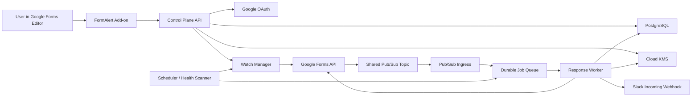
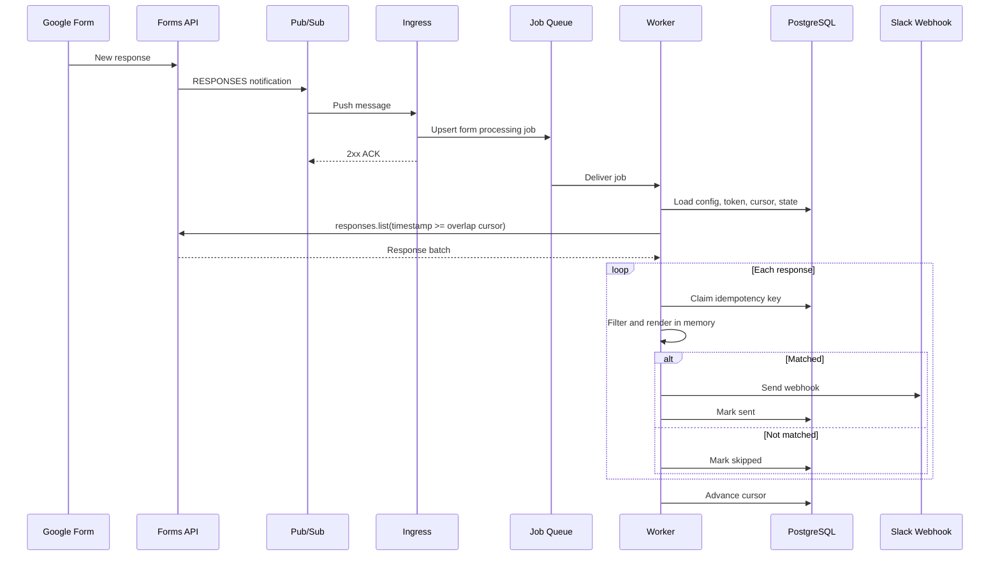

# FormAlert 商业化方案评审文档：100 Forms 云端监控架构

文档版本：Draft v0.1  
创建日期：2026-06-11  
评审对象：产品经理、研发负责人、安全与隐私负责人、运营负责人  
提案状态：待联合评审，不代表已经批准实施  
目标版本：FormAlert V2 Commercial  

## 0. 评审结论摘要

本方案在技术上可以落地。Google Forms API 已正式提供基于 Cloud Pub/Sub 的 response watch，允许后台在用户不在线时接收 Form response 变更通知，并使用 `forms.responses.list()` 拉取新增或更新的 response。

但该方案不是当前 V1.6 纯 Apps Script 架构的简单扩容，而是一次产品与隐私架构升级：

- 当前 V1.6：response、Slack Webhook 和模板均留在用户的 Apps Script 环境，FormAlert 服务器不参与通知执行。
- V2 商业方案：response 会在 FormAlert worker 内存中被短暂处理，OAuth refresh token、Slack Webhook、模板和 Form 配置需要加密存储在 FormAlert 后台。
- 当前网站和隐私政策中的“response 与 Webhook 不进入 FormAlert 服务器”承诺，在 V2 上线前必须修改。

本方案建议通过后，先完成一个 1 至 2 周的技术 PoC，再进行内部测试和小规模 Beta。只有当 OAuth、watch 续订、重复通知、漏处理恢复、Slack 重复发送风险和 100 Forms 容量测试全部通过后，才可对外承诺 Business 支持 100 个启用 Forms。

推荐产品结论：

| 项目 | 推荐 |
|---|---|
| 商业化路线 | 保留 V1.6 Apps Script 模式，同时研发 V2 Cloud Monitoring |
| 套餐计数 | 按启用中的 Forms 数量计费 |
| 套餐上限 | Free 1、Standard 20、Business 100 |
| 通知时效承诺 | Near real-time；低负载时可能数秒送达，但通常几分钟内，不承诺秒级 |
| OAuth scopes | `forms.responses.readonly` 必需；推荐同时申请 `forms.body.readonly` |
| response 保存 | 不保存完整 response，仅在 worker 内存中短暂处理 |
| 密钥保存 | refresh token、Webhook、模板必须应用层加密 |
| 事件消费 | Pub/Sub push ingress + durable job + worker |
| 幂等策略 | response 处理幂等 + Slack 发送状态机；接受极小概率重复 Slack 消息 |
| Dashboard | 从后台读取用户已注册 Forms；不扫描 Google Drive |

## 1. 背景与问题

### 1.1 当前 V1.6 产品模型

FormAlert 当前是 Google Forms Editor Add-on：

- 用户从当前 Google Form 页面右上角插件按钮打开 Sidebar。
- 每个 Form 对应一条 Alert 配置。
- Apps Script 读取当前 Form questions 和 responses。
- Apps Script 执行 Filter、模板替换和 Slack Webhook 发送。
- 每个连接的 Form 依赖一个 installable Form submit trigger。
- 配置保存在用户级 Apps Script `UserProperties`。
- response、Webhook、模板不进入 FormAlert 服务器。

当前模型隐私边界清晰，适合 MVP 和低成本验证，但受到 Apps Script trigger、属性存储、跨 Form 运维能力和商业化管理能力限制。

### 1.2 商业化问题

Business 套餐希望支持每个用户最多监控 100 个 Google Forms，并提供稳定的跨 Form Dashboard、统一的暂停/恢复、连接状态和发送状态。

如果继续完全依赖 Apps Script：

- 用户级 installable trigger 数量存在平台限制，无法稳定承诺 100 Forms。
- 无法在 FormAlert 后台统一判断哪些 Forms 正常、过期、失去权限或 trigger 失效。
- 配置分散在 Apps Script Properties 中，后台无法提供可靠的跨 Form 管理和运营支持。
- 商业套餐难以进行稳定的 Form 数量计费、容量治理、告警和故障恢复。

因此需要评估基于 Google Forms API response watch、Cloud Pub/Sub 和后台 worker 的商业级架构。

## 2. 应用场景

### 2.1 多 Form 业务监控

用户同时拥有大量 Google Forms，例如：

- 市场团队管理多个活动报名表。
- 销售团队按地区、产品线或渠道维护多个 lead forms。
- 客服团队维护多个反馈、退款和问题上报表。
- 招聘团队维护多个职位申请表。
- 教育机构维护多个课程、考试和问卷表。
- 代理商为多个客户管理独立 Forms。

用户需要在一个 Dashboard 中看到所有已连接 Forms，并控制每个 Form 的通知状态。

### 2.2 重要 response 筛选

用户不希望将所有 response 都发送到 Slack，而是希望通过 Filter 只发送重要内容，例如：

- `Budget >= 1000`
- `Priority equals High`
- `Message contains refund`
- 多个 Conditions 使用 `all` 或 `any` 匹配

### 2.3 无人在线时持续监控

用户完成首次授权后，即使不再打开 Google Form 或 FormAlert，系统也必须持续监控新 response、执行 Filter 并发送 Slack 通知。

### 2.4 跨 Form 运维

用户需要：

- 查看 1、20 或 100 个已连接 Forms。
- 搜索 Form title。
- Pause、Resume、Edit、Delete 某个 Form。
- 识别授权失效、watch 异常、Webhook 异常。
- 在不理解 watch、Pub/Sub 或 OAuth token 的前提下修复连接。

## 3. 产品目标与非目标

### 3.1 产品目标

1. 支持同一 Google Account 稳定监控最多 100 个启用 Forms。
2. 新 Form response 通常在几分钟内完成 Filter 和 Slack 发送。
3. Dashboard 稳定展示用户已注册的所有 Forms。
4. 后台可自动续订 watch、恢复临时故障并避免重复处理。
5. 不保存完整 Google Form response。
6. 不申请 Google Drive 或 Gmail 权限。
7. 提供清晰的隐私承诺、删除能力和授权撤销处理。
8. 套餐按启用中的 Forms 数量执行 Free 1、Standard 20、Business 100 限制。

### 3.2 非目标

1. 不承诺秒级实时通知。
2. 不承诺 Slack 端绝对 exactly-once。
3. 不扫描或列出用户 Google Drive 中所有 Forms。
4. 不保存完整 response 用于历史查询或分析。
5. 不提供 response 内容搜索、报表或 AI 分析。
6. 不使用 Gmail、Drive 或 Slack OAuth。
7. 不在本阶段支持嵌套 Filter、混合 AND/OR 或复杂表达式。
8. 不在本阶段支持一个 Form 对应多条 Alert 配置。

## 4. 产品模型与套餐

### 4.1 核心对象

- 一个 Google Account 对应一个 FormAlert Account。
- 一个已连接 Form 对应一条 Alert 配置。
- 一条 Alert 配置包含一个 Slack Webhook、Message/Payload 模板和多个 Conditions。
- 每个 Form 只按 `formId` 去重，不能按 `formTitle` 去重。
- 两个标题相同但 `formId` 不同的 Forms 必须分别显示和计费。

### 4.2 套餐建议

| Plan | Enabled Forms | Conditions per Form | Slack sends |
|---|---:|---:|---:|
| Free | 1 | 1 | 30/月或现有 Free credits 规则 |
| Standard | 20 | 5 | Unlimited，受合理使用政策约束 |
| Business | 100 | 10 | Unlimited，受合理使用政策约束 |

推荐按“启用中的 Forms”计费：

- Pause：停止监控并释放启用名额。
- Resume：重新占用名额；超出套餐时禁止 Resume。
- Delete：删除配置、watch 和相关状态。

此规则与当前 V1.6“Paused Forms 仍占名额”不同，需要产品经理最终确认。

推荐 V2 采用 Pause 释放名额，原因：

- 套餐卖点明确描述为“启用中的 Forms”。
- Pause 后后台不需要继续拉取 response，可降低 Google API、Pub/Sub 和 worker 成本。
- 用户更容易理解启用数量，而不是历史连接数量。

### 4.3 Dashboard

Dashboard 数据来自 FormAlert 后台中的已注册 Forms，而不是扫描 Google Drive：

- Home 最多展示最近使用或最近更新的 3 个 Forms。
- All Forms 每页 10 个。
- 搜索只匹配 `formTitle`。
- 每行只显示 Form title、状态和必要操作。
- 相同标题的 Forms 通过内部 `formId` 保持独立。
- Dashboard 必须显示需要用户处理的状态，例如 `Needs reconnect`。

## 5. 用户流程

### 5.1 首次启用 Cloud Monitoring

1. 用户从 Google Form Editor 打开 FormAlert Add-on。
2. 用户配置 Slack Webhook、模板和 Filters。
3. 用户点击 `Enable cloud monitoring` 或首次 Save。
4. Add-on 打开 FormAlert 后台 OAuth 授权页面。
5. 用户确认 Google OAuth 权限。
6. 后台获取 authorization code，并以 offline access 交换 access token 与 refresh token。
7. Add-on 将当前 Form 的 `formId`、title、question schema 和配置提交至后台。
8. 后台检查套餐名额。
9. 后台创建 response watch，并保存 watch expiration。
10. UI 显示 `Connected`。

### 5.2 新 response 处理

1. 用户提交 Google Form。
2. Google Forms API 向共享 Pub/Sub topic 发布 response 变更通知。
3. Pub/Sub 将通知发送给 ingress。
4. Ingress 校验来源并创建可重试 job，然后快速返回成功。
5. Worker 使用该 Form 的 OAuth credential 调用 `forms.responses.list()`。
6. Worker 读取 watermark 之后的 responses，并使用 overlap 防止边界漏处理。
7. Worker 对每个 response 执行幂等检查。
8. Worker 构建临时 response map，执行 Filters 和模板渲染。
9. 匹配时向 Slack Incoming Webhook 发送。
10. Worker 保存 response ID、处理结果、发送状态和脱敏错误。
11. Worker 清除内存中的 response 内容。

### 5.3 Pause

推荐行为：

1. 用户点击 Pause。
2. 后台将 Form 标记为 paused。
3. 后台删除该 Form 的 response watch。
4. 已排队但未开始的 job 在执行前检查状态并跳过。
5. Pause 释放套餐名额。

### 5.4 Resume

1. 用户点击 Resume。
2. 后台检查套餐名额和 OAuth 状态。
3. 后台创建 response watch。
4. 默认从 Resume 时刻开始监控，不补发 Pause 期间的 response。
5. UI 显示 `Connected`。

是否补发 Pause 期间 response 是产品 Decision Gate，推荐默认不补发。

### 5.5 Delete

1. 用户确认 Delete。
2. 后台删除 watch。
3. 后台删除 Form 配置、Webhook、模板、question schema、cursor 和发送记录。
4. 后台保留最小化安全审计记录，且不得包含 Form title、Webhook、模板或 response 内容。
5. 释放套餐名额。

### 5.6 OAuth 失效或用户失去 Form 权限

1. watch 进入 suspended，或 API 返回授权/权限错误。
2. 后台停止重试不可恢复错误。
3. Form 状态变为 `Needs reconnect`。
4. Dashboard 和 Add-on 显示可操作的 `Reconnect`。
5. 不向用户暴露 token、watch 或 Pub/Sub 概念。

## 6. 详细功能需求

### 6.1 Google OAuth

必须：

- 使用后台 Web Server OAuth flow。
- 请求 offline access，以便用户不在线时刷新 access token。
- 使用 OIDC `openid` 建立稳定账号身份；`email` 只用于展示和通知，不作为永久唯一键。
- 使用 `state` 防止 CSRF，并绑定发起用户、Form 和过期时间。
- refresh token 必须加密存储。
- 支持用户重新授权和撤销授权。
- 支持 Google 多账号场景，明确展示当前授权账号。

最小必需 scope：

```text
https://www.googleapis.com/auth/forms.responses.readonly
```

推荐增加：

```text
https://www.googleapis.com/auth/forms.body.readonly
```

账号身份 scope 与 Forms 数据 scope 分开管理：

```text
openid
email
```

原因：

- `forms.responses.readonly` 可创建 response watch 并读取 responses。
- `forms.responses.readonly` 不能调用 `forms.get()` 获取 Form title、question title 和 schema。
- 若不申请 `forms.body.readonly`，question schema 必须由 Add-on 首次连接时上传，并在用户打开 Add-on 时刷新；后台无法可靠感知 Form question 变更。
- `forms.body.readonly` 可支持后台读取 Form schema，并配合 `SCHEMA` watch 自动刷新字段。
- `SCHEMA` watch 是可选增强，会使每个启用 Form 同时拥有一个 `RESPONSES` watch 和一个 `SCHEMA` watch；是否首版启用需由研发评审确认。

不申请：

- Google Drive scopes
- Gmail scopes
- Form 编辑权限

### 6.2 Form 注册

必须保存：

- `formId`
- `formTitle`
- owner account ID
- enabled/paused/status
- plan slot state
- question schema 或 question map
- response watch ID、状态和过期时间
- response cursor/watermark
- 配置版本和更新时间

不得仅凭 `formTitle` 识别 Form。

### 6.3 Alert 配置

每个 Form 一条配置：

- Slack Incoming Webhook
- Message 或 Payload mode
- Message template
- Payload template
- Conditions
- Match mode：单条件隐藏；多条件使用 `all` 或 `any`
- enabled/paused 状态

Filters 沿用 V1.6 规则：

- 数值 operator：`eq`、`neq`、`gt`、`lt`、`gte`、`lte`
- 字符串 operator：`contains`、`text_eq`
- 数值比较前去除 `$`、`,` 和空格
- 非数字输入产生可识别错误
- 无 Filter 时所有新 response 均发送

### 6.4 Watch 管理

必须：

- 每个启用 Form 创建一个 `RESPONSES` watch。
- 使用一个共享 Pub/Sub topic 服务所有 watches。
- 保存 watch expiration。
- watch 到期前自动续订。
- 定期检查 suspended、expired 和 missing watch。
- Pause 与 Delete 删除 watch。
- Resume 创建或恢复 watch。
- OAuth 撤销或失去 Form 权限时标记 `Needs reconnect`。

推荐续订策略：

- 每小时扫描一次未来 48 小时内过期的 watches。
- 使用 jitter 分散续订请求。
- 续订失败使用指数退避。
- 距离到期 6 小时仍未成功时触发高优先级告警。
- 到期后创建恢复任务并更新用户可见状态。

### 6.5 Response 获取

Forms notification 不包含 response 内容，也不保证一条通知只对应一条 response。Worker 必须在收到通知后调用：

```text
forms.responses.list(formId, filter)
```

推荐 cursor 算法：

1. 每个 Form 保存 `watermarkSubmittedAt`。
2. 查询时使用小范围 overlap，例如：

```text
timestamp >= watermarkSubmittedAt - 120 seconds
```

3. 对返回结果按 `lastSubmittedTime` 和 `responseId` 排序。
4. 使用数据库唯一键跳过已处理版本。
5. 所有 response 处理完成后推进 watermark。
6. 如果处理失败，不推进到会造成漏处理的位置。

使用 overlap 的原因：

- 通知可能延迟、合并或重复。
- 时间戳边界和分页可能造成严格 `>` cursor 漏处理。
- 数据库幂等可以安全消化重复读取。

### 6.6 新增与更新 response

Google Forms `RESPONSES` watch 会同时通知新增和更新的 response。

必须由产品经理决定：

| 选项 | 行为 | 优点 | 风险 |
|---|---|---|---|
| A. 仅首次提交发送 | 同一 `responseId` 只处理一次 | 用户理解简单，减少重复 Slack 消息 | 编辑后的重要变化不会通知 |
| B. 每次更新都重新评估 | 使用 `formId + responseId + lastSubmittedTime` 作为版本键 | 反映更新后的内容 | 可能重复通知，需在 Slack 文案中说明 |

推荐 V2 首版选择 A：仅首次提交发送。更新 response 仍被拉取，但检测到已处理 `responseId` 后跳过。

### 6.7 Slack 发送

必须：

- 仅允许合法 Slack Incoming Webhook URL。
- 设置连接与响应超时。
- 区分可重试与不可重试错误。
- 对 `429` 遵守 `Retry-After`。
- 不记录 Webhook、完整请求 body 或完整 Slack 响应。
- Webhook 在数据库中应用层加密。

需要明确的技术限制：

- Slack Incoming Webhook 不提供业务幂等键。
- 如果 worker 已成功发送 Slack，但在写入发送成功状态前崩溃，重试时可能再次发送。
- 系统可以将重复概率降到很低，但不能诚实承诺 Slack 端绝对 exactly-once。

推荐状态机：

```text
pending -> processing -> sent
                      -> skipped
                      -> retryable_error
                      -> permanent_error
```

处理 lease 超时后允许其他 worker 接管。任何接管都必须先检查最新状态。

### 6.8 Dashboard 与状态

建议用户可见状态：

| 状态 | 含义 | 用户动作 |
|---|---|---|
| Connected | 正常监控 | Pause / Edit / Delete |
| Paused | 用户主动暂停 | Resume / Edit / Delete |
| Needs reconnect | OAuth 或 Form 权限失效 | Reconnect |
| Setup failed | watch 创建失败 | Fix setup |
| Delivery issue | Webhook 持续失败 | Edit Webhook |

Dashboard 不展示：

- 完整 response
- 完整模板
- Slack Webhook
- 完整日志
- OAuth token
- Pub/Sub 或 watch 技术细节

### 6.9 Debug 与支持

用户级 Debug 只展示最近 10 条脱敏状态：

- Form title 或安全截断后的标识
- status
- event time
- error code
- 可操作建议

不得包含：

- response values
- respondent email
- Slack Webhook
- 完整模板
- 完整替换后 payload
- OAuth access token 或 refresh token

## 7. 非功能需求

### 7.1 可用性与时效

建议上线 SLO：

| 指标 | Beta 目标 | GA 目标 |
|---|---:|---:|
| 成功接收并处理 response | 99.5% | 99.9% |
| P50 提交到 Slack | 3 分钟内 | 3 分钟内 |
| P95 提交到 Slack | 10 分钟内 | 8 分钟内 |
| Watch 续订成功率 | 99.9% | 99.99% |
| 可恢复错误最终恢复 | 24 小时内 | 6 小时内 |

Google 官方描述是通知“通常在几分钟内”到达，因此不得承诺秒级通知。

监控 Form 数量与端到端延迟的关系：

- Form 数量较少、提交量较低时，FormAlert 自有队列、Forms API 配额竞争和 worker 排队通常更少，实际通知可能在数秒内完成。
- Form 数量较多或提交集中爆发时，自有队列和项目级 Forms API 配额会增加延迟，需要通过合并 job、限流和扩容控制。
- Google Forms watch 通知到达时间由 Google 控制，不随 FormAlert 监控数量线性变化。即使只监控一个 Form，也无法保证 Google 在数秒内发布通知。
- 每个 watch 最多每 30 秒收到一条通知；一条通知可能代表多个 events。因此低负载可以改善实际体验，但不能改变官方交付语义。

推荐对外文案：

```text
Near real-time Slack alerts. Most notifications arrive within minutes,
and low-volume Forms may arrive within seconds.
```

不得使用：

```text
Instant alerts
Guaranteed within seconds
```

推荐在 Beta 中按启用 Form 数量和 response 量分别统计 P50、P95、P99。只有实测数据可以用于优化内部 SLO，不能覆盖 Google 上游不提供秒级保证这一事实。

### 7.2 容量

首期容量目标：

- 1,000 个付费用户。
- 每用户最多 100 个启用 Forms。
- 100,000 个启用 watches。
- 单 Form 短时间突发提交需要通过一次 response list 拉取批量处理。

Business 的 100 Forms 上限是产品套餐限制，不是 Forms API 对单用户全部 Forms 的直接硬上限。系统仍需基于项目级 API quota、worker 并发和成本做容量治理。

### 7.3 数据保留

推荐：

| 数据 | 保留期限 |
|---|---|
| 完整 response | 不落库；仅 worker 内存短暂处理 |
| response ID / version key | 90 天，或按幂等窗口调整 |
| response watermark | Form 存续期间 |
| send status | 30 至 90 天，不含 response 内容 |
| 脱敏错误日志 | 30 天 |
| OAuth refresh token | 用户连接期间 |
| Webhook / template / Filters | Form 配置存续期间 |
| 删除审计记录 | 90 天，仅最小化元数据 |

最终期限需由隐私、安全和支持团队共同确认。

### 7.4 可观测性

必须监控：

- active / paused / suspended / expired watch 数量
- watch renew success/failure
- Pub/Sub ingress latency 和失败率
- job queue depth 和 oldest job age
- Forms API `429`、`401`、`403`、`5xx`
- Slack `2xx`、`4xx`、`429`、`5xx`
- response fetch count 和每次批量大小
- duplicate response processing prevented
- potential duplicate Slack send window
- per-user 和 per-project quota 使用率

所有指标与日志都必须避免 response 内容和 secret。

## 8. 推荐技术架构

### 8.1 架构原则

1. 控制面与数据处理面分离。
2. Pub/Sub ingress 快速确认，不在 ingress 内完成完整业务处理。
3. 所有外部事件按 at-least-once 设计。
4. response 内容只存在于 worker 内存中。
5. secrets 在应用层加密后才写入数据库。
6. 后台只展示已注册 Forms，不使用 Drive 做 Form 发现。
7. 每个处理步骤必须可重试、可恢复、可审计。

### 8.2 组件

| 组件 | 职责 |
|---|---|
| Google Forms Editor Add-on | 当前 Form 配置 UI、字段插入、发起 OAuth、展示 Dashboard |
| OAuth / Control Plane API | Google OAuth callback、账号绑定、套餐校验、Form 注册、配置管理 |
| Watch Manager | create、renew、delete、repair watches |
| Cloud Pub/Sub Topic | 接收所有 Forms API watch 通知 |
| Pub/Sub Ingress | 校验通知、去重/coalesce、创建 durable job、快速 ACK |
| Job Queue | 保存可重试处理任务与退避时间 |
| Response Worker | 拉取 responses、执行幂等、Filter、渲染、Slack 发送 |
| Scheduler | watch 续订、健康扫描、重试和清理任务 |
| PostgreSQL | 保存账号、Forms、配置、watch、cursor、幂等与发送状态 |
| Cloud KMS | 加密 refresh token、Webhook 和模板 |
| Observability | 指标、脱敏日志、告警和审计 |

推荐部署在 Google Cloud，以降低 Forms API、Pub/Sub、Cloud Run、Cloud KMS 和 IAM 集成复杂度。数据库可以使用 Cloud SQL PostgreSQL；若继续使用 Neon PostgreSQL，必须额外评估网络、区域、KMS 集成、连接池和故障恢复。

### 8.3 架构图



### 8.4 事件处理时序



## 9. 数据模型建议

以下为逻辑模型，字段名称和类型需在开发设计阶段进一步细化。

### 9.1 `accounts`

| 字段 | 说明 |
|---|---|
| `id` | 内部 account ID |
| `google_subject` | Google OIDC `sub`，唯一身份键 |
| `email` | 可选，应用隐私策略控制 |
| `plan` | free / standard / business |
| `status` | active / revoked / deleted |
| `created_at` / `updated_at` | 时间 |

不要使用 email 作为唯一且永久不变的身份键。

### 9.2 `google_credentials`

| 字段 | 说明 |
|---|---|
| `account_id` | 关联账号 |
| `encrypted_refresh_token` | KMS envelope encrypted |
| `scope_set` | 已授权 scopes |
| `token_status` | active / revoked / needs_reauth |
| `last_refresh_at` | 最近成功刷新时间 |
| `created_at` / `updated_at` | 时间 |

不得保存 access token 超过必要生命周期；不得记录 token 明文。

### 9.3 `forms`

| 字段 | 说明 |
|---|---|
| `id` | 内部 ID |
| `account_id` | 所属账号 |
| `form_id` | Google Form ID |
| `form_title` | Dashboard 展示 |
| `status` | connected / paused / needs_reconnect / setup_failed |
| `enabled` | 是否占用启用名额 |
| `schema_version` | question schema 版本 |
| `watermark_submitted_at` | response cursor |
| `created_at` / `updated_at` | 时间 |

唯一约束：

```text
unique(account_id, form_id)
```

### 9.4 `form_questions`

| 字段 | 说明 |
|---|---|
| `form_id` | 内部 Form 关联 |
| `question_id` | Google question/item ID |
| `title` | 字段展示名 |
| `type` | text / number-compatible / choice 等 |
| `position` | 排序 |
| `active` | question 是否仍存在 |

不保存 response value。

### 9.5 `alert_configs`

| 字段 | 说明 |
|---|---|
| `form_id` | 一对一关联 |
| `mode` | message / payload |
| `encrypted_webhook_url` | 加密 Webhook |
| `encrypted_message_template` | 加密 Message template |
| `encrypted_payload_template` | 加密 Payload template |
| `encrypted_conditions` | 加密 Conditions；Filter value 可能包含业务敏感信息 |
| `match_mode` | all / any |
| `config_version` | 乐观并发控制 |
| `updated_at` | 时间 |

模板是否必须加密需由安全评审确认；本方案推荐加密，因为模板可能包含业务敏感信息。
Conditions 同样推荐加密，因为 Filter value 可能是客户邮箱、内部编号或其他业务敏感值。

### 9.6 `form_watches`

| 字段 | 说明 |
|---|---|
| `form_id` | 关联 Form |
| `watch_id` | Google watch ID |
| `event_type` | RESPONSES |
| `state` | active / suspended / expired / deleting |
| `expire_time` | watch 到期时间 |
| `last_renew_attempt_at` | 最近续订尝试 |
| `last_error_code` | 脱敏错误码 |

### 9.7 `response_deliveries`

| 字段 | 说明 |
|---|---|
| `form_id` | 关联 Form |
| `response_id_hash` 或 `response_id` | 幂等标识 |
| `response_version_time` | 若支持更新重发则使用 |
| `status` | processing / sent / skipped / retryable_error / permanent_error |
| `attempt_count` | 尝试次数 |
| `lease_until` | worker lease |
| `slack_response_code` | 可选，仅状态码 |
| `error_code` | 脱敏错误码 |
| `created_at` / `updated_at` | 时间 |

唯一约束：

```text
unique(form_id, response_id)
```

若产品选择更新重发，则改为：

```text
unique(form_id, response_id, response_version_time)
```

### 9.8 `processing_jobs`

| 字段 | 说明 |
|---|---|
| `form_id` | 关联 Form |
| `status` | queued / running / retry / completed |
| `available_at` | 下次可执行时间 |
| `attempt_count` | 尝试次数 |
| `lease_until` | worker lease |
| `last_error_code` | 脱敏错误码 |

同一 Form 同时只允许一个 response fetch job 执行，避免 cursor 竞争。

## 10. 幂等、一致性与重复风险

### 10.1 事实约束

- Forms watch 通知是 at-least-once。
- 一条通知可能代表多个 response 事件。
- Pub/Sub push 不提供 exactly-once。
- `forms.responses.list()` 可能因为 overlap 返回已经处理过的 response。
- Slack Incoming Webhook 没有 FormAlert 可控制的业务幂等键。

### 10.2 推荐幂等层级

1. Pub/Sub ingress 层：按 Pub/Sub `messageId` 做短期去重，但不能只依赖它。
2. Form job 层：同一 Form 合并并发通知，只保留一个 active fetch job。
3. Response 层：使用 `formId + responseId` 唯一约束。
4. Worker 层：使用数据库事务和 processing lease。
5. Slack 状态层：发送前后记录状态，失败按错误类型重试。

### 10.3 可接受的一致性声明

可承诺：

- 系统会自动重试临时错误。
- 系统使用 response ID 避免绝大多数重复处理。
- 系统不保存完整 response。

不可承诺：

- 每条通知秒级送达。
- Pub/Sub 只投递一次。
- Slack 消息在所有崩溃场景下绝不重复。

## 11. 安全与隐私方案

### 11.1 隐私承诺必须变化

V2 上线前，网站、Privacy Policy、FAQ、安装指引和 Marketplace disclosure 必须从：

```text
Responses and Slack Webhooks never reach FormAlert servers.
```

修改为类似：

```text
Form responses are processed transiently to evaluate your rules and send matching
Slack notifications. FormAlert does not store complete form responses. OAuth tokens,
Slack Webhooks, and templates are encrypted at rest.
```

最终英文文案需法律与隐私评审。

### 11.2 Secret 加密

必须应用层加密：

- OAuth refresh token
- Slack Webhook URL
- Message template
- Payload template
- Filter Conditions

推荐使用 Cloud KMS envelope encryption：

- 每个用户或每条敏感记录使用独立 DEK。
- 使用 AES-256-GCM。
- 使用 Cloud KMS KEK 包装 DEK。
- 使用 `accountId` 和数据类型作为 AAD。
- 数据库只保存 ciphertext 和 wrapped DEK。
- KMS 权限只授予需要解密的 worker 和 control plane service account。
- 定期轮换 KEK，并验证重加密流程。

### 11.3 IAM 与服务隔离

推荐拆分 service accounts：

- Control Plane：可管理账号、配置和 watch。
- Pub/Sub Ingress：只可写 job，不可解密 Webhook。
- Response Worker：可读取 job、调用 Forms API、解密配置并发送 Slack。
- Scheduler：可触发续订和健康任务。
- Support/Operations：默认不可解密任何 secret。

### 11.4 日志与错误

日志中禁止出现：

- response 内容
- respondent email
- Webhook
- 完整模板
- 完整 payload
- access token / refresh token
- OAuth authorization code

推荐错误格式：

```json
{
  "accountId": "internal-id",
  "formIdHash": "sha256-prefix",
  "operation": "responses.list",
  "status": "retryable_error",
  "errorCode": "FORMS_RATE_LIMITED",
  "attempt": 2,
  "occurredAt": "2026-06-11T00:00:00Z"
}
```

### 11.5 删除与撤销

必须支持：

- 用户删除单个 Form。
- 用户断开 Google Account。
- 用户删除 FormAlert Account。
- OAuth 撤销后停止所有后台访问。
- 删除 watch、token、Webhook、模板、cursor 和发送状态。
- 建立可验证的数据删除流程和审计。

### 11.6 OAuth 验证

公开应用申请访问用户数据 scope 时需要准备 Google OAuth verification：

- 最小 scope 原则和每个 scope 的用途说明。
- OAuth consent screen。
- 隐私政策和服务条款。
- 域名验证。
- 展示 OAuth flow 和 scope 使用方式的演示视频。
- 数据使用、保存与删除说明。
- 若 Google 将所选 scope 归类为 restricted，需准备额外安全评估。

scope 分类和审核要求必须在提交 OAuth verification 前从 Google Cloud Console 再次确认。

## 12. API 与后台接口建议

以下是逻辑接口，不代表最终 URL。

### 12.1 Add-on / Control Plane

```text
POST   /v2/oauth/google/start
GET    /v2/oauth/google/callback
POST   /v2/forms/register
GET    /v2/forms
GET    /v2/forms/:formId
PUT    /v2/forms/:formId/config
POST   /v2/forms/:formId/pause
POST   /v2/forms/:formId/resume
POST   /v2/forms/:formId/reconnect
DELETE /v2/forms/:formId
POST   /v2/forms/:formId/test
GET    /v2/forms/:formId/debug
```

### 12.2 Internal

```text
POST /internal/pubsub/forms-events
POST /internal/jobs/process-form
POST /internal/jobs/renew-watches
POST /internal/jobs/repair-watches
POST /internal/jobs/cleanup
```

### 12.3 身份与请求安全

- Add-on 到 Control Plane 的请求必须使用短期签名 token 或经过验证的 Google identity。
- OAuth `state` 必须一次性、短期有效并绑定用户与发起上下文。
- Internal endpoints 必须使用 Cloud IAM / OIDC，不使用静态公共 secret。
- Pub/Sub push ingress 必须验证 Google 签发的 OIDC token、预期 audience 和指定 Pub/Sub push service account。
- 所有修改操作需要授权检查：当前 account 是否拥有该注册 Form。
- 所有接口需要 rate limit、请求大小限制和 schema validation。

## 13. 与当前 V1.6 的关系

### 13.1 推荐双轨策略

不要立即删除 V1.6 Apps Script 执行模式。

推荐：

- V1 Local Mode：保留当前 Apps Script trigger 路径，隐私边界最强，最多支持 20 Forms 或按平台能力限制。
- V2 Cloud Monitoring：用户主动启用，支持 100 Forms、后台 Dashboard 和自动 watch 运维。

产品必须清楚标识两种模式的数据处理差异，不能默认把现有用户的 Webhook、模板或 response 路径迁移到后台。

### 13.2 迁移原则

- 必须由用户主动选择并完成 OAuth。
- 必须在迁移前展示新的隐私说明。
- 不自动上传现有 Apps Script 配置。
- 用户确认后，Add-on 才将当前 Form 配置提交到后台。
- 迁移成功后删除或禁用当前 Form 的 Apps Script submit trigger，避免双发。
- 支持回退到 Local Mode，但回退时需要重新创建 Apps Script trigger。

### 13.3 当前仓库边界变化

当前 `AGENTS.md` 明确规定：

- 网站不是 Dashboard。
- 不使用 FormAlert server 处理 response。
- 不在后台保存 Webhook 和模板。

因此在 V2 开发前必须先批准并更新项目边界。推荐仍保持公共网站与后台服务分离：

- 当前 Next.js 网站继续承担营销、文档、价格和法律页面。
- 新建独立的 Control Plane / Worker 服务。
- Add-on Dashboard 调用 Control Plane API。
- 是否增加 Web Dashboard 作为后续单独产品决策，本阶段不默认实现。

## 14. 配额与容量评估

### 14.1 Google Forms API 官方配额

截至 2026-06-11，Google Forms API 官方文档列出的核心配额包括：

| 请求类型 | 每分钟每项目 | 每分钟每用户每项目 | 每日 |
|---|---:|---:|---:|
| Read requests | 975 | 390 | Unlimited |
| Expensive read requests：`forms.responses.list` | 450 | 180 | Unlimited |
| Write requests | 375 | 150 | Unlimited |

超过配额通常返回 `429`，必须使用带 jitter 的截断指数退避。

### 14.2 Watch 官方约束

- watch 有效期为 7 天，可以在到期前续订。
- 每个 watch 最多每 30 秒收到一条通知。
- 一条通知可能代表多个事件。
- 对给定 Form 和 event type，每个 Cloud project 最多 20 个 watches，且每个 end user 最多一个 watch。
- 每个 Form 在所有 Cloud projects 中每种 event type 最多 50 个 watches。
- 通知通常在几分钟内到达。
- 用户撤销授权或失去 Form 编辑权限时 watch 会停止或 suspended。

这些限制不会阻止一个用户监控 100 个不同 Forms，因为限制主要按“给定 Form + event type”计算，而不是限制一个用户只能拥有 20 个不同 Forms。

### 14.3 容量风险

100 Forms 能力需要重点测试以下场景：

- 100 个 Forms 在短时间内同时提交。
- 单个 Form 在 30 秒内大量提交，只有一条合并通知。
- 大量 Forms 同时到达 watch 续订窗口。
- 项目级 `forms.responses.list` 450/min 配额被多个用户共享。
- OAuth token refresh 集中发生。
- Slack `429` 或网络故障造成队列积压。

必要时：

- 按用户和 Form 做公平调度。
- 对同一 Form 合并 jobs。
- 对 Forms API 和 Slack 分别限流。
- 为高规模阶段申请 Google API quota increase。

## 15. 故障处理

### 15.1 错误分类

| 错误 | 分类 | 行为 |
|---|---|---|
| Forms API `429` / `5xx` | 可重试 | 指数退避，不推进 cursor |
| OAuth token refresh 临时失败 | 可重试 | 退避并告警 |
| OAuth `invalid_grant` | 不可自动恢复 | 标记 Needs reconnect |
| Form `403` / 失去权限 | 不可自动恢复 | 标记 Needs reconnect |
| Watch suspended | 可尝试修复 | renew；失败则 Needs reconnect |
| Slack `429` | 可重试 | 遵守 Retry-After |
| Slack `5xx` / timeout | 可重试 | 有限重试 |
| Slack `4xx` 配置错误 | 不可自动恢复 | Delivery issue |
| 模板或 Payload 无效 | 配置错误 | permanent_error，提示 Edit |
| Worker 崩溃 | 可恢复 | lease 超时后重新执行 |

### 15.2 Dead Letter

经过最大重试仍失败的 job 进入 dead-letter 状态：

- 不保存 response 内容。
- 保存 formId hash、operation、error code、attempt count 和时间。
- 自动创建运维告警。
- 用户 Dashboard 显示可操作状态。

## 16. PoC 与测试计划

### 16.1 PoC 目标

PoC 不是验证 Forms API 是否存在，而是验证 FormAlert 能否以可商业承诺的方式运行。

必须验证：

1. 后台 OAuth offline access 能稳定获取并刷新 token。
2. 仅使用 `forms.responses.readonly` 可完成 watch 和 response 拉取。
3. 增加 `forms.body.readonly` 后可稳定同步 title 和 question schema。
4. 100 个 Forms 可注册并创建 watches。
5. watch 自动续订和 suspended 恢复。
6. 合并、延迟和重复通知不会漏处理 response。
7. Worker 崩溃和重试不会造成大量重复 Slack 消息。
8. response 不落库、不进入日志或错误追踪系统。
9. KMS 加密、解密、轮换和删除流程可用。
10. Dashboard 能稳定展示、搜索和操作 100 Forms。

### 16.2 测试矩阵

#### OAuth

- 首次授权
- 多 Google Account
- 拒绝授权
- refresh token 缺失
- token 撤销
- scope 增量授权
- 用户失去 Form 权限

#### Watch

- create / renew / delete
- 到期前续订
- 到期后恢复
- suspended 恢复
- 重复创建
- Pause / Resume
- 100 Forms 批量续订

#### Response

- 单条新增
- 同一秒多条新增
- 30 秒内大量新增导致通知合并
- 重复 Pub/Sub 通知
- 通知乱序
- 通知延迟
- response 更新
- 分页超过单页
- cursor 边界
- worker 在推进 cursor 前后崩溃

#### Filter 与模板

- 无 Filter
- 单 Condition
- `all` / `any`
- 数值清洗和非法数字
- Message / Payload
- 缺失 question
- question 重命名或删除
- Payload invalid

#### Slack

- `2xx`
- `400`
- `404` / Webhook revoked
- `429`
- `5xx`
- timeout
- 发送成功后 worker 在写库前崩溃

#### 安全与隐私

- 数据库中无明文 token、Webhook 和模板
- 日志中无 response、Webhook、token 和完整 payload
- 错误追踪中无敏感数据
- 删除账号后所有相关 secret 和配置被删除
- IAM 最小权限验证
- Pub/Sub ingress 来源验证
- OAuth CSRF / replay 测试

### 16.3 容量测试

最低通过门槛：

- 分别使用 1、20、100 个启用 Forms 测量 Google watch 延迟、内部排队延迟和端到端 Slack 延迟。
- 在 1 个低提交量 Form 场景中记录数秒送达比例，但不得将结果转化为秒级外部保证。
- 在 20 和 100 Forms 场景中验证内部排队不会成为主要延迟来源。
- 单用户 100 Forms 连续运行 14 天。
- watch 续订 100% 成功，或失败可在到期前自动恢复。
- 100 Forms 同分钟各产生至少一条 response。
- 单 Form 在 30 秒内产生 100 条 responses。
- 项目级 API quota 达到 70% 时系统能限流且不漏处理。
- Worker 重启、部署和数据库短暂故障后可恢复。

### 16.4 Beta 计划

推荐：

1. Internal PoC：开发和测试账号，最多 100 Forms。
2. Private Alpha：5 至 10 个用户，最多 20 Forms/用户。
3. Private Beta：20 至 50 个用户，开放 100 Forms。
4. GA：OAuth verification、隐私文档、SLO 和运维告警全部完成后开放。

Beta 期间不要在公开 Pricing 页面承诺 100 Forms，除非具备人工支持和容量保护方案。

## 17. 实施阶段建议

### Phase 0：联合评审与 Decision Gates

- 确认 V2 是否允许 response 在后台内存中短暂处理。
- 确认是否允许后台加密保存 Webhook 和模板。
- 确认是否申请 `forms.body.readonly`。
- 确认 Pause 是否释放名额。
- 确认 response 更新是否重发。
- 确认 Local Mode 与 Cloud Monitoring 是否长期双轨。
- 确认公开隐私承诺和价格策略。

### Phase 1：技术 PoC

- OAuth offline access。
- Forms watch + Pub/Sub。
- response list cursor + overlap。
- PostgreSQL 幂等。
- Slack 发送和故障注入。
- KMS secret 加密。
- 100 Forms 容量测试。

### Phase 2：商业 MVP

- Control Plane API。
- Add-on Cloud Monitoring 启用流程。
- Dashboard 后台数据源。
- Plan limits。
- Watch Manager 和 Scheduler。
- Debug、告警和支持状态。

### Phase 3：安全、合规与 Beta

- OAuth verification。
- Privacy、Terms、FAQ、Marketplace disclosure 更新。
- IAM 和安全审计。
- 数据删除流程。
- Private Beta。

### Phase 4：GA

- Business 100 Forms 正式开放。
- SLO 与 on-call 手册。
- 成本和 quota 仪表盘。
- 事故响应和用户通知流程。

## 18. 必须由联合评审确定的 Decision Gates

| ID | 决策 | 推荐 | 负责人 |
|---|---|---|---|
| DG-01 | 是否接受 response 在后台内存中短暂处理 | 接受，并明确“不保存完整 response” | 产品 + 隐私 |
| DG-02 | 是否允许后台加密保存 Webhook 和模板 | 允许，使用 KMS 应用层加密 | 产品 + 安全 |
| DG-03 | 是否申请 `forms.body.readonly` | 申请，用于稳定 schema 同步 | 产品 + 安全 |
| DG-04 | Pause 是否释放套餐名额 | 释放 | 产品 |
| DG-05 | response 更新是否重新发送 | V2 首版不重发 | 产品 |
| DG-06 | 是否保留 V1 Local Mode | 保留，用户主动迁移 | 产品 + 研发 |
| DG-07 | 是否开发 Web Dashboard | 本阶段不开发，继续使用 Add-on Dashboard | 产品 |
| DG-08 | Pub/Sub push 或 pull | 首版使用 push ingress + durable job | 研发 |
| DG-09 | PostgreSQL 选择 | 优先 Cloud SQL；Neon 需专项评估 | 研发 + 运维 |
| DG-10 | Business 100 Forms 公开时间 | Private Beta 验证后 | 产品 + 研发 |

## 19. 风险清单

| 风险 | 严重度 | 缓解措施 |
|---|---|---|
| 隐私承诺与当前网站冲突 | Critical | V2 上线前更新所有公开文案并取得用户主动同意 |
| OAuth verification 延迟 | High | 在 PoC 后立即准备验证材料，不等功能全部完成 |
| Watch 7 天到期导致漏监控 | High | 提前 48 小时续订、jitter、健康扫描和告警 |
| Pub/Sub 重复或合并通知 | High | cursor 回查、overlap、Form job 合并、response 幂等 |
| Slack 可能极小概率重复发送 | High | 状态机、lease、有限重试、诚实披露 |
| 100 Forms 并发导致 Forms API quota 紧张 | High | 限流、公平调度、队列、配额监控和申请提升 |
| response 意外进入日志或 APM | Critical | 严格日志 API、字段白名单、自动敏感数据测试 |
| refresh token / Webhook 泄露 | Critical | KMS、IAM 隔离、轮换、审计、禁止 support 解密 |
| Form schema 变化导致变量失效 | Medium | `forms.body.readonly` + SCHEMA watch 或定期同步 |
| 用户误认为 Dashboard 会发现全部 Forms | Medium | 明确只展示已注册 Forms |
| 双轨模式造成重复发送 | High | 每个 Form 明确 execution mode，迁移时先停旧路径 |

## 20. 上线验收标准

### 产品

- [ ] 用户可从 Google Forms Add-on 主动启用 Cloud Monitoring。
- [ ] Dashboard 可稳定展示并搜索 100 个已注册 Forms。
- [ ] Free / Standard / Business 分别限制 1 / 20 / 100 个启用 Forms。
- [ ] Pause、Resume、Edit、Delete、Reconnect 行为清晰。
- [ ] 用户不需要理解 watch、Pub/Sub、cursor 或 token。
- [ ] 公开文案不承诺秒级或绝对 exactly-once。

### 功能

- [ ] 每个启用 Form 存在一个有效 response watch。
- [ ] watch 到期前自动续订。
- [ ] 新 response 能执行 Filter、模板渲染并发送 Slack。
- [ ] 无 Filter 时直接发送。
- [ ] 重复和合并通知不造成漏处理。
- [ ] Pause 后不发送；Resume 后从恢复时刻继续监控。
- [ ] Delete 删除 watch、配置和相关 secret。

### 安全与隐私

- [ ] 不申请 Drive 或 Gmail scope。
- [ ] OAuth refresh token、Webhook 和模板均为应用层加密。
- [ ] 完整 response 不落库。
- [ ] response、Webhook、token 和完整 payload 不进入日志或错误追踪。
- [ ] 用户可撤销授权并删除数据。
- [ ] OAuth verification 和隐私披露已完成。

### 可靠性

- [ ] 100 Forms 容量测试通过。
- [ ] 14 天持续运行测试通过。
- [ ] Forms API、Pub/Sub、数据库和 Slack 故障注入测试通过。
- [ ] 续订失败、授权撤销和失去 Form 权限均产生可操作状态。
- [ ] 监控、告警、runbook 和事故响应流程已建立。

## 21. 联合评审建议流程

建议会议按以下顺序进行：

1. 产品经理确认应用场景、套餐、Pause 计费、更新 response 行为和双轨策略。
2. 隐私与安全负责人确认数据处理变化、scope、加密、日志、删除和公开承诺。
3. 研发负责人确认组件、数据模型、幂等、cursor、续订、配额和 PoC 范围。
4. 运营负责人确认 OAuth verification、支持流程、告警与事故响应。
5. 所有 Decision Gates 记录结论、负责人和截止日期。
6. 只有 DG-01、DG-02、DG-03、DG-05 和 DG-06 明确后，才进入正式开发。

## 22. 官方资料与事实依据

以下链接在 2026-06-11 编写本文档时核对：

1. Google Forms API Push Notifications  
   https://developers.google.com/workspace/forms/api/guides/push-notifications

2. `forms.watches.create`  
   https://developers.google.com/workspace/forms/api/reference/rest/v1/forms.watches/create

3. `forms.responses.list`  
   https://developers.google.com/workspace/forms/api/reference/rest/v1/forms.responses/list

4. `forms.get` 与 `forms.body.readonly`  
   https://developers.google.com/workspace/forms/api/reference/rest/v1/forms/get

5. Google Forms API Usage Limits  
   https://developers.google.com/workspace/forms/api/limits

6. OAuth 2.0 for Web Server Applications  
   https://developers.google.com/identity/protocols/oauth2/web-server

7. Google OAuth Verification Requirements  
   https://support.google.com/cloud/answer/13461325  
   https://support.google.com/cloud/answer/13464321

8. Pub/Sub Exactly-once Delivery  
   https://docs.cloud.google.com/pubsub/docs/exactly-once-delivery

9. Cloud KMS Envelope Encryption  
   https://docs.cloud.google.com/kms/docs/envelope-encryption

## 23. 评审记录

| 日期 | 评审人 | 角色 | 结论 | 待办 |
|---|---|---|---|---|
| 待填写 | 待填写 | 产品 | 待评审 | 待填写 |
| 待填写 | 待填写 | 研发 | 待评审 | 待填写 |
| 待填写 | 待填写 | 安全/隐私 | 待评审 | 待填写 |
| 待填写 | 待填写 | 运营 | 待评审 | 待填写 |
