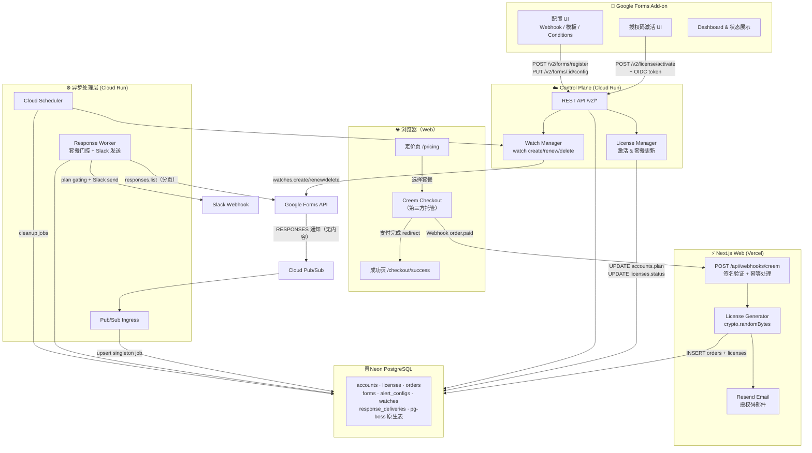
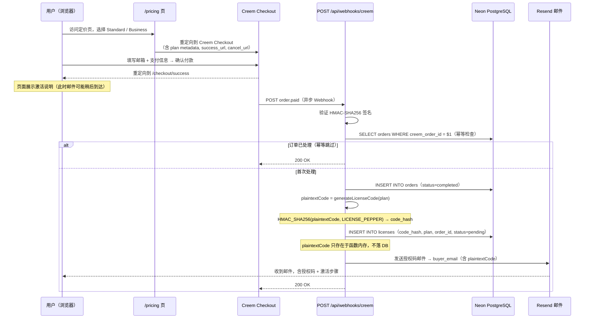
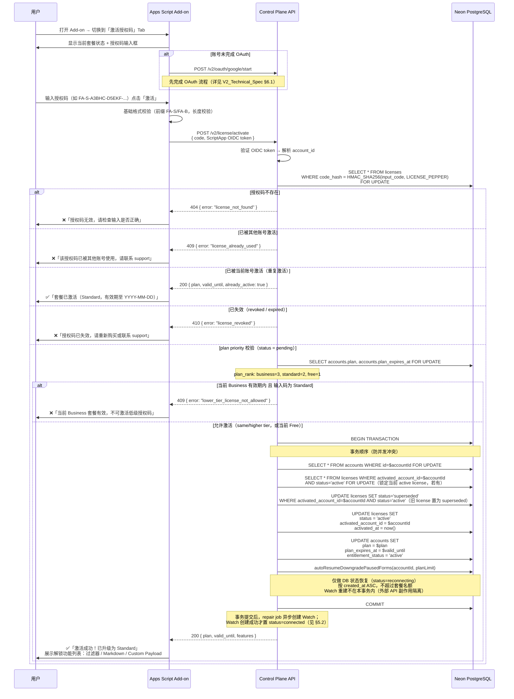
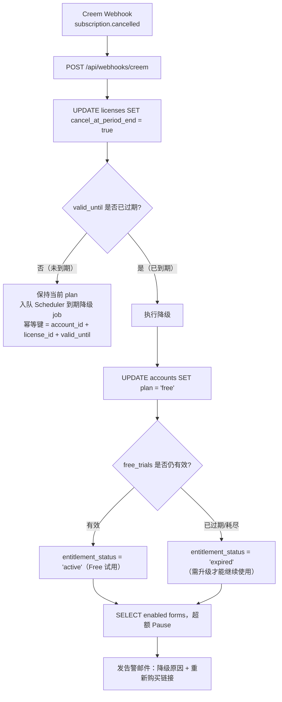
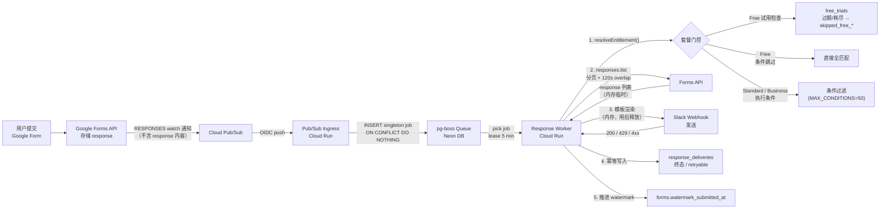
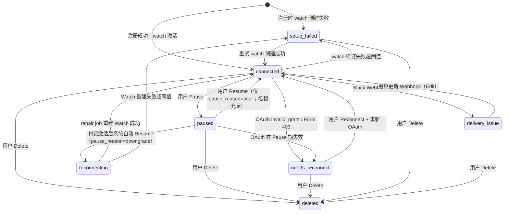
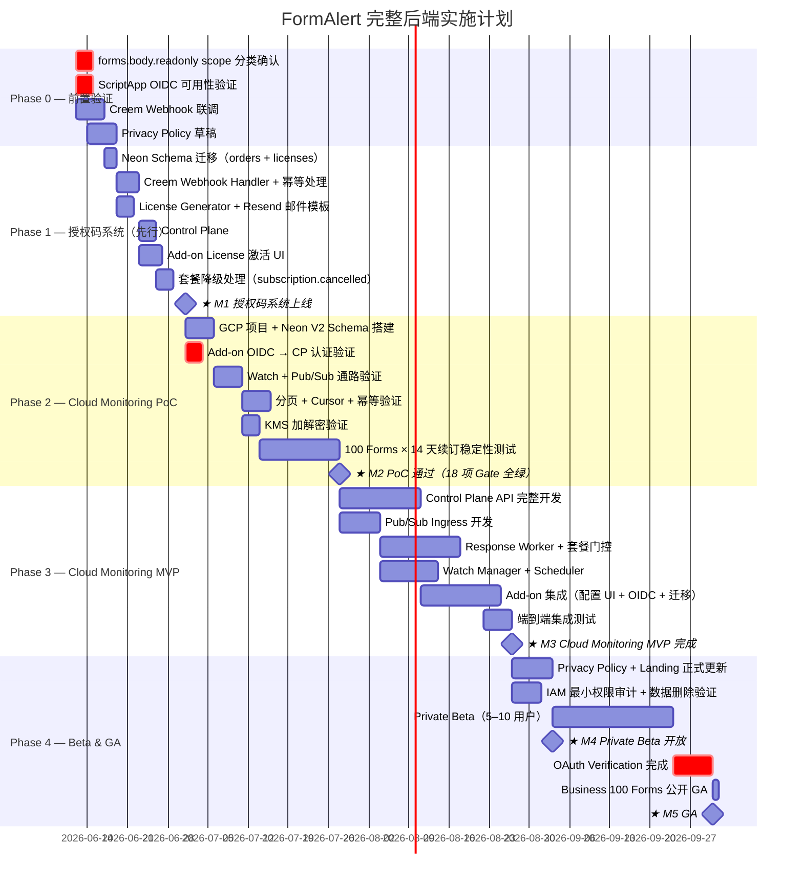

# FormAlert — 完整后端技术方案（Web + Plugin）

文档版本：v4.1  
创建日期：2026-06-11  
修订日期：2026-06-12（v4.0：按 Deep Review v4 修正全部 P0/P1 条目；v4.1：按架构过度设计与成本审计落实 MVP 部署形态修正 OD-1～OD-5）  
覆盖范围：Web 端套餐购买 / 授权码发放 + 插件端 Cloud Monitoring / 授权码激活  
参考文档：`FormAlert_V2_Technical_Spec.md`（插件端 Cloud Monitoring 细节）、`FormAlert_Full_Backend_Spec_Deep_Review_v4.md`（开发准入评审）  
状态：**正式规划文档（分阶段 Conditional GO：Phase 0/1 可开发且 Phase 1 宿主为 Vercel，Phase 2 仅 PoC 双轨验证，Phase 3 待 PoC 通过）**

> **v4.1 架构修正摘要**（独立开发者 MVP 成本约束）：
>
> 1. **OD-1**：Phase 1 授权码系统全部端点以 Next.js API Routes 部署在 Vercel，**零 GCP 依赖**；Control Plane（Cloud Run）推迟到 V2 PoC 通过后引入（§7.2）。
> 2. **OD-2**：pg-boss 常驻轮询与 Neon autosuspend / Cloud Run 缩容到零互相冲突，队列形态（pg-boss vs Cloud Scheduler + Cloud Run Jobs）改为 **PoC 裁决项**（§9.1 / §9.2）。
> 3. **OD-3**：KMS 信封加密 V2 初期以**单一应用级 key** 起步，per-row DEK 与轮换延后（§8.4）。
> 4. **OD-4**：V2 响应获取链路（watch+Pub/Sub 推送 vs 定时轮询）改为 **PoC 双轨验证后裁决**，不预设答案（§6.0）。
> 5. **OD-5**：双状态机 / `deriveFormStatus` / repair 体系为 watch 路线设计储备，不进入 Phase 1 代码（§6.2）。
> 6. 新增 §9.4 成本预算与盈亏平衡模型。

---

## 1. 系统全景架构

### 1.1 总体部署图（ASCII）

```
┌──────────────────────────────────────────────────────────────────────────┐
│                              用 户 端                                     │
│                                                                            │
│   ┌──────────────────────────────┐    ┌──────────────────────────────┐    │
│   │    Google Forms Add-on       │    │       浏览器（Web）           │    │
│   │   (Apps Script Sidebar)      │    │   FormAlert 定价 / 购买页    │    │
│   │  ┌──────┐ ┌────────┐ ┌────┐ │    │                              │    │
│   │  │Config│ │License │ │Dash│ │    │  /pricing  /checkout/success │    │
│   │  │  UI  │ │  UI    │ │board│ │    └──────────────┬───────────────┘    │
│   │  └──────┘ └────────┘ └────┘ │                   │ HTTPS              │
│   └──────────────────┬───────────┘                   │                    │
└────────────────────── ┼ ─────────────────────────────┼────────────────────┘
                        │ OIDC + REST                   │
          ┌─────────────▼──────────────┐   ┌───────────▼─────────────────────┐
          │  Control Plane (Cloud Run) │   │    Next.js Web App (Vercel)     │
          │                            │   │                                  │
          │  POST /v2/license/activate │   │  POST /api/webhooks/creem        │
          │  POST /v2/forms/register   │   │  ├─ 验证 Creem 签名              │
          │  PUT  /v2/forms/:id/config │   │  ├─ 生成授权码                   │
          │  GET  /v2/forms            │   │  └─ 发送 Resend 邮件             │
          │  Watch Manager             │   │                                  │
          └─────────────┬──────────────┘   └──────────────┬──────────────────┘
                        │                                  │
          ┌─────────────▼──────────────────────────────────▼──────────────────┐
          │                  Neon PostgreSQL（Web + Plugin 共享）              │
          │                                                                     │
          │  accounts | google_credentials | licenses | orders                 │
          │  forms | alert_configs | form_questions | form_watches             │
          │  response_deliveries | free_trials | deleted_accounts              │
          │  debug_events | （pg-boss 原生 job 表，独立 schema）               │
          └─────────────┬───────────────────────────────────────────────────── ┘
                        │
          ┌─────────────▼────────────────────────────────────────────────────┐
          │                  异步处理层（Cloud Run）                           │
          │                                                                    │
          │  Pub/Sub Ingress → pg-boss Queue → Response Worker → Slack        │
          │  Cloud Scheduler → Watch Manager（watch 续订 / 健康扫描）         │
          └───────────────────────────────────────────────────────────────────┘
                        │                    │
          ┌─────────────▼──────┐  ┌──────────▼───────────────────────────────┐
          │   Cloud KMS        │  │   外部服务                                │
          │  Envelope Encrypt  │  │   Google Forms API  Cloud Pub/Sub         │
          └────────────────────┘  │   Creem（支付）     Resend（邮件）        │
                                  │   Slack Incoming Webhook                  │
                                  └──────────────────────────────────────────┘
```

### 1.2 双端交互全景图



---

## 2. 定价与套餐策略

### 2.1 套餐功能矩阵

|  | **Free** | **Standard** | **Business** |
|---|:---:|:---:|:---:|
| 月费 | **$0** | **$5 /月** | **$8 /月** |
| 年费 | — | **$39 /年** | **$79 /年** |
| 启用 Forms 上限 | 1 | 20 | 100 |
| Slack 通知 | **30 次（总计试用）** | 无限制 | 无限制 |
| **Free 有效期** | **7 天或 30 次（先到者生效）** | — | — |
| Markdown 消息模板 | ❌ | ✅ | ✅ |
| Custom Payload（Block Kit） | ❌ | ✅ | ✅ |
| Filter 条件过滤 | ❌ | ✅ | ✅ |
| 每 Form 最大 Conditions | 0 | **Unlimited\*** | **Unlimited\*** |
| Cloud Monitoring | ✅ | ✅ | ✅ |
| Debug 日志（最近 10 条） | ✅ | ✅ | ✅ |
| Pause / Resume | ✅ | ✅ | ✅ |
| 购买方式 | **无需购买（OAuth 自动激活）** | 授权码激活 | 授权码激活 |
> **Unlimited\*** = 付费版不设套餐级 Conditions 限制；后端统一安全上限 `MAX_CONDITIONS_PER_FORM = 50`，防滥用 & 请求体大小控制，不作为套餐卖点展示。
>
> ✅ **产品决策已确认（2026-06-12，Review v4 §4.1）**：Standard = **20 Forms**、Business = **100 Forms** 为最终产品决策。当前网站定价页（`components/site/pricing.tsx`）仍为旧版 10/20，需在 Phase 1 上线前同步更新定价页文案、plan limit 常量与数据库默认值。

### 2.2 套餐规则执行位置

| 规则 | 执行位置 | 触发时机 |
|---|---|---|
| enabled Forms ≤ plan limit | Control Plane API | `register` & `resume` |
| Free 试用期上限（7 天 / 30 次） | Response Worker | Slack 发送前对 `free_trials` 做**原子条件预占**（见 §2.3 STEP 4） |
| Filter 条件（Free 跳过） | Response Worker | 条件评估阶段 |
| Markdown / Payload（Free 禁用） | Response Worker | 模板渲染阶段 |
| Conditions 数量（防滥用上限 50） | Control Plane API | `config` 保存时统一校验，非套餐限制 |
| 套餐有效性 | Control Plane API + Worker | 每次 API 调用 + Worker 初始化 |

### 2.3 Free 试用 Worker 行为约定

Free 不是月度免费额度，而是**一次性试用**：**首次成功完成 OAuth/account bootstrap** 时开始计时，7 天内或 30 次 Slack 发送前可用，两者任一先达到即终止，永不重置。

> 试用从 OAuth bootstrap 时开始，而非 Marketplace 安装时开始，原因：用户可能安装插件但从未授权，若从安装日计算会无声消耗试用资格。

```
Free 试用 Worker 门控（按序执行，配额采用「发送前预占」模型）：

  STEP 1 — 试用生命周期快速检查（free_trials 表，只读 fast-path）
    trial ← SELECT * FROM free_trials WHERE account_id = $id
    IF now() > trial.expires_at:
      → response_deliveries.status = 'skipped_free_expired'
      → 写 debug_event("free_trial_expired")
      → STOP（不发 Slack）
    IF trial.send_used >= trial.send_limit:
      → response_deliveries.status = 'skipped_free_quota'
      → 写 debug_event("free_trial_exhausted")
      → STOP（不发 Slack）
    // 此步只是 fast-path 提前跳过，不构成发送资格；
    // 发送资格由 STEP 4 的条件 UPDATE 原子授予。

  STEP 2 — 条件过滤
    跳过 conditions 评估 → 全部视为匹配（matched = true）

  STEP 3 — 模板渲染
    强制使用 plain text message template
    忽略 alert_configs.mode（即使存的是 'payload'）
    不渲染 Markdown 语法（原样输出）

  STEP 4 — 配额预占（发送前，原子条件 UPDATE）
    IF response_deliveries.quota_reserved = true:
      → 本 delivery 此前已预占过配额（retry 场景），跳过预占，直接进 STEP 5
    rows ← UPDATE free_trials
           SET send_used = send_used + 1, updated_at = now()
           WHERE account_id = $id
             AND status = 'active'
             AND send_used < send_limit
             AND now() <= expires_at
           RETURNING send_used, send_limit
    IF rows 为空:
      → 配额已被并发耗尽或已过期
      → response_deliveries.status = 'skipped_free_quota'（或 skipped_free_expired）
      → STOP（不发 Slack，绝不超发）
    ELSE:
      → response_deliveries.quota_reserved = true（与预占同事务写入）

  STEP 5 — Slack 发送（预占成功后才执行）
    成功（200）：response_deliveries.status = 'sent'
    retryable error（429 / 5xx / timeout）：
      → status = 'retryable_error'，沿用同一 delivery 重试
      → 不退还配额，重试时因 quota_reserved=true 不再二次预占
    permanent error（永久 4xx，如 Webhook 404）：
      → status = 'permanent_error'
      → 固定规则：不退还配额（send_used 保持单调递增，
        避免退还路径引入新竞态；错误通过 debug_events 提示用户修复）
```

> **预占模型要点**：发送资格只能由条件 UPDATE 原子授予，先扣减后发送，30 次上限为强约束；`quota_reserved` 落在 `response_deliveries` 上，保证 retry 不会重复扣减。

---

## 3. 完整数据模型

### 3.1 实体关系图（ASCII）

```
 orders ─────────── licenses
  (1:1)                │
                       │ N:1
                    accounts ─────────── google_credentials
                       │  (1:1)                  (1:1)
                       │
                       ├── free_trials        (1:1  one-time trial quota)
                       │
                       └── forms (1:N)
                              │
                              ├── alert_configs      (1:1)
                              ├── form_questions     (1:N)
                              ├── form_watches       (1:1)
                              ├── response_deliveries(1:N)
                              └── debug_events       (1:N)

 deleted_accounts（独立 tombstone 表，无 FK，见 §3.14）
 pg-boss 原生 job 表（独立 schema，非业务表，见 §3.10）
```

### 3.2 `accounts`

| 字段 | 类型 | 说明 |
|---|---|---|
| `id` | uuid PK | 内部账号 ID |
| `google_subject` | text UNIQUE | Google OIDC `sub`，永久身份键 |
| `email` | text NULLABLE | 仅展示，不作唯一键 |
| `plan` | enum | `free` / `standard` / `business`；表示**购买层级**，不表示当前可用性 |
| `plan_expires_at` | timestamptz NULLABLE | 付费订阅到期时间；null = Free；由续费 Webhook 延长 |
| `entitlement_status` | enum | `active` / `expired` / `exhausted` / `payment_issue` / `revoked`；**仅作缓存/展示字段** |
| `status` | enum | `active` / `revoked` / `deleted` |
| `created_at` / `updated_at` | timestamptz | — |

> **权威关系约定**（Review v4 §4.3）：
>
> 1. `accounts.plan` = 购买层级；`free_trials.status` = Free 试用自身状态。
> 2. `resolveEntitlement()`（§6.3）是账号当前可用性的**唯一权威**，Worker / Dashboard / Plan API 一律调用它，不得各自拼装判断。
> 3. `accounts.entitlement_status` 只能作为 `resolveEntitlement()` 结果的缓存或展示字段，不作为核心判断依据；不一致时以函数结果为准并回写。

### 3.3 `google_credentials`

| 字段 | 类型 | 说明 |
|---|---|---|
| `id` | uuid PK | — |
| `account_id` | uuid FK → accounts UNIQUE | — |
| `encrypted_refresh_token` | text | AES-256-GCM ciphertext |
| `wrapped_dek` | text | Cloud KMS wrapped DEK |
| `scope_set` | text[] | 已授权 scopes |
| `token_status` | enum | `active` / `revoked` / `needs_reauth` |
| `last_refresh_at` | timestamptz | — |
| `created_at` / `updated_at` | timestamptz | — |

### 3.4 `orders`（Creem 订单记录）

| 字段 | 类型 | 说明 |
|---|---|---|
| `id` | uuid PK | — |
| `creem_order_id` | text UNIQUE | Creem 侧订单 ID（幂等键） |
| `creem_subscription_id` | text NULLABLE | Creem 订阅 ID（续费关联用） |
| `buyer_email` | text | 购买时填写的邮箱，仅用于发送授权码 |
| `plan` | enum | `standard` / `business` |
| `billing_cycle` | enum | `monthly` / `yearly` |
| `amount_cents` | integer | 实付金额（分） |
| `currency` | text | `USD` |
| `status` | enum | `pending` / `completed` / `refunded` / `disputed` |
| `created_at` / `updated_at` | timestamptz | — |

> `buyer_email` 仅用于发送授权码邮件，不创建 FormAlert 账号，不与 `accounts.email` 关联。

### 3.5 `licenses`（授权码）

| 字段 | 类型 | 说明 |
|---|---|---|
| `id` | uuid PK | — |
| `code_hash` | text UNIQUE | `HMAC_SHA256(plaintext_code, LICENSE_PEPPER)`；明文只存于邮件，不落 DB |
| `order_id` | uuid FK → orders | 来源订单 |
| `plan` | enum | `standard` / `business` |
| `status` | enum | `pending` / `active` / `revoked` / `expired` / `superseded` |
| `activated_account_id` | uuid FK → accounts NULLABLE | 激活账号 |
| `activated_at` | timestamptz NULLABLE | — |
| `valid_until` | timestamptz NULLABLE | 订阅周期结束时间；由续费 Webhook 延长 |
| `cancel_at_period_end` | boolean | 已取消但仍保留到 valid_until；`subscription.cancelled` 时置 true |
| `cancelled_at` | timestamptz NULLABLE | Creem 收到取消事件的时间戳 |
| `creem_subscription_id` | text NULLABLE | 用于关联续费/取消 Webhook |
| `created_at` | timestamptz | — |

> **`superseded` 状态**：Standard → Business 升级时，旧 Standard license 在事务内标记为 `superseded`，确保同一账号同一时间只有一条 `active` license。  
> **唯一性约束**：`UNIQUE (activated_account_id) WHERE status = 'active'`。升级时事务内先将旧 active license 置为 `superseded`，再激活新 license，避免约束冲突。

### 3.6 `forms`

| 字段 | 类型 | 说明 |
|---|---|---|
| `id` | uuid PK | — |
| `account_id` | uuid FK → accounts | — |
| `form_id` | text | Google Form ID |
| `form_title` | text | Dashboard 展示 |
| `status` | enum | `connected` / `reconnecting` / `paused` / `needs_reconnect` / `setup_failed` / `delivery_issue` / `deleted` |
| `enabled` | boolean | 是否占用启用名额（Pause 时为 false） |
| `pause_reason` | enum NULLABLE | `user` / `downgrade` / `payment_risk`；仅 `status = paused` 时有值；`connected` 时为 null |
| `schema_version` | integer | question schema 版本 |
| `watermark_submitted_at` | timestamptz | response 处理游标 |
| `created_at` / `updated_at` | timestamptz | — |

> `unique(account_id, form_id)`。
>
> **状态职责约定**（防止与 `form_watches.state` 组合爆炸）：
>
> 1. `forms.status` 只表示用户可理解的**业务状态**；`form_watches.state` 只表示 Google Watch 的**技术状态**。
> 2. Dashboard 展示状态不得直接只读 `forms.status`，必须经派生函数：`deriveFormStatus(forms, form_watches, google_credentials, alert_configs)`（规则见 §6.2）。
> 3. repair job 负责检测并修复不一致组合（如 `connected + expired`、`paused + active`）。
> 4. `reconnecting` 为中间态：名额已恢复但 Watch 尚未重建成功（见 §5.2）。

### 3.7 `form_questions`

| 字段 | 类型 | 说明 |
|---|---|---|
| `id` | uuid PK | — |
| `form_db_id` | uuid FK → forms | — |
| `question_id` | text | Google question ID |
| `title` | text | 字段名 |
| `type` | text | `text` / `number_compatible` / `choice` |
| `position` | integer | 排序 |
| `active` | boolean | question 是否仍存在 |

### 3.8 `alert_configs`

| 字段 | 类型 | 说明 |
|---|---|---|
| `id` | uuid PK | — |
| `form_db_id` | uuid FK → forms UNIQUE | — |
| `mode` | enum | `message` / `payload`（Free 计划 Worker 强制降级为 message） |
| `encrypted_webhook_url` | text | AES-256-GCM |
| `encrypted_message_template` | text | AES-256-GCM |
| `encrypted_payload_template` | text | AES-256-GCM |
| `encrypted_conditions` | text | AES-256-GCM（JSON array，Free 存储但不执行） |
| `wrapped_dek` | text | 该配置专属 wrapped DEK |
| `match_mode` | enum | `all` / `any` |
| `config_version` | integer | 乐观并发控制 |
| `updated_at` | timestamptz | — |

### 3.9 `form_watches`

| 字段 | 类型 | 说明 |
|---|---|---|
| `id` | uuid PK | — |
| `form_db_id` | uuid FK → forms UNIQUE | — |
| `watch_id` | text | Google watch ID |
| `event_type` | text | `RESPONSES` |
| `state` | enum | `pending_create` / `active` / `suspended` / `expired` / `deleting` |
| `expire_time` | timestamptz | — |
| `last_renew_attempt_at` | timestamptz | — |
| `last_error_code` | text NULLABLE | — |

### 3.10 队列（pg-boss 原生表，不自建 `processing_jobs`）

**决策**：队列只使用 pg-boss 原生 job 表（独立 `pgboss` schema），**不自定义 `processing_jobs` 业务表**，避免重复建模（Review v4 §5.2，采纳推荐方案一）。

> ⚠️ **v4.1 / OD-2 补充**：是否采用 pg-boss 本身已降级为 **V2 PoC 裁决项**（成本矛盾见 §9.1 修正注）。若 PoC 裁决采用 Cloud Scheduler + Cloud Run Jobs 批处理，则本节 pg-boss 约定整体作废，由「Scheduler 触发 → Jobs 批量处理 → `response_deliveries` 记录业务状态」替代；`response_deliveries`（§3.11）的幂等与状态机设计在两种形态下均不变。

| 关注点 | 约定 |
|---|---|
| 队列实现 | pg-boss 原生表 + 原生 retry/backoff/dead-letter 能力 |
| singleton | pg-boss 原生 singleton key = `form_db_id`，同一 Form 最多一个 queued/running job |
| 业务可观测性 | 业务级处理状态一律记录在 `response_deliveries`（§3.11），不依赖查询 pg-boss 内部表 |
| 隔离 | pg-boss 表位于独立 schema，业务代码不得直接读写；仅通过 pg-boss API 操作 |

### 3.11 `response_deliveries`

| 字段 | 类型 | 说明 |
|---|---|---|
| `id` | uuid PK | — |
| `form_db_id` | uuid FK → forms | — |
| `response_id` | text | Google Forms response ID |
| `status` | enum | `new` / `claimed` / `rendering` / `sending` / `sent` / `skipped` / `skipped_free_expired` / `skipped_free_quota` / `retryable_error` / `permanent_error` |
| `quota_reserved` | boolean | Free 配额是否已为本 delivery 预占（防 retry 二次扣减，见 §2.3） |
| `attempt_count` | integer | — |
| `available_at` | timestamptz NULLABLE | retryable 退避到期时间 |
| `lease_until` | timestamptz | — |
| `slack_response_code` | integer NULLABLE | 仅 HTTP 状态码，不含 body |
| `error_code` | text NULLABLE | — |
| `created_at` / `updated_at` | timestamptz | — |

> `unique(form_db_id, response_id)`；不存储 response 内容。

**Delivery 状态机**：

```
new → claimed → rendering → sending → sent
                                   ↘ retryable_error（→ 退避后回 claimed 重试）
                                   ↘ permanent_error
任意非终态 → skipped / skipped_free_expired / skipped_free_quota
终态：sent / permanent_error / skipped*（终态后绝对禁止再次发送）
```

**发送语义：at-least-once + 强内部 sent 守卫**（明确选型，Slack Incoming Webhook 无原生 idempotency key，去重只能在本系统侧）：

| 场景 | 约定行为 |
|---|---|
| `sent` 终态 | Worker 在发送前必须以条件 UPDATE 抢占 `sending`（`WHERE status NOT IN (sent, permanent_error)`）；已 `sent` 的 delivery **绝对禁止**再次发送 |
| Slack 200 但 DB 写 `sent` 失败 | delivery 停留在 `sending`；lease 过期后被重试 → 可能重复发送一次（at-least-once 的已声明代价，需在 FAQ/文档中披露 duplicate risk） |
| Slack timeout | 视为 retryable；Slack 可能已收到 → 同上，接受小概率重复 |
| Slack 429 | 优先按 `Retry-After` header 设置 `available_at`；无 header 时指数退避（30s 起，×2，上限 15min） |
| Slack 5xx | 指数退避重试，`attempt_count ≤ 5`，超限 → `permanent_error` |
| Slack 永久 4xx（404/410 等） | `permanent_error` + `forms.status = delivery_issue` + debug_event |
| lease 过期被其他 worker 接管 | 接管前必须重读 delivery 当前状态；处于终态则直接放弃，不重发 |

### 3.12 `free_trials`（一次性试用配额）

| 字段 | 类型 | 说明 |
|---|---|---|
| `id` | uuid PK | — |
| `account_id` | uuid FK → accounts | — |
| `started_at` | timestamptz | OAuth bootstrap 完成时自动创建 |
| `expires_at` | timestamptz | `started_at + 7 days` |
| `send_limit` | integer | 固定 30 |
| `send_used` | integer | 已预占的发送次数（只增不减，发送前预占） |
| `status` | enum | `active` / `expired` / `exhausted` |
| `updated_at` | timestamptz | — |

> - 用户首次 OAuth 后由后端自动创建，无需激活码；创建须与 account bootstrap 同事务，或配补偿机制（Phase 1 设计锁定项）。
> - `expires_at` 到期或 `send_used >= send_limit` 即失效，永不重置。
> - **配额模型为发送前预占**：Worker 在发送 Slack 前以条件 UPDATE 原子预占额度（见 §2.3 STEP 4），预占失败则不发送；Standard / Business 跳过此表检查。
> - `free_trials.status` 仅描述试用自身状态，账号当前可用性以 `resolveEntitlement()` 为唯一权威（见 §6.3）。

### 3.13 `debug_events`

| 字段 | 类型 | 说明 |
|---|---|---|
| `id` | uuid PK | — |
| `form_db_id` | uuid FK → forms | — |
| `status` | text | 脱敏状态描述 |
| `event_time` | timestamptz | — |
| `error_code` | text NULLABLE | — |
| `actionable_hint` | text NULLABLE | 用户可操作建议 |

> 每 Form 保留最近 10 条；不含 response value / Webhook / token / payload。
>
> **写入白名单约束**（Review v4 §7.2）：
>
> 1. 只能通过统一 `DebugService` 写入，业务代码不得直接 INSERT。
> 2. `error_code` 必须取自枚举白名单，禁止自由字符串。
> 3. `status` / `actionable_hint` 为预定义模板文案，**禁止拼接任何用户输入或上游原文**。
> 4. Slack response body 一律不写入（仅 HTTP 状态码）。
> 5. Google API error message 必须经 redaction（只保留 error reason 枚举），防止携带 response value。

### 3.14 `deleted_accounts`（账号删除 tombstone）

| 字段 | 类型 | 说明 |
|---|---|---|
| `id` | uuid PK | — |
| `account_id` | uuid | 原账号 ID（无 FK，原行已删除） |
| `google_subject_hash` | text | `HMAC_SHA256(google_subject)`，防重复注册滥用试用，不存明文 |
| `creem_subscription_ids` | text[] | 删除时账号关联的全部 Creem 订阅 ID |
| `reason` | text | `user_request` 等 |
| `deleted_at` | timestamptz | — |

> 用途：账号删除后，迟到的 Creem Webhook（如 `subscription.renewed`）可通过 `creem_subscription_ids` 命中 tombstone → 直接 200 幂等吞掉并触发订阅取消重试，不再重建任何账号数据（见 §7.2 DELETE /v2/account）。

---

## 4. Web 端：套餐购买 & 授权码发放

### 4.0 邮箱收集机制说明（无登录场景）

FormAlert 网站**没有注册/登录功能**，用户无需在官网创建账号。授权码邮件所需的邮箱地址完全由 **Creem Checkout 托管页面**收集，整个流程如下：

```
用户访问 /pricing
    ↓ 点击「Buy Standard / Buy Business」
    ↓ 重定向到 Creem 托管的结账页（第三方域名）
用户在 Creem Checkout 页面填写：
    ├── 邮箱地址  ← 这是唯一收集邮箱的入口
    └── 支付信息（卡号 / Apple Pay 等，由 Creem 处理）
    ↓ 支付成功
    ↓ Creem 重定向到 /checkout/success（仅展示激活说明）
    ↓ Creem 异步推送 order.paid Webhook 到我们服务器
我们服务器从 Webhook payload 读取 buyer_email → 发送授权码邮件
```

**关键约束**：

| 约束 | 说明 |
|---|---|
| 邮箱来源唯一 | 只来自 Creem Webhook `event.data.customer.email`（即 `buyer_email`），我们侧不存在独立的邮箱收集表单 |
| 邮箱用途单一 | 只用于发送授权码邮件；不创建 FormAlert 账号；不与 `accounts.email` 关联 |
| 邮箱不上 DB 明文 | `orders.buyer_email` 存储购买邮箱；**账号删除时匿名化**（§7.2 步骤 10） |
| 用户输错邮箱怎么办 | 用户须联系 support，由管理员手动 revoke 旧 license + 生成新 license + 重发邮件（支持 runbook） |
| Checkout 页语言 | Creem Checkout 为英文界面（Creem 侧控制），我们无法自定义 checkout 表单字段 |
| `/checkout/success` 页定位 | 纯展示页：说明「邮件即将发送，请查收」+ 激活步骤文字说明；不展示授权码本身（码只在邮件中） |

> **用户体验补丁**：`/checkout/success` 页面应明确提示用户检查 **垃圾邮件文件夹**，并附上 `support@formalert.app` 联系方式，以应对邮件未送达情况。

### 4.1 购买全流程时序



### 4.2 Creem Webhook 事件处理矩阵

```
POST /api/webhooks/creem
─────────────────────────────────────────────────────────────────────
处理流程：
  1. rawBody = await req.arrayBuffer()（不提前 parse，保持原始 bytes）
  2. sig = req.headers['x-creem-signature']
  3. expected = 'hmac-sha256=' + HMAC_SHA256(rawBody, CREEM_WEBHOOK_SECRET)
  4. timingSafeEqual(sig, expected) → false → 401 拒绝
  5. JSON.parse(rawBody) → event.type + event.data
  6. 按 event.type 路由处理（见下表）
  7. 所有 DB 错误 → 500（Creem 自动重试）
```

| Creem 事件 | 动作 | 幂等键 |
|---|---|---|
| `order.paid` | INSERT orders + INSERT licenses；发送授权码邮件 | `creem_order_id` |
| `subscription.renewed` | UPDATE licenses SET valid_until = +30d 或 +365d；UPDATE accounts SET plan_expires_at | `creem_subscription_id + period_start` |
| `subscription.cancelled` | 记录 cancel_at_period_end；**保持付费套餐直到 `valid_until`**；到期后 Scheduler Job 执行降级 | `creem_subscription_id` |
| `payment.failed` | 发告警邮件到 buyer_email；不立即降级（等 cancelled 事件） | `creem_order_id + attempt_count` |


> **支付风险事件**（不作为正常降级流程，独立处理）：

| 支付风险事件 | 动作 | 幂等键 |
|---|---|---|
| `refund.created` | ① `orders.status=refunded`；② revoke license（`status=revoked`）；③ `accounts.entitlement_status=revoked`；④ `resolveEntitlement()` 重算有效套餐（通常降为 Free 或 none）；⑤ 按 effective entitlement 重新处理**所有** Forms（超额者 Pause `pause_reason=payment_risk`，此类 Forms 不可手动 Resume）；⑥ 通知用户 | `creem_order_id` |
| `dispute.created` | 同 refund 全部流程；额外标记 `accounts.entitlement_status=payment_issue` | 事件唯一 ID |

### 4.3 授权码生成算法

```typescript
// 格式：FA-S-XXXXX-XXXXX-XXXXX-XXXXX  (Standard)
//        FA-B-XXXXX-XXXXX-XXXXX-XXXXX  (Business)
// 字符集：排除易混淆字符 0/O, 1/I/L → 32 个安全字符
const CHARSET = 'ABCDEFGHJKMNPQRSTUVWXYZ23456789';

function generateSegment(length = 5): string {
  return Array.from({ length }, () =>
    CHARSET[crypto.randomInt(0, CHARSET.length)]
  ).join('');
}

function generateLicenseCode(plan: 'standard' | 'business'): string {
  const prefix = plan === 'standard' ? 'FA-S' : 'FA-B';
  const segments = Array.from({ length: 4 }, () => generateSegment());
  return `${prefix}-${segments.join('-')}`;
  // 示例：FA-S-A3BHC-D5EKF-G7HMI-J9KNL
}

// 碰撞概率：32^20 ≈ 1.2 × 10^30，百万用户规模不可预测
// 存储策略：明文只在邮件中出现；DB 保存 HMAC-SHA256 hash：
//   code_hash = HMAC_SHA256(plaintext_code, LICENSE_PEPPER)
//   激活时：SELECT * FROM licenses WHERE code_hash = HMAC_SHA256($input, PEPPER)
```

### 4.4 Resend 邮件模板规范

**发送时机**：`order.paid` Webhook 处理完成后立即调用 Resend。

```typescript
await resend.emails.send({
  from: 'FormAlert <noreply@formsalert.com>',
  to: [order.buyer_email],
  subject: `[FormAlert] 您的 ${planName} 授权码`,
  react: LicenseCodeEmail({
    code: plaintextCode,   // 生成函数内存中的明文，不来自 DB
    plan: license.plan,
    activationGuideUrl: 'https://formsalert.com/installation-guide',
    supportEmail: 'support@formsalert.com',
  }),
});
```

**邮件内容结构**：

```
┌──────────────────────────────────────────────────────────┐
│  Subject: [FormAlert] 您的 Standard 授权码               │
├──────────────────────────────────────────────────────────┤
│                                                           │
│  感谢购买 FormAlert Standard 套餐！                       │
│                                                           │
│  您的授权码：                                             │
│  ┌─────────────────────────────────┐                    │
│  │   FA-S-A3BHC-D5EKF-G7HMI-J9KN  │                    │
│  └─────────────────────────────────┘                    │
│                                                           │
│  激活步骤：                                               │
│  1. 打开 Google Forms，进入 FormAlert 插件侧边栏          │
│  2. 点击「授权码激活」选项卡                              │
│  3. 输入以上授权码 → 点击「激活」                         │
│  4. 激活成功后即可使用 Standard 套餐全部功能              │
│                                                           │
│  注意事项：                                               │
│  · 每个授权码仅可激活一次                                 │
│  · 激活后绑定您的 Google 账号                             │
│  · 如需帮助请联系 support@formsalert.com                 │
│                                                           │
│  需要帮助？support@formsalert.com                        │
└──────────────────────────────────────────────────────────┘
```

---

## 5. 插件端：授权码激活 & 套餐管理

### 5.1 授权码激活完整时序



### 5.2 套餐降级处理（订阅取消）



**降级通知邮件模板**：

降级执行完成（Forms 已被 Pause）后，立即通过 Resend 发送至 `orders.buyer_email`（与授权码邮件同一地址）。

```typescript
// 触发时机：Scheduler Job 执行 valid_until 到期降级后
await resend.emails.send({
  from: 'FormAlert <noreply@formalert.app>',
  to: [account.buyerEmail],           // 来自 orders.buyer_email
  subject: '[FormAlert] Your plan has been downgraded',
  react: PlanDowngradeEmail({
    previousPlan,                      // 'standard' | 'business'
    pausedFormCount,                   // 被暂停的 Form 数量（0 表示仅 1 个 Form 保持运行）
    retainedFormTitle,                 // 保留的最旧 Form 标题
    renewUrl: 'https://formalert.app/pricing',
    supportEmail: 'support@formalert.app',
  }),
});
```

**邮件内容结构（ASCII 线框）**：

```
场景 A：Standard → Free（有 Form 被暂停）
────────────────────────────────────────────────────────────
Subject: [FormAlert] Your plan has been downgraded

Your FormAlert Standard plan has expired.

Your account has been downgraded to Free.

What changed:
  · 3 of your 4 connected Forms have been paused.
  · "My Contact Form" continues running (oldest Form retained).
  · Paused Forms keep their configurations — no data lost.

To restore all Forms, renew your plan:
  [ Renew Standard – $5/mo ]  [ See all plans ]

Need help? support@formalert.app
────────────────────────────────────────────────────────────

场景 B：只有 1 个 Form，无 Form 被暂停
────────────────────────────────────────────────────────────
Subject: [FormAlert] Your plan has been downgraded

Your FormAlert Business plan has expired.

Your account has been downgraded to Free.

What changed:
  · Your connected Form continues running on the Free plan.
  · New responses will be delivered until your 30-send trial
    limit is reached (trial period began when you first
    connected your Google Account).

To continue without limits, renew your plan:
  [ Renew Business – $8/mo ]  [ See all plans ]

Need help? support@formalert.app
────────────────────────────────────────────────────────────
```

**相关触发规则**：

| 事件 | 收件人 | 触发时机 |
|---|---|---|
| 套餐自然到期降级 | `orders.buyer_email` | Scheduler Job 执行降级 SQL 后 |
| 支付失败告警（不立即降级） | `orders.buyer_email` | `payment.failed` Webhook 收到时 |
| refund / dispute 强制降级 | `orders.buyer_email` | `refund.created` / `dispute.created` 处理完成后 |

> `orders.buyer_email` 为购买时在 Creem Checkout 填写的邮箱（见 §4.0），CP 侧通过 `orders JOIN accounts` 查询获得。如账号已删除（tombstone 存在），不再发送降级邮件。

**降级规则速查**：

| 原套餐 → 新套餐 | Forms 处理 | 通知 |
|---|---|---|
| Standard 取消 → valid_until 到期 → Free（或 expired） | 保留最旧 1 个，其余 Pause | 邮件告知降级 |
| Business 取消 → valid_until 到期 → Free（或 expired） | 保留最旧 1 个，其余 Pause | 邮件告知降级 |

> Business → Standard 自动降级**不支持**；取消 Business 后只能降回 Free。如需换为 Standard，需购买新授权码（Business 有效期内拒绝 Standard 码激活）。

**"保留最旧 1 个，其余 Pause"详解**：

Free 套餐只允许 1 个 Form 启用监控（`enabled = true`）。当付费套餐到期降级时，账号下可能仍有多个已启用的 Form，后端需自动执行以下 SQL 逻辑：

```sql
-- 步骤 1：查出当前所有已启用的 Form，按注册时间升序
SELECT id FROM forms
WHERE account_id = $accountId AND enabled = true
ORDER BY created_at ASC;

-- 步骤 2：保留第一条，其余系统暂停（不可手动 Resume；付费后由系统自动恢复）
UPDATE forms
SET status = 'paused',
    enabled = false,
    pause_reason = 'downgrade'
WHERE account_id = $accountId
  AND enabled = true
  AND id != $oldestFormId;  -- 排除第一条
```

| 术语 | 含义 |
|---|---|
| **最旧 1 个** | `created_at` 最早的 Form，即用户最初注册的那个 Form，假定为最重要的主 Form |
| **其余 Pause** | 其他 Form 的 `status = paused`、`enabled = false`、`pause_reason = downgrade`；Watch 被删除，监控停止；**配置完整保留在 DB，不删除** |
| **不可手动恢复** | `pause_reason = downgrade` 的 Form **不允许**用户通过 `POST /v2/forms/:id/resume` 手动启用 |
| **付费后自动恢复** | 用户重新激活 Standard / Business 授权码时，后端在激活事务内**自动 Resume** 所有 `pause_reason = downgrade` 的 Form，按 `created_at ASC` 优先恢复，直至达到新套餐 `enabled` 上限；恢复后 `pause_reason = null`，进入中间态 `reconnecting`，Watch 由 repair job 异步重建 |

**付费升级后自动恢复（`autoResumeDowngradePausedForms`）**：

触发时机：`POST /v2/license/activate` 成功写入付费套餐后，同一事务内执行 **DB 状态恢复**；Watch 重建是外部 Google API 调用，**严禁放入同一 DB 事务**，由事务提交后的 repair job 异步执行。

```sql
-- plan_limit: Standard=20, Business=100
slots_available = plan_limit - (
  SELECT COUNT(*) FROM forms
  WHERE account_id = $accountId AND enabled = true
);

-- 按注册时间从早到晚，恢复因降级暂停的 Form（进入中间态，而非直接 connected）
WITH candidates AS (
  SELECT id FROM forms
  WHERE account_id = $accountId
    AND status = 'paused'
    AND pause_reason = 'downgrade'
  ORDER BY created_at ASC
  LIMIT GREATEST(slots_available, 0)
)
UPDATE forms
SET status = 'reconnecting',      -- 中间态：已恢复名额，等待 Watch 重建
    enabled = true,
    pause_reason = NULL
WHERE id IN (SELECT id FROM candidates);

-- 同事务内将对应 form_watches 标记为待创建
UPDATE form_watches
SET state = 'pending_create'
WHERE form_db_id IN (SELECT id FROM candidates);
```

- 若降级暂停的 Form 数量超过剩余名额，只恢复最早的 N 个，其余保持 `pause_reason = downgrade`（仍不可手动 Resume）。
- 事务提交后，repair job（outbox 模式）按 `form_watches.state = 'pending_create'` 异步创建 Watch：
  - 创建成功 → `forms.status = 'connected'`，`form_watches.state = 'active'`；
  - 创建失败 → Form 保持 `reconnecting`，repair job 按退避重试；超阈值后置 `setup_failed` 并写 debug_event。
- Dashboard 对 `reconnecting` 状态展示 `Restoring monitoring…`，避免「显示 connected 但实际无监控」的 UI 失真。

**插件 UI / API contract 配套要求（downgrade pause 可解释性）**：

1. `pause_reason = downgrade` 的 Form 不得只显示为 disabled，须显示 `Paused after plan downgrade`。
2. 操作按钮显示 `Upgrade to resume`（跳转定价页），而非普通 Resume。
3. 重新付费激活后，激活响应须返回自动恢复结果摘要（恢复了哪些 Form、哪些因名额不足仍保持暂停），插件据此展示。

---

## 6. Cloud Monitoring 核心流程（概要）

> 详细流程、Watch 管理、Worker 算法、加密设计见 `FormAlert_V2_Technical_Spec.md`。

### 6.0 响应获取链路形态：PoC 双轨裁决（v4.1 / OD-4）

V2 响应获取存在两条候选链路，**Phase 2 PoC 必须双轨并行验证后裁决，不预设答案**：

| 维度 | 路线 A：Watch + Pub/Sub 推送（本章现稿） | 路线 B：定时轮询 `responses.list` |
|---|---|---|
| 通知延迟 | 秒级 | 1–5 分钟（通知场景可接受） |
| 复杂度 | watch 创建/14 天续订/删除 + Pub/Sub + Ingress + renew/repair/health-scan 3 个 Scheduler job + 状态机（约占 V2 复杂度 40%） | Scheduler 定时触发 + watermark 游标增量拉取（§3.6 `watermark_submitted_at` 已具备），**无 watch/Pub/Sub/续订/修复整层** |
| 外部风险 | watch 真实行为 / Pub/Sub 重复延迟 / 续订稳定性均未验证（Review v4 §3.5） | Forms API 配额：Business 100 Forms × 每 5 分钟 ≈ 2.88 万次/天/用户，**是否可行必须 Phase 0 实测** |
| 固定成本 | 常驻依赖多（结合 §9.1 修正注） | 可全程缩容到零 |

**裁决规则**：

1. 轮询配额实测可行 → V2 MVP 采用路线 B，「实时通知」留作日后付费卖点；本章 watch 相关设计转为储备。
2. 轮询配额不足且 watch PoC 通过 → 按本章现稿实施路线 A。
3. 两者均受阻 → 重新评估 V2 方向。

### 6.1 端到端数据流



### 6.2 Form 状态机（Plugin Dashboard 展示依据）



**Dashboard 状态派生规则（`deriveFormStatus`）**：

Dashboard / `GET /v2/forms` 返回的状态必须为派生结果，不得直接透传 `forms.status`：

```
deriveFormStatus(form, watch, credentials, alertConfig):
  IF form.status IN [deleted, paused]:            RETURN form.status   // 业务态优先
  IF credentials.token_status != 'active':        RETURN needs_reconnect
  IF form.status == 'reconnecting':               RETURN reconnecting
  IF watch.state IN ['expired', 'suspended']:     RETURN needs_attention（映射 setup_failed / needs_reconnect）
  IF form.status == 'connected' AND watch.state == 'active':  RETURN connected
  ELSE:                                           RETURN form.status，并由 repair job 标记不一致组合
```

| 不一致组合示例 | repair job 动作 |
|---|---|
| `connected` + `expired` | 尝试续订/重建 Watch；失败超阈值 → `setup_failed` |
| `paused` + `active` | 删除残留 Watch（Pause 时删除失败的补偿） |
| `setup_failed` + `active` | 校验 Watch 实际有效性后回写 `connected` |

> **v4.1 / OD-5 适用范围**：本节双状态机、`deriveFormStatus()`、repair job 体系是**路线 A（watch 推送）的配套设计储备**，不进入 Phase 1 代码。若 §6.0 PoC 裁决采用路线 B（轮询），则 `reconnecting` / `pending_create` / `expired` / `suspended` 等 watch 技术状态及对应 repair 规则大半删除，`form_watches` 表本身也可能不再需要。

### 6.3 Worker 套餐门控伪代码（核心逻辑）

**权威状态对照矩阵**（`resolveEntitlement()` 为唯一权威，下表为缓存字段的期望取值）：

| 场景 | accounts.plan | free_trials.status | resolveEntitlement() | entitlement_status（缓存） |
|---|---|---|---|---|
| Free 7 天过期 | free | expired | none / free_trial_expired | expired |
| Free 30 次耗尽 | free | exhausted | none / free_trial_exhausted | exhausted |
| Standard 到期且 Free 已过期 | standard（购买层级保留） | expired | none / free_trial_expired | expired |
| refund revoked 但 Free 仍有效 | standard | active | free / free_active | revoked（标记支付风险，展示用） |

> refund/dispute 场景下 `entitlement_status = revoked / payment_issue` 仅用于展示与风控标记；实际可用性仍由 `resolveEntitlement()` 决定（revoked license 不再参与付费判定，回落 Free 路径）。

```
// ① 权益解析：统一入口（唯一权威），Worker / Dashboard / Plan API 只读取 effectivePlan
function resolveEntitlement(account):
  IF account.plan IN ["standard", "business"]:
    IF account.plan_expires_at IS NULL OR now() <= account.plan_expires_at:
      RETURN { effectivePlan: account.plan, reason: "paid_active" }
    ELSE:
      // 付费已到期，检查 Free 试用
      fall_through_to_free = true

  // Free 路径（首次或付费到期后回落）
  trial = DB.get(free_trials, account_id=account.id)
  IF trial IS NULL OR now() > trial.expires_at:
    RETURN { effectivePlan: "none", reason: "free_trial_expired" }
  IF trial.send_used >= trial.send_limit:
    RETURN { effectivePlan: "none", reason: "free_trial_exhausted" }
  RETURN { effectivePlan: "free", reason: "free_active" }

// ② Worker 主逻辑
function applyPlanGating(account, alertConfig, response):

  ent = resolveEntitlement(account)

  IF ent.effectivePlan == "none":
    status = IF ent.reason == "free_trial_expired"
               THEN "skipped_free_expired"
               ELSE "skipped_free_quota"
    RETURN { skip: true, reason: ent.reason, status }

  ── 条件过滤 ──────────────────────────────────────────────
  matched = true
  IF ent.effectivePlan IN ["standard", "business"]:
    conditions = KMS.decrypt(alertConfig.encrypted_conditions)
    IF conditions.length > 0:
      matched = evaluateConditions(conditions,
                  response, alertConfig.match_mode)
  // Free 跳过条件评估，matched 保持 true

  IF NOT matched:
    RETURN { skip: true, reason: "condition_not_matched" }

  ── 模板渲染 ──────────────────────────────────────────────
  IF ent.effectivePlan == "free":
    payload = renderPlainText(alertConfig.encrypted_message_template, response)
  ELIF alertConfig.mode == "payload":
    payload = renderCustomPayload(alertConfig.encrypted_payload_template, response)
  ELSE:
    payload = renderMarkdown(alertConfig.encrypted_message_template, response)

  ── 发送前配额预占（仅 Free 试用，原子条件 UPDATE 授予发送资格）──
  IF ent.effectivePlan == "free":
    IF NOT delivery.quota_reserved:          // retry 场景不重复预占
      rows = DB.execute("""
        UPDATE free_trials
        SET send_used = send_used + 1,
            updated_at = now()
        WHERE account_id = $1
          AND status = 'active'
          AND send_used < send_limit
          AND now() <= expires_at
        RETURNING send_used, send_limit
      """, [account.id])
      IF rows.length == 0:
        // 并发中已被耗尽或过期 → 不发送，绝不超发
        RETURN { skip: true, reason: "free_trial_exhausted",
                 status: "skipped_free_quota" }
      DB.update(delivery, { quota_reserved: true })  // 同事务写入

  ── Slack 发送（预占成功后才执行）──────────────────────────
  ON Slack 200:           delivery.status = "sent"
  ON retryable error:     delivery.status = "retryable_error"
                          // 不退还配额；重试沿用同一 delivery，
                          // quota_reserved=true 保证不二次扣减
  ON permanent error:     delivery.status = "permanent_error"
                          // 固定规则：不退还配额（send_used 单调递增）

  RETURN { skip: false, payload }
```

---

## 7. API 完整规范

### 7.1 Web API（Next.js API Routes，Vercel）

| Method | Path | 功能 | 鉴权 |
|---|---|---|---|
| POST | `/api/webhooks/creem` | Creem 事件处理（购买/续费/取消/支付风险事件） | HMAC-SHA256 签名 |
| GET | `/api/license/check?code=FA-S-...` | 查询授权码状态（响应最小化，见下） | 无（限速 10 req/min） |

**`/api/license/check` 响应最小化约束**（无鉴权接口，Review v4 §6.3）：

```
可用码响应：   { "usable": true, "plan": "standard" }
不可用码响应： { "usable": false }          // 不存在 / 已激活 / 已失效 一律同形
```

1. 禁止返回 `buyer_email`、`activated_account_id`、`valid_until` 精确值。
2. 「不存在」与「存在但不可用」返回完全相同的响应体与状态码，降低枚举信号。
3. 仅用于购买后用户自助核验授权码是否可激活。

### 7.2 Control Plane API（全部需 OIDC token；宿主按阶段划分）

**宿主与部署阶段约定（v4.1 / OD-1）**：

| 阶段 | 宿主 | 范围 | 说明 |
|---|---|---|---|
| **Phase 1（M1 授权码上线）** | **Vercel（Next.js API Routes）** | `/v2/license/activate`、`/v2/account/plan`、OAuth bootstrap（`/v2/oauth/google/*` 的账号创建部分） | **零 GCP 依赖**。验证 `ScriptApp.getIdentityToken()` 只是校验 Google 签发的 JWT（JWKS 公钥验签 + audience 校验），在 Vercel 即可完成，不需要 Cloud Run / IAM。API 保留 `/v2/*` 路径前缀，便于 V2 阶段平移 |
| **V2（PoC 通过后）** | Cloud Run（独立 Control Plane） | Form 管理、Watch/轮询、Worker、Internal jobs | 监控类端点与异步处理引入 GCP 时才拆分部署 |

> Phase 1 不部署任何 Cloud Run 服务。下表端点中，Form 管理 / Internal 部分属 V2 范围。

**授权码与套餐**：

| Method | Path | 功能 | 请求体 | 响应 |
|---|---|---|---|---|
| POST | `/v2/license/activate` | 激活授权码，更新 accounts.plan | `{ code }` | `{ plan, valid_until, features }` |
| GET | `/v2/account/plan` | 查询当前套餐与用量 | — | `{ plan, valid_until, enabled_forms, plan_limit, free_trial: { send_used, send_limit, expires_at, status } }` |

**Form 管理**：

| Method | Path | 功能 |
|---|---|---|
| POST | `/v2/forms/register` | 注册 Form（含名额 + 套餐校验） |
| GET | `/v2/forms` | 获取所有 Forms（Dashboard 数据源） |
| GET | `/v2/forms/:formId` | 获取单个 Form 详情 |
| PUT | `/v2/forms/:formId/config` | 更新配置（含套餐功能门控校验） |
| POST | `/v2/forms/:formId/pause` | 用户主动暂停；写入 `pause_reason = user` |
| POST | `/v2/forms/:formId/resume` | **用户手动调用**：仅允许恢复 `pause_reason = user`（含名额检查）；`pause_reason = downgrade` → 403 `form_locked_by_system`（说明：需付费升级，系统在激活事务内自动恢复，**不可手动**）；`pause_reason = payment_risk` → 403 `form_locked_payment_risk`（不可恢复）。**系统自动 Resume** 仅在 `/v2/license/activate` 事务内由 `autoResumeDowngradePausedForms()` 触发 |
| DELETE | `/v2/forms/:formId` | 删除 Form |
| POST | `/v2/forms/:formId/test` | 测试最新 response（边界规则见下方） |
| GET | `/v2/forms/:formId/debug` | 获取最近 10 条脱敏调试日志 |

**`POST /v2/forms/register` 幂等语义**（按 `(account_id, form_id)` 幂等）：

| 已存在记录状态 | 行为 |
|---|---|
| `connected` / `reconnecting` / `paused`（含各异常态） | 返回 200 + 现有记录，不新建、不计为新增名额；`form_title` 变化时顺带更新 |
| `deleted` | **新建一条全新记录**（不恢复旧配置；deleted 为终态），按正常新注册走名额校验 |
| `pause_reason = payment_risk` | 拒绝：403 `form_locked_payment_risk`，不允许通过重新 register 绕过风控 |
| plan limit 已满 + 重复 register 已有 Form | 幂等返回现有记录（不算超额）；仅**新建**时校验名额 |

**`POST /v2/forms/:formId/test` 套餐与状态边界**：

```
1. Test 发送真实 Slack 消息（用户期望验证真实通路）。
2. Test 不消耗 Free 试用配额（quota 预占逻辑跳过）。
3. Test 仍执行套餐功能门控：Free 不能测试 payload / conditions
   （与 Worker 行为一致，防止用 Test 绕过付费限制）。
4. Free 试用已过期/耗尽：Test 仍允许（不计配额、不构成正常通知），
   响应中附 trial_expired 提示。
5. Form 处于 paused：允许 Test，但响应必须返回 paused 警告，UI 同步展示。
6. Webhook 失效（4xx）：照常写 debug_events（脱敏），并返回 delivery_issue 提示。
```

**OAuth**：

| Method | Path | 功能 |
|---|---|---|
| POST | `/v2/oauth/google/start` | 发起 OAuth，返回授权 URL（生成签名 `state`，绑定当前 account） |
| GET | `/v2/oauth/google/callback` | 校验 `state` + `sub` 一致性后，交换并加密存储 refresh token |

**OAuth account linking 强约束**（防账号串绑，Review v4 §5.4）：

```
start:
  调用方已通过 ScriptApp OIDC 鉴权 → 解析 account_id
  state = signed(account_id, nonce, expires_at, csrf)   // HMAC 签名，10 分钟有效，单次使用
  返回带 state 的授权 URL

callback:
  1. 验证 state 签名 / 有效期 / nonce 未使用 → 失败一律 400，不写任何数据
  2. 用 code 交换 token，取 OAuth 返回的 Google sub
  3. 校验 OAuth sub == accounts[state.account_id].google_subject
     → 不一致：拒绝（oauth_subject_mismatch），不写 refresh token
  4. 全部通过后才加密写入 google_credentials（account_id 取自 state，绝不取自回调参数）
```

> 关键不变量：refresh token 必须与正在使用 Add-on 的同一 Google 用户绑定；`state` 不绑定 account 时可能出现「用户 A 打开 Add-on、用户 B 完成 callback、token 串绑」的严重安全问题。

**账号**：

| Method | Path | 功能 |
|---|---|---|
| DELETE | `/v2/account` | 删除账号及所有关联数据（删除顺序见下方说明） |

**`DELETE /v2/account` 数据删除顺序**：

```
0. 写入 deleted_accounts tombstone（§3.14：account_id、google_subject_hash、
   creem_subscription_ids、deleted_at）— 必须最先持久化
1. 取消所有 active Google Forms Watch（调用 forms.watches.delete，避免孤悬 Pub/Sub 推送）
2. 取消 active Creem 订阅（防止续费后无账号处理 Webhook）
3. 撤销 OAuth refresh token（google_credentials）
4. 删除 pg-boss 队列中所有属于该账号的 pending/scheduled jobs
5. 删除 alert_configs、form_questions、form_watches（含加密数据）
6. 删除 forms 记录
7. 删除 response_deliveries、debug_events
8. 删除 free_trials
9. licenses：标记 status=revoked（删除后授权码即作废，不可再激活）；行保留为最小审计记录
10. orders：匿名化 buyer_email（财务合规要求保留订单金额/时间，不保留个人邮箱）
11. 删除 google_credentials
12. 删除 accounts 记录
```

**删除语义与异步冲突约定**（Review v4 §5.5）：

| 问题 | 约定 |
|---|---|
| 删除账号 ≟ 取消订阅 | 删除账号**包含**取消订阅（步骤 2）；UI 须在确认弹窗明确告知「删除将同时取消订阅，且不退款」 |
| Creem 取消调用失败 | **不阻塞**本地数据删除；tombstone 中保留 `creem_subscription_ids`，由后台 job 重试取消并人工跟进 |
| 订单财务合规 | orders 不物理删除，仅匿名化个人字段（步骤 10） |
| 删除后迟到 Webhook | `subscription.renewed` 等事件按 `creem_subscription_id` 命中 tombstone → 返回 200 幂等吞掉，触发一次订阅取消重试，**不重建账号数据** |
| 删除后 license code | 步骤 9 已置 revoked，激活接口返回 `license_revoked` |

> 所有步骤应在事务或幂等 runbook 内执行；外部 API 调用（Watch 删除、Creem 取消）失败不应阻塞 DB 数据清理，记录错误日志并人工跟进。

**Internal（不对外暴露）**：

| Method | Path | 调用方 |
|---|---|---|
| POST | `/internal/pubsub/forms-events` | Cloud Pub/Sub push |
| POST | `/internal/jobs/renew-watches` | Cloud Scheduler（每小时） |
| POST | `/internal/jobs/repair-watches` | Cloud Scheduler（每小时） |
| POST | `/internal/jobs/health-scan` | Cloud Scheduler（每天） |
| POST | `/internal/jobs/cleanup` | Cloud Scheduler（每天） |

### 7.3 配置保存时的套餐功能校验

```
PUT /v2/forms/:formId/config — 服务端套餐校验规则：

  plan = accounts.plan（实时读取，不信任 Add-on 传入）

  ┌──────────────────────────────────────────────────────┐
  │ Free 计划                                             │
  │   IF request.conditions?.length > 0                  │
  │     → 403 { error: "feature_not_available"           │
  │              upgrade_url: "/pricing" }               │
  │   IF request.mode == "payload"                       │
  │     → 403 { error: "feature_not_available" }         │
  │   强制保存时 mode = "message"，忽略 conditions        │
  ├──────────────────────────────────────────────────────┤
  │ Standard / Business 计划                             │
  │   IF request.conditions?.length > 50                 │
  │     → 400 { error: "conditions_limit", limit: 50 }  │
  │   // 50 为后端安全上限，防滥用 & 请求体大小控制      │
  │   // 不作为套餐营销限制，不向用户展示                │
  └──────────────────────────────────────────────────────┘
```

---

## 8. 安全设计

### 8.1 授权码安全层次

```
┌────────────────────────────────────────────────────────────────┐
│  层次          措施                                             │
├────────────────────────────────────────────────────────────────┤
│  生成          crypto.randomInt() × 20 chars → 120 bits 熵     │
│  存储          HMAC-SHA256(code, LICENSE_PEPPER) hash 入库     │
│                明文仅存于邮件，不落 DB；DB 泄露无法直接盗用     │
│                数据库连接全程 TLS                               │
│  传输          HTTPS only；Add-on → CP 通过 OIDC token 鉴权    │
│  使用          单次激活；partial unique index 防双激活          │
│  速率限制      /v2/license/activate: 5 次/min/IP               │
│                失败 5 次 → 封禁 15 分钟                         │
│  泄露处置      管理员 API 手动 revoke → 重新生成新码 → 重发邮件 │
└────────────────────────────────────────────────────────────────┘
```

### 8.2 全链路鉴权矩阵

| 通信链路 | 鉴权方式 | 验证内容 |
|---|---|---|
| Add-on → Control Plane | `ScriptApp.getIdentityToken()` OIDC | audience = CP client ID；`sub` 匹配 account |
| Creem → Web Webhook | HMAC-SHA256 签名 | `X-Creem-Signature` header；timing-safe 比对 |
| Pub/Sub → Ingress | Google OIDC push token | issuer + audience + service account |
| Scheduler → Internal | Cloud IAM OIDC | 不使用静态 secret |
| Worker → KMS | GCP Service Account（`worker-sa`） | IAM role binding |

### 8.3 速率限制汇总

| 接口 | 限制规则 |
|---|---|
| `POST /v2/license/activate` | 5 req/min/IP；连续失败 5 次 → 封禁 15 分钟 |
| `GET /api/license/check` | 10 req/min/IP |
| `POST /api/webhooks/creem` | **主要**：HMAC-SHA256 签名验证；IP 白名单为可选增强（IP 变动风险） |
| 所有 `/v2/*` 接口 | 100 req/min/IP（全局） |
| 所有修改接口 | 请求体最大 64 KB；JSON Schema 严格校验 |

### 8.4 Envelope Encryption 密钥粒度与轮换

> **v4.1 / OD-3 实施分期**：本节为目标态设计，**V2 初期不实施 per-row DEK**。
>
> | 阶段 | 加密形态 |
> |---|---|
> | Phase 1 | 不涉及 KMS（仅 `LICENSE_PEPPER` 环境变量做授权码 HMAC） |
> | V2 初期 | **单一应用级 AES-256-GCM key**（Secret Manager 托管）加密 webhook / token / 模板 / conditions；表结构保留 `wrapped_dek` 字段（暂存 key 标识），便于后续无 schema 变更升级 |
> | 付费规模后 | 升级到下表的 per-row DEK + KMS 轮换目标态 |
>
> 安全底线在所有阶段不变：密文落库、明文不进日志、Support 无解密能力（§8.5）。

**目标态设计（付费规模后实施）**：

| 设计点 | 约定 |
|---|---|
| DEK 粒度 | `google_credentials`：**per account DEK**；`alert_configs`：**per form config DEK** |
| key version | KMS key version 存储于 `wrapped_dek` metadata 中，解密时按 version 路由 |
| KEK 轮换 | KMS key rotation 后，后台 rewrap job 按 `wrapped_dek` 的旧 version 批量 unwrap → rewrap，**不重加密数据本体**（DEK 不变） |
| KMS 解密失败 | `forms.status = setup_failed`（配置不可读）或 `delivery_issue`（发送阶段），`error_code = KMS_DECRYPT_FAILED`；写 debug_event，**不记录任何密文/明文片段** |
| decryption error 日志 | 仅记录 error_code 与 key version，禁止落密文 |

### 8.5 Support / Admin 工具权限边界

```
1. 默认不存在任何后台 UI / 工具可以查看明文 secrets
   （Slack Webhook、refresh token、payload template、conditions）。
2. Support 服务账号无 KMS decrypt 权限（IAM 层面隔离，非应用层判断）。
3. 必要支持场景只展示 masked 形态，例如：
   https://hooks.slack.com/services/***/***
4. 任何解密能力的增加都视为安全设计变更，需要走架构评审。
```

### 8.6 V2 隐私文案（GA 阻塞项）

V2 架构下 response 内容由后端 Worker 通过 Forms API 拉取并**在内存中处理**（不落库），与早期「数据不进入服务器」的承诺不同。GA 前必须在以下位置全部更新一致：

1. 官网 Privacy Policy
2. Marketplace Listing
3. OAuth consent screen
4. 插件 Help / FAQ
5. 安装引导页

统一表述（必须包含）：

```
We process form responses in memory to evaluate filters and send Slack notifications.
We do not store full response values.
Slack webhook URLs and templates are encrypted at rest.
```

> Severity：P0 for GA，P1 for PoC——不阻塞 PoC，但阻塞 Marketplace 审核与公开上线。同时按 §3.11 发送语义，FAQ 须披露 at-least-once 下的小概率重复通知风险。

---

## 9. 基础设施与技术栈

### 9.1 组件部署总览（ASCII）

```
┌─────────────────────────────────────────────────────────────────────┐
│  组件                  平台              规格              计费模型  │
├─────────────────────────────────────────────────────────────────────┤
│  Next.js Web App       Vercel            Serverless        按量计费  │
│  Control Plane API     Cloud Run         0.25 vCPU/512 MB  按请求   │
│  Pub/Sub Ingress       Cloud Run         0.25 vCPU/256 MB  按请求   │
│  Response Worker       Cloud Run         0.5  vCPU/512 MB  按请求   │
│  Scheduler Jobs        Cloud Run Jobs    0.25 vCPU/256 MB  按执行   │
│  Database              Neon PostgreSQL   Serverless        按算力   │
│  Job Queue             pg-boss (Neon)    —                 复用 DB  │
│  Encryption            Cloud KMS         —                 按操作   │
│  Message Bus           Cloud Pub/Sub     —                 按消息   │
│  Email                 Resend            —                 按发送   │
│  Payment               Creem             —                 按交易   │
└─────────────────────────────────────────────────────────────────────┘
```

> ⚠️ **计费模型修正（v4.1 / OD-2）**：上表「按请求 / 按算力」的前提在 pg-boss 方案下**不成立**——
>
> 1. pg-boss 需要 7×24 轮询 DB + direct 长连接 → **Neon autosuspend 永不触发**，compute 全天计费（实际为 Launch 档 $19/月起步且持续消耗 CU）。
> 2. Response Worker 需常驻监听队列 → Cloud Run 需 `min-instances=1`（0.5 vCPU 常驻约 $15–30/月）。
> 3. 即零用户时每月固定支出约 $35–70。
>
> 因此**队列形态改为 V2 PoC 裁决项**：默认候选为「Cloud Scheduler → Cloud Run Jobs 批处理」或「Cloud Tasks 按任务触发」（两者无常驻、可缩容到零）；仅当 PoC 证明真实通知延迟要求 < 30 秒时才保留 pg-boss。成本对比见 §9.4。

### 9.2 技术选型表

| 层级 | 选型 | 理由 |
|---|---|---|
| Web 框架 | Next.js 15 (App Router) | 现有栈；Vercel 一键部署 |
| 后端语言 | TypeScript (Node.js 22) | 统一 TS 栈，前后端共用类型 |
| ORM | Drizzle ORM | 现有栈；Type-safe schema；Neon 原生支持 |
| 数据库 | **Neon PostgreSQL** | 现有栈；Serverless；连接池；Web+CP 共享 |
| Job Queue | **待 PoC 裁决**：Cloud Scheduler + Cloud Run Jobs（默认候选）vs pg-boss | pg-boss 有 singleton key 优势但强制 Neon/Worker 常驻计费（见 §9.1 修正注）；批处理形态可缩容到零，PoC 按延迟需求与成本实测裁决 |
| 加密 | Cloud KMS + AES-256-GCM | Envelope encryption；KEK 集中管理 |
| 消息队列 | Cloud Pub/Sub（push 模式） | Forms API watch 原生集成 |
| 邮件服务 | **Resend** | 现有栈；React Email 模板；高送达率 |
| 支付 | **Creem** | 现有栈；Webhook 完善；支持订阅 |
| 可观测性 | Cloud Logging + Cloud Monitoring | 原生 GCP；无第三方 APM 敏感数据泄露风险 |

### 9.3 共享 Neon 的 Schema 治理（migration owner）

Web（Vercel）与 Control Plane（Cloud Run）共享同一 Neon PostgreSQL，必须遵守：

| 治理点 | 约定 |
|---|---|
| **migration owner** | Drizzle migration **只能由一个部署流程执行**：本仓库（Web repo）的独立 migration command（CI 部署前置步骤）；Cloud Run 服务一律不执行 migration |
| schema 版本一致性 | 所有服务（Web / CP / Worker / Ingress）启动时检查 DB schema version（drizzle migrations 表），不匹配即拒绝启动并告警，防止「Web 已写 `licenses.code_hash`、CP 仍按旧 schema 读取」式 drift |
| 连接方式 | Vercel 与 Cloud Run 各自使用独立 DATABASE_URL 凭据，统一经 **Neon connection pooling (PgBouncer)** 接入 |
| pg-boss 连接 | pg-boss 需要长连接 + LISTEN/NOTIFY，必须使用 Neon **direct connection**（非 pooler 端点）；其与 Neon serverless 连接模型的稳定性列入 Phase 0 验证项 |
| 部署顺序 | schema 变更遵循 expand → migrate → contract：新列先加后用，旧列待所有服务升级后再删 |

### 9.4 成本预算与盈亏平衡（v4.1 新增）

三种部署形态的月固定成本估算（美元/月，按 2026 各厂商公开定价；不含 Creem 按交易抽成与域名年费）：

| 形态 | 构成 | 月固定成本 | 盈亏平衡（Standard $5/月） |
|---|---|---|---|
| **Phase 1（Vercel 宿主，v4.1 修正后）** | Vercel Hobby $0 / Pro $20 + Neon Free $0 + Resend Free $0；零 GCP | **$0–21** | **4 人** |
| **V2 简化形态（轮询 + Jobs + 单 key）** | Vercel Pro $20 + Neon $0–19 + Cloud Run Jobs $1–5 + Secret Manager/KMS ~$1 + Logging $0–5 | **$22–50** | 5–10 人 |
| **V2 现稿形态（pg-boss 常驻 + watch 全家桶）** | Vercel Pro $20 + Neon Launch $19–39（被 pg-boss 锁死全天计费）+ Worker 常驻 $15–30 + CP/Ingress $0–5 + KMS ~$1 + Logging $0–10 | **$55–105** | **11–21 人** |

**隐藏与长期成本风险清单**：

| 风险 | 严重度 | 对策 |
|---|---|---|
| pg-boss 常驻 → Neon + Cloud Run 双常驻计费 | P0（结构性） | 队列形态 PoC 裁决（§9.1 修正注） |
| Google OAuth 审核：forms scope 若被归 **restricted** → CASA 第三方安全评估约 **$540–4,500+/年** | **P0，Phase 0 第一验证项** | 先确认 scope 分类再写任何 V2 生产代码；sensitive 档审核免费但需年度复审 |
| Vercel Hobby 禁止商用 | P2 | 开始收费即转 Pro $20/月，已计入上表 |
| Cloud Logging 超 50 GiB/月后 $0.50/GiB | P2 | Worker 高频路径日志做等级控制 + 采样，设预算告警 |
| `response_deliveries` / 队列表增长 | P3 | 已有 `/internal/jobs/cleanup`；Neon 存储超 0.5 GiB 进入付费档 |

> **预算纪律**：在出现稳定付费用户前，月固定成本不得超过 Phase 1 档（$0–21）；V2 形态裁决必须以本表为约束条件之一。

---

## 10. 实施阶段计划

### 10.0 开发准入结论（Deep Review v4 + 架构/成本审计 v4.1，分阶段 Conditional GO）

| 阶段 | 准入结论 | 说明与附加条件 |
|---|---|---|
| Phase 0 前置验证 | **GO** | 立即进入，且必须先做；**v4.1 新增两项硬验证**：① forms 相关 scope 的审核分类（sensitive vs restricted → 是否触发 CASA 年度评估，见 §9.4）；② 轮询 vs watch 的 Forms API 配额实测（§6.0 裁决依据） |
| Phase 1 授权码 / Creem / Free Trial / Account Bootstrap | **GO，附架构修正** | 全部端点以 Next.js API Routes 部署在 **Vercel，零 GCP 依赖**（§7.2 / OD-1）；v4.0 前置修复（配额预占、激活事务拆分、OAuth linking 等）已落实；Review v5 的 P1-01～P1-04（entitlement 查 active license、订阅升级双扣费、pending license 生命周期、Test 滥用限制）纳入首轮实现验收 |
| Phase 2 Cloud Monitoring | **仅 PoC（双轨）** | watch 推送与轮询并行验证（§6.0）；同时裁决队列形态 pg-boss vs Cloud Run Jobs（§9.1 修正注）；以 §9.4 成本表为约束条件 |
| Phase 3 完整 Worker / Watch / Pub/Sub 生产实现 | **NO-GO（暂缓）** | 待 Phase 0 + Phase 2 PoC 全部通过、且出现真实付费信号后，按裁决后的链路形态重估工程量 |
| Marketplace / GA | **NO-GO（暂缓）** | 待隐私文案（§8.6）、OAuth verification、数据删除、日志脱敏、成本模型（§9.4）全部闭环 |

**Phase 1 开发前设计锁定清单**（已全部写入本文档，开发首日复核）：

- [x] Free quota 发送前预占模型（§2.3 / §6.3）
- [x] License activation 完整事务 + Watch 重建拆分（§5.1 / §5.2）
- [x] OAuth state / account linking（§7.2）
- [x] `free_trials` bootstrap 同事务或补偿机制（§3.12）
- [x] `/v2/forms/register` 幂等规则（§7.2）
- [x] `/v2/forms/:formId/test` 套餐约束（§7.2）
- [x] debug_events 写入白名单（§3.13）
- [x] migration owner（§9.3）
- [x] Standard Forms 上限最终产品确认：**20 Forms**（2026-06-12 确认，见 §2.1 注；定价页同步更新待办）
- [x] Phase 1 宿主形态：**Vercel / Next.js API Routes，零 GCP 依赖**（v4.1 / OD-1，见 §7.2）
- [ ] Review v5 P1-01～P1-04 在 Phase 1 首轮实现中验收（entitlement 须校验 active license；superseded license 的续费 webhook 不得覆盖更高级 entitlement；pending license 生命周期随订阅更新；Test 接口加 rate limit 且 Free 耗尽后降为受限模式）

### 10.1 里程碑总览

```
Timeline Overview
─────────────────────────────────────────────────────────────────────
Jun W3   Jul W1   Jul W2   Jul W4   Aug W2   Aug W4   Sep W3   Sep W4
  │        │        │        │        │        │        │        │
  ├── Phase 0: 前置验证（2 周）
  │         ├── Phase 1: 授权码系统（2 周）★ 先行上线
  │         │            └── M1: 授权码可用
  │         │                     ├── Phase 2: Cloud Monitoring PoC（4 周）
  │         │                     │            └── M2: PoC 通过
  │         │                     │                     ├── Phase 3: MVP（8 周）
  │         │                     │                     │     └── M3: MVP 完成
  │         │                     │                     │           ├── Phase 4: Beta & GA
  │         │                     │                     │           │     └── M4: Beta
  │         │                     │                     │           │           └── M5: GA
```

### 10.2 阶段 Gantt 图



### 10.3 里程碑交付物清单

| 里程碑 | 预计日期 | 交付物 |
|---|---|---|
| **M1** 授权码系统可用 | 2026-07-01 | Creem Webhook + License Gen + Resend 邮件 + /v2/license/activate + Add-on License UI + 降级处理 |
| **M2** PoC 通过 | 2026-07-28 | 18 项 PoC Gate 全部通过（详见 V2_Technical_Spec §15.3） |
| **M3** Cloud Monitoring MVP | 2026-08-27 | 完整插件端监控功能：注册/配置/Test/Debug/Dashboard/V1 迁移 |
| **M4** Private Beta | 2026-09-03 | 5–10 用户，全功能验收，14 天 SLO 达标 |
| **M5** GA | 2026-10-01 | OAuth Verification 通过，Business 公开，成本核算完成 |

### 10.4 Phase 1 优先的理由

```
授权码系统（M1）建议先于 Cloud Monitoring MVP 上线，原因：

  ✅ 工程量小：约 2 周，无 GCP 复杂依赖
  ✅ 立即收入：Free 用户可付费升级，验证商业模式
  ✅ 零中断：授权码系统与 Cloud Monitoring 无强依赖，可独立上线
  ✅ 串行风险：授权码系统与 Cloud Monitoring 无强依赖

  Cloud Monitoring 是核心功能，但需要：
  · Phase 0 scope 分类确认（阻塞项）
  · OIDC 认证 PoC 验证（阻塞项）
  · 更长的 14 天稳定性测试（POC-11）
```

---

## 11. 关键设计决策速查

| 决策点 | 结论 |
|---|---|
| 购买流程 | 无需登录；Creem 结账 → Webhook → 授权码邮件（Resend） |
| 授权码格式 | `FA-[S/B]-XXXXX-XXXXX-XXXXX-XXXXX`（120 bits 熵） |
| 授权码存储 | HMAC-SHA256 hash 入库；明文仅出现在邮件中 |
| 激活绑定 | 授权码 ↔ Google 账号（`google_subject`），单次，不可转让 |
| 套餐降级触发 | subscription.cancelled → 保留至 valid_until；Scheduler Job 到期后执行降级 |
| 降级后 Forms 处理 | 保留最旧 1 个，其余自动 Pause（`pause_reason=downgrade`）；**不可手动 Resume**；付费激活后**系统自动 Resume** |
| Free 条件过滤 | Worker 跳过条件评估，全部视为匹配 |
| Free Markdown | Worker 强制 plain text，不渲染 Markdown |
| Free 配额执行 | **发送前原子预占**（条件 UPDATE 授予发送资格）；一次性 7 天/30 次，永不重置；retry 凭 `quota_reserved` 不二次扣减 |
| Free 配额退还 | **任何失败都不退还**（retryable / permanent 均不退）；`send_used` 单调递增 |
| Slack 发送语义 | **at-least-once** + 强内部 sent 守卫；终态 delivery 绝对禁止重发；FAQ 披露小概率重复风险 |
| 权益判定权威 | `resolveEntitlement()` 唯一权威；`accounts.entitlement_status` 仅缓存/展示 |
| Form 状态展示 | Dashboard 一律走 `deriveFormStatus()` 派生，不直读 `forms.status`；repair job 修复不一致组合 |
| 激活事务边界 | DB 状态恢复（含 downgrade Forms 置 `reconnecting`）在事务内；Watch 重建由 repair job 异步执行 |
| 队列实现 | **形态待 V2 PoC 裁决**：默认候选 Cloud Scheduler + Cloud Run Jobs（可缩容到零）；pg-boss 仅在延迟要求 <30s 时保留（§9.1 修正注）。无论何种形态，不自建 `processing_jobs`，业务状态记录于 `response_deliveries` |
| Phase 1 宿主 | **Vercel / Next.js API Routes，零 GCP 依赖**；Control Plane（Cloud Run）推迟到 V2 PoC 通过后引入（OD-1） |
| V2 响应获取链路 | **watch 推送 vs 定时轮询，PoC 双轨验证后裁决**（§6.0）；轮询胜出则 watch/Pub/Sub/续订/修复整层删除 |
| KMS 实施分期 | Phase 1 仅 `LICENSE_PEPPER`；V2 初期单一应用级 AES key + 预留 `wrapped_dek` 字段；per-row DEK + 轮换在付费规模后实施（§8.4） |
| 成本纪律 | 稳定付费用户出现前，月固定成本不超过 $0–21（Phase 1 档）；V2 形态裁决以 §9.4 成本表为约束 |
| OAuth linking | `state = signed(account_id, nonce, expires_at, csrf)`；callback 校验 state + sub 一致后才写 refresh token |
| 账号删除 | 先写 `deleted_accounts` tombstone；迟到 Creem Webhook 幂等吞掉；orders 匿名化保留 |
| migration owner | 仅 Web repo 的 migration command 执行 Drizzle migration；服务启动校验 schema version |
| Web vs CP 分工 | Web(Vercel) 处理购买/授权码；CP(Cloud Run) 处理监控/激活 |
| 数据库 | Web 和 CP 共享同一 Neon PostgreSQL 实例（治理见 §9.3） |
| 邮件 | Resend（现有栈）：授权码邮件 + 订阅告警邮件 |
| Cloud Monitoring | V2 全面替换 Apps Script；详见 `FormAlert_V2_Technical_Spec.md` |
| Free 激活方式 | OAuth bootstrap 自动激活，无需授权码 |
| 授权码降级路径 | 仅 Standard/Business → Free（via valid_until 到期）；不支持 Business → Standard |
| Plan priority 校验 | Business 有效期内拒绝 Standard 码激活；反之允许（视为升级） |
| 退款政策 | **不支持退款**；用户降级只走 `subscription.cancelled`；`refund.created` / `dispute.created` 仅作支付风险事件防御性处理（revoke license） |
| 邮箱收集 | 只在 Creem Checkout 页收集，无官网注册表单；`orders.buyer_email` 为唯一来源；账号删除时匿名化 |

---

## 12. 环境变量清单

所有变量按服务分组。带 🔒 的为 secret，必须通过 Vercel Environment Variables / GCP Secret Manager 管理，**禁止明文提交到代码仓库**。

> **阶段归属（v4.1 / OD-1）**：Phase 1 只需要 §12.1（Web App / Vercel）一组变量——授权码端点也部署在 Vercel，故 `NEXT_PUBLIC_CP_API_URL` 在 Phase 1 指向站点自身（生产可与 `NEXT_PUBLIC_SITE_URL` 相同，本地为 `http://localhost:3000`）。§12.2 / §12.3 的全部 GCP 相关变量为 **V2 范围**，PoC 裁决前无需获取。

> **阶段归属（v4.1 / OD-1）**：Phase 1 只需要 §12.1（Web App / Vercel）一组变量——授权码端点也部署在 Vercel，故 `NEXT_PUBLIC_CP_API_URL` 在 Phase 1 指向站点自身（生产可与 `NEXT_PUBLIC_SITE_URL` 相同，本地为 `http://localhost:3000`）。§12.2 / §12.3 的全部 GCP 相关变量为 **V2 范围**，PoC 裁决前无需获取。  
> **部署对照**：变量 → 配置入口的完整矩阵见 **§12.4**；本地 / Preview / Production 取值见 **§12.5**；仓库模板文件为根目录 `.env.example`（复制为 `.env` 本地使用，禁止提交）。

### 12.1 Web App（Vercel / Next.js）

| 变量名 | 必填 | 部署位置 | 说明 | 获取方式 |
|---|---|---|---|---|
| `DATABASE_URL` | ✅ | **Vercel** Production + Preview；本地 `.env` | Neon PostgreSQL **pooled** 连接串（PgBouncer，用于 Drizzle ORM 查询） | Neon 控制台 → Connection string (pooled) |
| `POSTGRES_URL_NON_POOLING` | ✅ | **Vercel** Production + Preview；本地 `.env` | Neon PostgreSQL **direct** 连接串（用于 `pnpm migrate`） | Neon 控制台 → Connection string (direct) |
| `CREEM_WEBHOOK_SECRET` 🔒 | ✅ | **Vercel** Production + Preview；本地 `.env` | Creem Webhook HMAC-SHA256 签名验证密钥 | Creem 控制台 → Webhooks → Secret |
| `LICENSE_PEPPER` 🔒 | ✅ | **Vercel** Production + Preview；本地 `.env`；V2 另需 **Cloud Run CP** | 授权码 HMAC-SHA256 的 Pepper，32 字节随机字符串；**Web App 与 Control Plane 必须完全一致** | 生成：`openssl rand -hex 32` |
| `RESEND_API_KEY` 🔒 | ✅ | **Vercel** Production + Preview；本地 `.env` | Resend 邮件服务 API Key（授权码 / 降级邮件） | resend.com → API Keys |
| `RESEND_FROM_EMAIL` | ✅ | **Vercel** Production + Preview；本地 `.env` | 发件人地址，如 `noreply@formalert.app`（需在 Resend 完成域名验证） | 自定义 |
| `SUPPORT_EMAIL` | ✅ | **Vercel** Production + Preview；本地 `.env` | 邮件底部支持地址，如 `support@formalert.app` | 自定义 |
| `NEXT_PUBLIC_SITE_URL` | ✅ | **Vercel** Production + Preview；本地 `.env` | 网站根 URL；生产 `https://formalert.app`；本地 `http://localhost:3000` | 自定义 |
| `NEXT_PUBLIC_CP_API_URL` | ✅ | **Vercel** Production + Preview；本地 `.env` | Control Plane 根 URL；**Phase 1 指向站点自身**（生产同 `NEXT_PUBLIC_SITE_URL`，本地 `http://localhost:3000`）；V2 才改为 Cloud Run URL | Phase 1 同站点 / V2 Cloud Run |
| `CP_OIDC_AUDIENCE` | ✅ | **Vercel** Production + Preview；本地 `.env` | 插件 OIDC identity token 的 audience（GCP OAuth Client ID，`xxxx.apps.googleusercontent.com`）；Phase 1 起激活/plan 端点在 Vercel 验签时使用 | GCP Console → OAuth 凭据 |
| `CRON_SECRET` 🔒 | ✅ | **Vercel** Production + Preview；本地 `.env` | Vercel Cron 调用 `/api/jobs/downgrade-expired`（到期降级日任务）的 Bearer 鉴权密钥 | 生成：`openssl rand -hex 32` |
| `NEXT_PUBLIC_MARKETPLACE_URL` | ✅ | **Vercel** Production + Preview；本地 `.env` | Google Workspace Marketplace 安装链接 | Marketplace 控制台 |
| `NEXT_PUBLIC_CREEM_STANDARD_MONTHLY_URL` | ✅ | **Vercel** Production + Preview；本地 `.env` | Standard 月付 Creem Checkout URL | Creem 控制台 → Products |
| `NEXT_PUBLIC_CREEM_STANDARD_YEARLY_URL` | ✅ | **Vercel** Production + Preview；本地 `.env` | Standard 年付 Creem Checkout URL | Creem 控制台 → Products |
| `NEXT_PUBLIC_CREEM_BUSINESS_MONTHLY_URL` | ✅ | **Vercel** Production + Preview；本地 `.env` | Business 月付 Creem Checkout URL | Creem 控制台 → Products |
| `NEXT_PUBLIC_CREEM_BUSINESS_YEARLY_URL` | ✅ | **Vercel** Production + Preview；本地 `.env` | Business 年付 Creem Checkout URL | Creem 控制台 → Products |
| `NEXT_PUBLIC_SUPPORT_EMAIL` | ✅ | **Vercel** Production + Preview；本地 `.env` | 前端展示用支持邮箱（与 `SUPPORT_EMAIL` 保持一致） | 同上 |

### 12.2 Control Plane（Cloud Run）

> **部署位置**：全部变量配置在 **GCP Cloud Run（Control Plane 服务）** 或 **GCP Secret Manager**（🔒 项）。**不要**写入 Vercel，直到 V2 PoC 通过且 CP 从 Vercel 迁出。

| 变量名 | 必填 | 部署位置 | 说明 | 获取方式 |
|---|---|---|---|---|
| `DATABASE_URL` | ✅ | **Cloud Run CP** | Neon PostgreSQL **pooled** 连接串 | Neon 控制台 |
| `DATABASE_URL_DIRECT` | ✅ | **Cloud Run CP** | Neon PostgreSQL **direct** 连接串（pg-boss LISTEN/NOTIFY 必须 direct） | Neon 控制台 |
| `LICENSE_PEPPER` 🔒 | ✅ | **Cloud Run CP**（与 Vercel 同值） | 与 Web App 共享同一个值 | 同 Web App |
| `GOOGLE_OAUTH_CLIENT_ID` | ✅ | **Cloud Run CP** | Google OAuth 2.0 Client ID | GCP Console → APIs & Services → Credentials |
| `GOOGLE_OAUTH_CLIENT_SECRET` 🔒 | ✅ | **Secret Manager → CP** | Google OAuth 2.0 Client Secret | GCP Console → APIs & Services → Credentials |
| `GOOGLE_OAUTH_REDIRECT_URI` | ✅ | **Cloud Run CP** | OAuth callback URL，如 `https://cp.formalert.app/v2/oauth/google/callback` | 与 GCP OAuth 凭据中「已授权重定向 URI」一致 |
| `OAUTH_STATE_SECRET` 🔒 | ✅ | **Secret Manager → CP** | OAuth state 参数 HMAC 签名密钥，防账号串绑 CSRF | 生成：`openssl rand -hex 32` |
| `CP_OIDC_AUDIENCE` | ✅ | **Cloud Run CP**（与 Vercel Phase 1 同值） | ScriptApp OIDC token 期望 audience（即本 CP 服务的 OAuth Client ID） | GCP Console → OAuth 凭据 |
| `GCP_PROJECT_ID` | ✅ | **Cloud Run CP** | GCP 项目 ID，如 `formalert-prod` | GCP Console |
| `GCP_REGION` | ✅ | **Cloud Run CP** | Cloud Run 部署区域，如 `us-central1` | 自定义 |
| `KMS_LOCATION` | ✅ | **Cloud Run CP** | Cloud KMS 位置，如 `global` 或 `us-central1` | GCP Console → Cloud KMS |
| `KMS_KEY_RING` | ✅ | **Cloud Run CP** | Cloud KMS KeyRing 名称，如 `formalert-keyring` | GCP Console → Cloud KMS |
| `KMS_CREDENTIALS_KEY` | ✅ | **Cloud Run CP** | 加密 `google_credentials` DEK 的 KMS Key 名称 | GCP Console → Cloud KMS |
| `KMS_CONFIG_KEY` | ✅ | **Cloud Run CP** | 加密 `alert_configs` DEK 的 KMS Key 名称 | GCP Console → Cloud KMS |
| `PUBSUB_TOPIC_NAME` | ✅ | **Cloud Run CP** | Forms watch 推送的 Pub/Sub Topic 名称 | GCP Console → Pub/Sub |
| `PUBSUB_PUSH_SA_EMAIL` | ✅ | **Cloud Run CP** | Pub/Sub push subscription 使用的 Service Account 邮箱（用于 OIDC 校验） | GCP Console → IAM |
| `SITE_URL` | ✅ | **Cloud Run CP** | 官网 URL，用于邮件模板内链接，如 `https://formalert.app` | 自定义 |
| `RESEND_API_KEY` 🔒 | ✅ | **Secret Manager → CP** | Resend API Key（CP 发送降级通知邮件） | resend.com → API Keys |
| `RESEND_FROM_EMAIL` | ✅ | **Cloud Run CP** | 发件人地址，同 Web App | 同 Web App |
| `SUPPORT_EMAIL` | ✅ | **Cloud Run CP** | 邮件底部支持地址，同 Web App | 同 Web App |

### 12.3 Worker & Pub/Sub Ingress（Cloud Run）

> **部署位置**：全部变量配置在 **GCP Cloud Run（Worker 服务 + Pub/Sub Ingress 服务）**。与 CP 共享的变量（`DATABASE_URL`、`LICENSE_PEPPER`、KMS 相关等）**值必须与 CP 一致**，但各自在对应 Cloud Run 服务中单独注入。

Worker 与 CP 共享大部分变量，以下为 Worker 独有或特别关注的：

| 变量名 | 必填 | 部署位置 | 说明 |
|---|---|---|---|
| `DATABASE_URL` | ✅ | **Cloud Run Worker** | Neon pooled（Worker 业务查询） |
| `DATABASE_URL_DIRECT` | ✅ | **Cloud Run Worker** | Neon direct（pg-boss Worker 连接，必须 direct） |
| `GCP_PROJECT_ID` / `KMS_LOCATION` / `KMS_KEY_RING` / `KMS_CONFIG_KEY` | ✅ | **Cloud Run Worker** | Worker 解密 `alert_configs`（Webhook URL / 模板 / conditions） |
| `PUBSUB_PUSH_SA_EMAIL` | ✅ | **Cloud Run Ingress** | Ingress 校验 Pub/Sub OIDC push token |
| `MAX_WORKER_CONCURRENCY` | ⬜ | **Cloud Run Worker** | 单 Worker 实例最大并发 job 数，默认 `5` |
| `DELIVERY_LEASE_SECONDS` | ⬜ | **Cloud Run Worker** | delivery lease 时长（秒），默认 `300` |

> Worker / Ingress 通过 **GCP Workload Identity（Service Account 绑定）** 自动获取 KMS / Pub/Sub 权限，不需要在环境变量中传入 GCP 凭据 JSON 文件。

### 12.4 部署位置总览（Phase 1 生产清单）

Phase 1 **唯一运行时宿主**是 **Vercel**（Next.js App Router + API Routes）。Neon、Creem、Resend、GCP OAuth 仅作为**数据源 / 外部服务**，不在这些平台上运行应用代码。

| 配置入口 | 阶段 | 配置内容 | 说明 |
|---|---|---|---|
| **Vercel → Project → Settings → Environment Variables** | Phase 1 ✅ | §12.1 全部 17 项 | Production 与 Preview **都必须**配置；Development 可选（`vercel dev`） |
| **本地 `.env`**（由 `.env.example` 复制） | Phase 1 ✅ | 与 §12.1 相同 | 仅开发者本机；已 `.gitignore`；`pnpm dev` / `pnpm migrate` 读取 |
| **Neon Console** | Phase 1 ✅ | 生成 `DATABASE_URL` / `POSTGRES_URL_NON_POOLING` | 不存 Pepper 等业务 secret；仅连接串 |
| **Creem Dashboard → Webhooks** | Phase 1 ✅ | Webhook URL + Secret | **不是环境变量**：URL 指向 Vercel 端点；Secret 写入 Vercel `CREEM_WEBHOOK_SECRET` |
| **Resend Dashboard** | Phase 1 ✅ | API Key + 发信域名验证 | API Key → Vercel `RESEND_API_KEY`；域名验证后才能用 `RESEND_FROM_EMAIL` |
| **GCP Console → OAuth 凭据** | Phase 1 ✅ | OAuth Client ID | Client ID → Vercel `CP_OIDC_AUDIENCE`；Phase 1 **不需要** Client Secret 上 Vercel |
| **GCP Cloud Run（Control Plane）** | V2 ⏸ | §12.2 全部 | PoC 通过后再部署；**禁止**提前写入 Vercel |
| **GCP Cloud Run（Worker + Ingress）** | V2 ⏸ | §12.3 全部 | 同上 |
| **GCP Secret Manager** | V2 ⏸ | `GOOGLE_OAUTH_CLIENT_SECRET`、`OAUTH_STATE_SECRET` 等 🔒 | 挂载到 Cloud Run；不进 Git、不进 Vercel |

**Creem Webhook URL（按环境）**

| 环境 | Webhook URL |
|---|---|
| Production | `https://formalert.app/api/webhooks/creem` |
| Preview | `https://<preview-deployment-host>/api/webhooks/creem`（每个 Preview 需单独注册，或 Phase 0 仅用 Production） |
| Local | 隧道 URL，如 `https://<ngrok-id>.ngrok.io/api/webhooks/creem` |

**Vercel Cron**：`vercel.json` 已声明 `0 3 * * *` → `/api/jobs/downgrade-expired`。只需在 Vercel 配置 `CRON_SECRET`；Vercel 调度时会自动发送 `Authorization: Bearer <CRON_SECRET>`。

**跨服务必须一致的值（Phase 1）**

| 变量 | 必须一致的副本 |
|---|---|
| `LICENSE_PEPPER` | 仅 Vercel + 本地 `.env`（V2 后增加 Cloud Run CP） |
| `CP_OIDC_AUDIENCE` | Vercel + 本地 `.env`（= GCP OAuth Client ID；V2 CP 沿用同值） |
| `SUPPORT_EMAIL` | 必须等于 `NEXT_PUBLIC_SUPPORT_EMAIL` |
| `NEXT_PUBLIC_CP_API_URL` | Phase 1 必须等于 `NEXT_PUBLIC_SITE_URL` |

### 12.5 各环境推荐取值

| 变量 | Local（`.env`） | Vercel Preview | Vercel Production |
|---|---|---|---|
| `NEXT_PUBLIC_SITE_URL` | `http://localhost:3000` | `https://<preview>.vercel.app` 或自定义 Preview 域 | `https://formalert.app` |
| `NEXT_PUBLIC_CP_API_URL` | `http://localhost:3000` | 同 Preview 站点 URL | `https://formalert.app` |
| `DATABASE_URL` | Neon dev 分支 pooled | Neon staging pooled（推荐分支隔离） | Neon production pooled |
| `POSTGRES_URL_NON_POOLING` | Neon dev direct | Neon staging direct | Neon production direct |
| `NEXT_PUBLIC_CREEM_*` | Creem **Test** Checkout URL | Test 或 Live（与 Webhook 环境一致） | Creem **Live** Checkout URL |
| `CREEM_WEBHOOK_SECRET` | Test mode secret | 与 Creem 环境匹配 | Live mode secret |
| `RESEND_API_KEY` | 开发 Key 或留空（本地跳过发信） | 生产 Key | 生产 Key |
| `CP_OIDC_AUDIENCE` | 同一 GCP OAuth Client ID | 同左 | 同左 |
| `CRON_SECRET` | 本地随机值 | Preview 独立 secret | Production 独立 secret |

**上线前 Phase 1 检查项**

1. Vercel Production 已配置 §12.1 全部 ✅ 变量（无空值的 🔒 项）。
2. `pnpm migrate` 已对 Production Neon 执行（使用 `POSTGRES_URL_NON_POOLING`）。
3. Creem Live Webhook 指向 `https://formalert.app/api/webhooks/creem`，Secret 与 Vercel 一致。
4. Resend 已验证 `formalert.app` 发信域；试发授权码邮件成功。
5. `CP_OIDC_AUDIENCE` 已填入 GCP OAuth Client ID；插件激活接口返回非 401。
6. `NEXT_PUBLIC_CP_API_URL` === `NEXT_PUBLIC_SITE_URL`（Phase 1 约束）。
7. Creem Checkout 链接已从 Test URL 换为 Live URL。

### 12.6 变量安全分级

| 分级 | 变量 | 管理方式 |
|---|---|---|
| **最高机密** | `LICENSE_PEPPER`、`CREEM_WEBHOOK_SECRET`、`GOOGLE_OAUTH_CLIENT_SECRET`、`OAUTH_STATE_SECRET`、`RESEND_API_KEY` | Vercel Encrypted Env / GCP Secret Manager，不允许在任何日志中出现 |
| **次级机密** | `DATABASE_URL`（含连接密码）、`DATABASE_URL_DIRECT`、`POSTGRES_URL_NON_POOLING` | 同上，泄露可导致 DB 直接访问 |
| **配置项** | 其余 `NEXT_PUBLIC_*`、URL 类变量 | Vercel / Cloud Run 环境变量，可查看但不公开 |
