# FormAlert V2 Cloud Monitoring — 技术实施方案

文档版本：v1.0  
创建日期：2026-06-11  
依据文档：`FormAlert_Commercial_Architecture_Review_v2.md` + `Claude_Review_Issues_V2_Cloud_Replacement.md`  
前提：V2 Cloud Monitoring **全面替换** Apps Script 执行模式  
状态：**可执行落地版本**

---

## 1. 系统架构总览

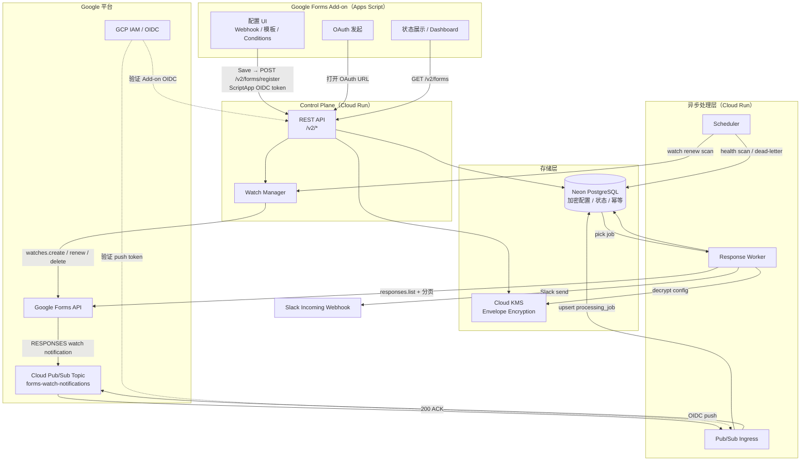

---

## 2. 组件职责边界

### 2.1 Apps Script Add-on：做什么 / 不做什么

| 职责 | V2 状态 | 说明 |
|---|---|---|
| 配置 UI（Webhook、模板、Conditions） | **保留** | Save 时调用 `PUT /v2/forms/:formId/config` |
| 字段变量选择器（读当前 Form questions） | **保留** | 从 Control Plane 拉取 `form_questions` |
| 首次 Save → 触发 OAuth + 注册 | **保留** | 唯一注册入口，无独立「Enable」按钮 |
| Dashboard（Form 列表、状态） | **保留** | 数据从 `GET /v2/forms` 读取，不本地存 |
| Test with Latest Response | **保留** | 调用 `POST /v2/forms/:formId/test`，后台执行 |
| Disconnect / Account 删除入口 | **保留** | Add-on 内「Disconnect FormAlert」选项 |
| ~~创建 installable Form submit trigger~~ | **删除** | V2 无 trigger，后台 watch 替代 |
| ~~执行 Filter 规则判断~~ | **删除** | Worker 执行 |
| ~~模板渲染~~ | **删除** | Worker 执行 |
| ~~Slack Webhook 发送~~ | **删除** | Worker 执行 |
| ~~本地存储 Webhook / 模板 / Conditions~~ | **删除** | 提交到后台 KMS 加密存储 |
| ~~调用 Forms API 拉取所有 responses~~ | **删除** | Worker 执行 |

### 2.2 后端服务职责分配

| 服务 | 运行环境 | 核心职责 |
|---|---|---|
| Control Plane API | Cloud Run | OAuth callback、账号管理、Form 注册/更新/删除、套餐校验、Watch Manager 调用 |
| Watch Manager | Control Plane 内模块 | `watches.create` / `renew` / `delete` / `repair`；维护 watch 状态 |
| Pub/Sub Ingress | Cloud Run（独立服务） | 验证 OIDC push token → upsert processing_job → 200 ACK |
| Response Worker | Cloud Run（独立服务，pg-boss 消费） | 拉取 config → responses.list（含分页）→ 幂等 → filter → 渲染 → Slack send |
| Scheduler | Cloud Scheduler → Cloud Run Job | 每小时：watch 续订扫描；每天：健康扫描 / dead-letter 告警 / 孤立 watch 清理 |

---

## 3. 技术栈选型

| 层级 | 选型 | 理由 |
|---|---|---|
| 语言 | TypeScript (Node.js 22) | 与现有 Next.js 栈一致 |
| Control Plane / Ingress | Cloud Run（无状态容器） | 与 GCP 原生集成；按量计费 |
| Worker | Cloud Run + pg-boss | PostgreSQL 原生 job queue，无需 Redis |
| 数据库 | **Neon PostgreSQL** | 与现有 Drizzle ORM + Vercel 栈一致；支持连接池；无需新建 Cloud SQL |
| ORM | Drizzle ORM | 现有栈 |
| 加密 | Cloud KMS + AES-256-GCM | Envelope encryption；KMS 管理 KEK；DB 存 wrapped DEK + ciphertext |
| Job Queue | **pg-boss** | 基于 Neon，无额外基础设施；支持 singleton job（form 级 coalesce） |
| Pub/Sub | Cloud Pub/Sub（push 模式） | 与 Google Forms API watch 原生集成 |
| 可观测性 | Cloud Logging + Cloud Monitoring | 原生 GCP；避免第三方 APM 意外捕获敏感数据 |
| 邮件 | Resend（现有） | License Code 邮件复用 |

---

## 4. 完整数据模型

### 4.1 `accounts`

| 字段 | 类型 | 说明 |
|---|---|---|
| `id` | uuid PK | 内部 account ID |
| `google_subject` | text UNIQUE | Google OIDC `sub`，永久唯一身份键 |
| `email` | text NULLABLE | 仅展示用，不作唯一键 |
| `plan` | enum | `free` / `standard` / `business` |
| `status` | enum | `active` / `revoked` / `deleted` |
| `created_at` | timestamptz | |
| `updated_at` | timestamptz | |

> **约束**：`unique(google_subject)`；`email` 不作外键，仅允许单 Google Account 绑定一个 FormAlert Account（首版）。

### 4.2 `google_credentials`

| 字段 | 类型 | 说明 |
|---|---|---|
| `id` | uuid PK | |
| `account_id` | uuid FK → accounts | |
| `encrypted_refresh_token` | text | AES-256-GCM ciphertext |
| `wrapped_dek` | text | Cloud KMS wrapped DEK |
| `scope_set` | text[] | 已授权 scopes |
| `token_status` | enum | `active` / `revoked` / `needs_reauth` |
| `last_refresh_at` | timestamptz | 最近成功刷新 access token 时间 |
| `created_at` / `updated_at` | timestamptz | |

> **约束**：`unique(account_id)`（首版一账号一 Google Account）；不保存 access token。

### 4.3 `forms`

| 字段 | 类型 | 说明 |
|---|---|---|
| `id` | uuid PK | |
| `account_id` | uuid FK → accounts | |
| `form_id` | text | Google Form ID |
| `form_title` | text | Dashboard 展示 |
| `status` | enum | `connected` / `paused` / `needs_reconnect` / `setup_failed` / `delivery_issue` |
| `enabled` | boolean | 是否占用启用名额（Pause 时为 false） |
| `schema_version` | integer | question schema 版本号 |
| `watermark_submitted_at` | timestamptz | response cursor |
| `created_at` / `updated_at` | timestamptz | |

> **约束**：`unique(account_id, form_id)`；`status` 增加 `delivery_issue`（对应 CI-08）。

### 4.4 `form_questions`

| 字段 | 类型 | 说明 |
|---|---|---|
| `id` | uuid PK | |
| `form_db_id` | uuid FK → forms | |
| `question_id` | text | Google question/item ID |
| `title` | text | 字段展示名 |
| `type` | text | `text` / `number_compatible` / `choice` 等 |
| `position` | integer | 排序 |
| `active` | boolean | question 是否仍存在 |

> **仅存** `question_id`、`title`、`type`、`position`。不存 Form description 或 section 内容（对应 CI 6.7）。

### 4.5 `alert_configs`

| 字段 | 类型 | 说明 |
|---|---|---|
| `id` | uuid PK | |
| `form_db_id` | uuid FK → forms UNIQUE | 一对一 |
| `mode` | enum | `message` / `payload` |
| `encrypted_webhook_url` | text | **必须加密**（AES-256-GCM） |
| `encrypted_message_template` | text | **必须加密** |
| `encrypted_payload_template` | text | **必须加密** |
| `encrypted_conditions` | text | **必须加密**（JSON array） |
| `wrapped_dek` | text | 该配置专属 wrapped DEK |
| `match_mode` | enum | `all` / `any` |
| `config_version` | integer | 乐观并发控制 |
| `updated_at` | timestamptz | |

> **所有敏感字段必须加密**，无待评审项（对应 CI-13）。

### 4.6 `form_watches`

| 字段 | 类型 | 说明 |
|---|---|---|
| `id` | uuid PK | |
| `form_db_id` | uuid FK → forms UNIQUE | |
| `watch_id` | text | Google watch ID |
| `event_type` | text | `RESPONSES` |
| `state` | enum | `active` / `suspended` / `expired` / `deleting` |
| `expire_time` | timestamptz | watch 到期时间 |
| `last_renew_attempt_at` | timestamptz | |
| `last_error_code` | text NULLABLE | 脱敏错误码 |

### 4.7 `processing_jobs`（pg-boss 扩展）

| 字段 | 类型 | 说明 |
|---|---|---|
| `id` | uuid PK | |
| `form_db_id` | uuid | 关联 Form |
| `status` | enum | `queued` / `running` / `retry` / `completed` / `dead_letter` |
| `available_at` | timestamptz | 下次可执行时间（退避用） |
| `attempt_count` | integer | 已尝试次数，最大 5 次 |
| `lease_until` | timestamptz | Worker lease 到期时间 |
| `last_error_code` | text NULLABLE | |

> **约束**：pg-boss singleton key = `form_db_id`，同一 Form 最多一个 `queued` 或 `running` job（对应 5.4 coalesce）。

### 4.8 `response_deliveries`

| 字段 | 类型 | 说明 |
|---|---|---|
| `id` | uuid PK | |
| `form_db_id` | uuid FK → forms | |
| `response_id` | text | Google Forms response ID |
| `status` | enum | `processing` / `sent` / `skipped` / `retryable_error` / `permanent_error` |
| `attempt_count` | integer | |
| `lease_until` | timestamptz | |
| `slack_response_code` | integer NULLABLE | 仅状态码，不含 body |
| `error_code` | text NULLABLE | 脱敏错误码 |
| `created_at` / `updated_at` | timestamptz | |

> **约束**：`unique(form_db_id, response_id)`；不存 response 内容。

### 4.9 `debug_events`

| 字段 | 类型 | 说明 |
|---|---|---|
| `id` | uuid PK | |
| `form_db_id` | uuid FK → forms | 每个 Form 独立最近 10 条 |
| `status` | text | 脱敏状态描述 |
| `event_time` | timestamptz | |
| `error_code` | text NULLABLE | |
| `actionable_hint` | text NULLABLE | 用户可操作建议 |

> 不含 response values / Webhook / token / payload（对应 4.6 Debug 说明）。

---

## 5. Form 状态机

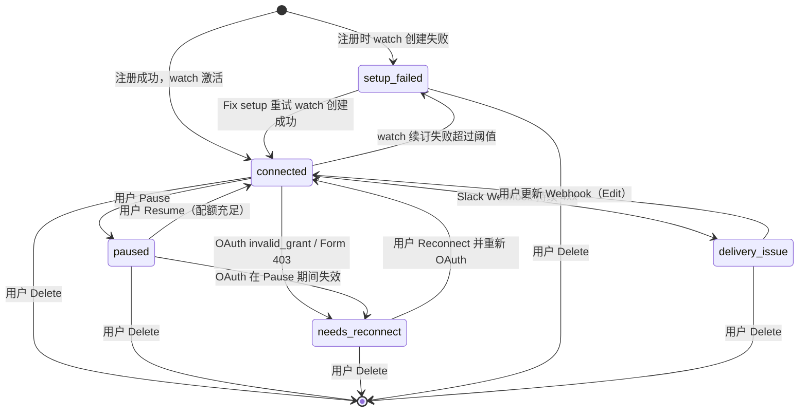

---

## 6. 用户流程设计

### 6.1 首次注册流程（Save = 唯一 Cloud Monitoring 入口）

> **产品决策**：无独立「Enable cloud monitoring」按钮。用户首次点击 Save 即触发完整注册流程（对应 CI-02）。

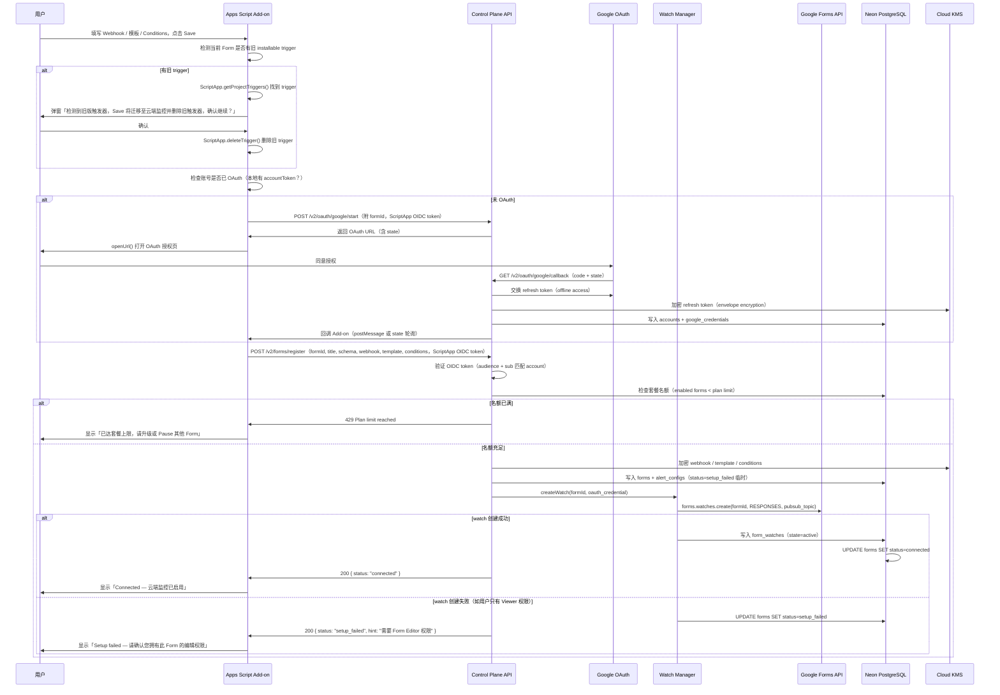

### 6.2 配置更新流程

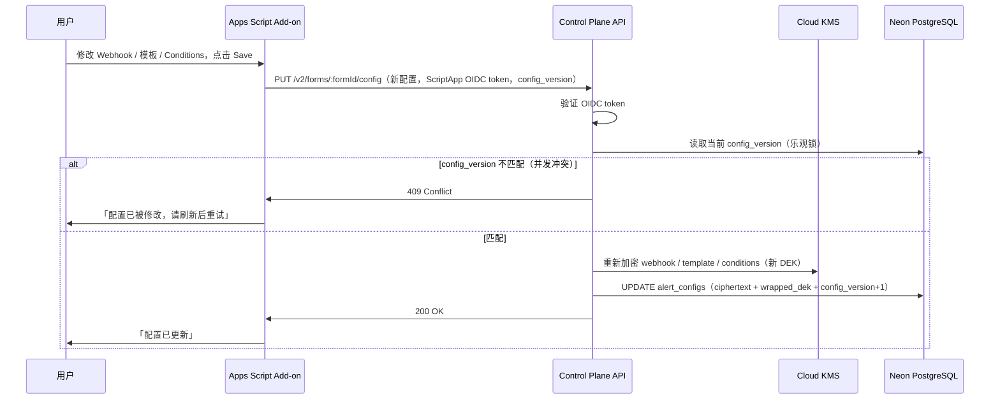

### 6.3 新 Response 处理流程（含分页 + 幂等）

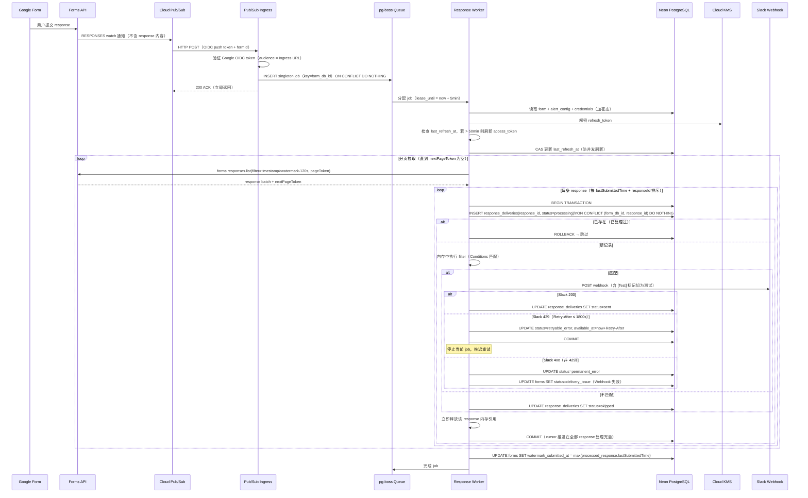

### 6.4 Test 功能流程

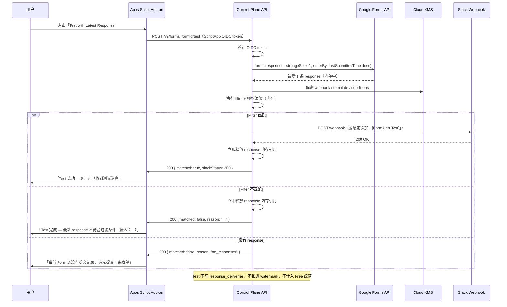

### 6.5 Pause / Resume / Delete 流程

```mermaid
flowchart TD
    subgraph Pause
        P1[用户点击 Pause] --> P2[POST /v2/forms/:formId/pause]
        P2 --> P3[后台：DELETE watch → form_watches]
        P3 --> P4[UPDATE forms SET status=paused, enabled=false]
        P4 --> P5[Scheduler 跳过 paused form 的 job]
        P5 --> P6[Add-on 显示 Paused]
    end

    subgraph Resume
        R1[用户点击 Resume] --> R2[POST /v2/forms/:formId/resume]
        R2 --> R3{套餐名额检查\nenabled count < plan limit?}
        R3 -->|否| R4[429 返回 Plan limit reached\nAdd-on 显示升级提示]
        R3 -->|是| R5{OAuth 状态 active?}
        R5 -->|否| R6[返回 needs_reconnect\nAdd-on 提示 Reconnect]
        R5 -->|是| R7[Watch Manager: watches.create]
        R7 --> R8[UPDATE forms SET status=connected, enabled=true]
        R8 --> R9[Add-on 显示 Connected\n注：不补发 Pause 期间 response]
    end

    subgraph Delete
        D1[用户确认 Delete] --> D2[POST DELETE /v2/forms/:formId]
        D2 --> D3[Watch Manager: watches.delete → 失败则标记 deleting 异步清理]
        D3 --> D4[KMS: 删除/作废该 form 的 DEK]
        D4 --> D5[DB: 删除 alert_configs / form_watches / form_questions\n/ processing_jobs / response_deliveries / debug_events]
        D5 --> D6[DB: UPDATE forms SET status=deleted, enabled=false]
        D6 --> D7[保留最小审计记录 90 天\n仅 formId hash + 时间，无敏感内容]
        D7 --> D8[Add-on 刷新 Dashboard]
    end
```

### 6.6 Watch 续订与恢复流程

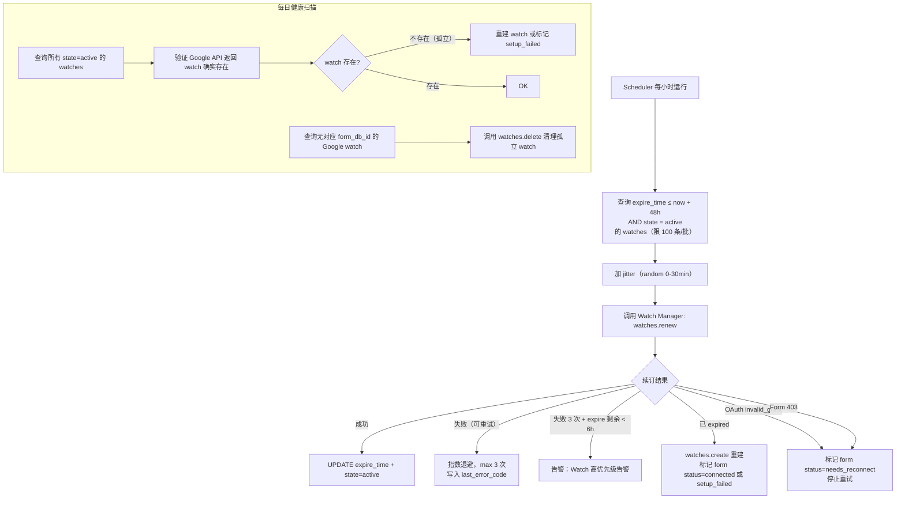

### 6.7 存量 V1 用户迁移流程

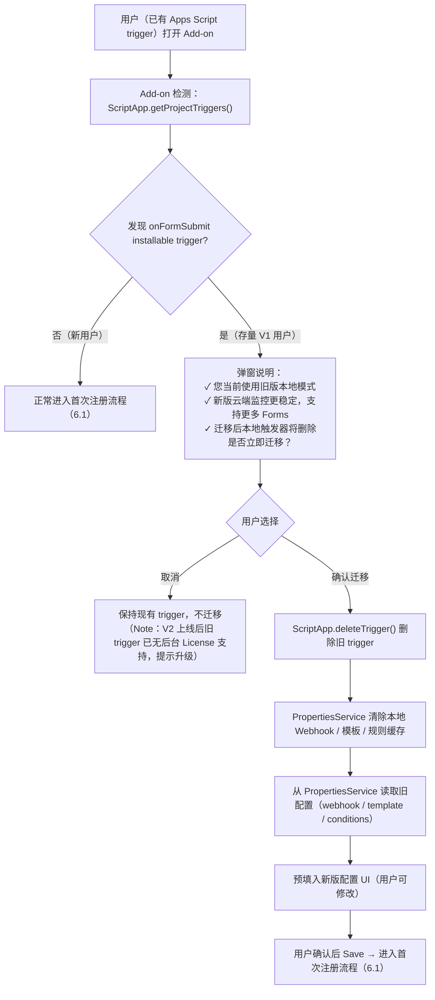

### 6.8 OAuth 失效与 Reconnect 流程

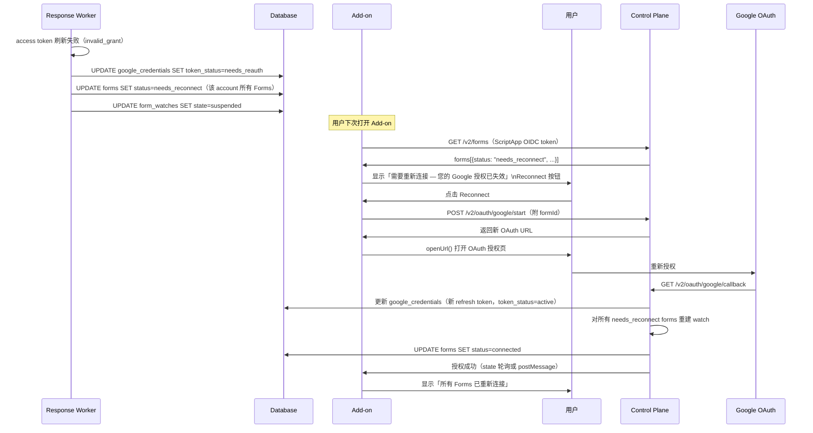

---

## 7. Watch 管理设计

### 7.1 Watch 状态机

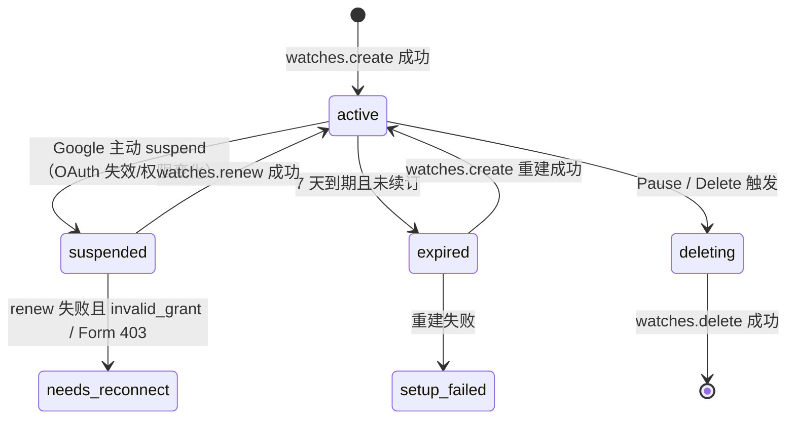

### 7.2 续订调度参数

| 参数 | 值 | 说明 |
|---|---|---|
| 扫描频率 | 每小时 | Cloud Scheduler → Cloud Run Job |
| 提前续订窗口 | 48 小时 | expire_time ≤ now + 48h |
| Jitter 范围 | 0–30 分钟 | 分散 100k watches 的并发续订请求 |
| 单批次处理 | 100 条 | 控制 Write quota 消耗 |
| 写操作速率 | ≤ 200/min | Forms API Write quota 375/min，留 40% 余量 |
| 指数退避上限 | 3 次 | 每次间隔翻倍（1min, 2min, 4min） |
| 高优先级告警阈值 | expire 剩余 < 6 小时且仍未成功 | PagerDuty / Cloud Monitoring 告警 |

---

## 8. Job Queue 设计（pg-boss）

### 8.1 Coalesce 逻辑

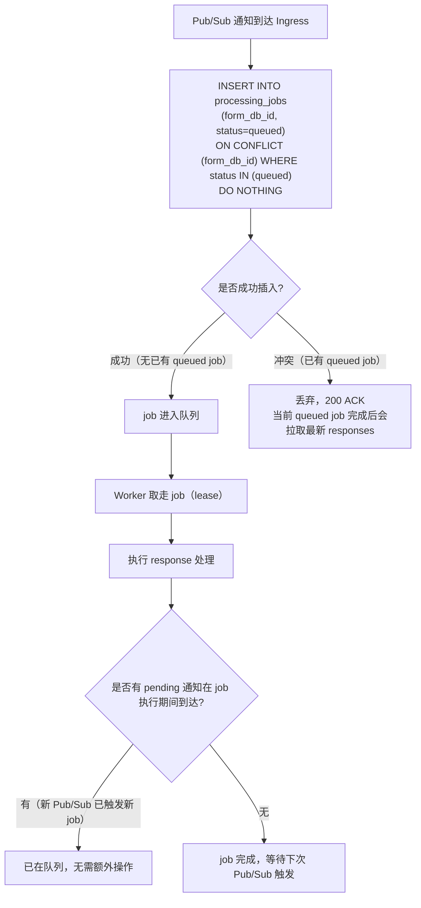

### 8.2 Job 生命周期参数

| 参数 | 值 |
|---|---|
| Lease 时长 | 5 分钟 |
| 最大重试次数 | 5 次 |
| 退避策略 | 指数退避（30s, 1min, 2min, 4min, 8min） |
| Dead-letter 触发条件 | attempt_count ≥ 5 |
| Dead-letter 后 Form 状态 | `delivery_issue`（若为 Slack 错误） |
| Slack 429 最大等待 | 1800 秒（30 分钟），超过则退为 retryable_error |

---

## 9. Worker 核心算法

### 9.1 完整执行伪代码

```
function processFormJob(formDbId):
  // 1. 加载配置
  form = DB.get(forms, formDbId)
  if form.status == "paused": return skip
  
  credential = DB.get(google_credentials, form.account_id)
  alertConfig = DB.get(alert_configs, formDbId)
  
  // 2. access token 管理（防并发刷新）
  if now() - credential.last_refresh_at > 50min:
    DB.UPDATE google_credentials SET refreshing=true WHERE refreshing=false  // CAS
    if updated == 1:
      decryptedToken = KMS.decrypt(credential.encrypted_refresh_token)
      accessToken = Google.refreshAccessToken(decryptedToken)
      DB.UPDATE google_credentials SET last_refresh_at=now(), refreshing=false
    else:
      WAIT 3s; RELOAD credential  // 等待其他 worker 完成刷新
  
  // 3. 解密 alert 配置（KMS）
  webhook = KMS.decrypt(alertConfig.encrypted_webhook_url)
  template = KMS.decrypt(alertConfig.encrypted_message_template or payload)
  conditions = KMS.decrypt(alertConfig.encrypted_conditions)
  
  // 4. 分页拉取 responses（含 overlap）
  cursor = form.watermark_submitted_at
  overlapCursor = cursor - 120seconds
  pageToken = null
  allResponses = []
  
  do:
    result = FormsAPI.responses.list(
      formId = form.form_id,
      filter = "timestamp >= " + overlapCursor.toISO(),
      pageSize = 100,
      pageToken = pageToken
    )
    allResponses += result.responses
    pageToken = result.nextPageToken
  while pageToken != null
  
  // 5. 排序：lastSubmittedTime ASC，同时间按 responseId ASC
  allResponses.sortBy(r => [r.lastSubmittedTime, r.responseId])
  
  newWatermark = cursor
  
  for response in allResponses:
    // 6. 幂等检查（数据库事务）
    DB.BEGIN_TRANSACTION
    inserted = DB.INSERT_OR_IGNORE(response_deliveries, 
      form_db_id=formDbId, response_id=response.responseId, status="processing")
    
    if NOT inserted:
      DB.ROLLBACK; continue  // 已处理过
    
    // 7. filter + 渲染（全在内存，使用后立即释放）
    responseMap = buildMap(response, form_questions)  // 临时内存对象
    matched = evaluateConditions(conditions, responseMap)
    
    if matched:
      payload = renderTemplate(template, responseMap)
      responseMap = null  // 立即释放
      
      // 8. Slack 发送
      result = HTTP.POST(webhook, payload, timeout=10s)
      
      if result.status == 200:
        DB.UPDATE response_deliveries SET status="sent"
      elif result.status == 429:
        retryAfter = min(result.headers["Retry-After"], 1800)
        DB.UPDATE response_deliveries SET status="retryable_error"
        DB.UPDATE processing_jobs SET available_at=now()+retryAfter
        DB.COMMIT
        return retry_later  // 停止当前 job
      elif result.status in [400, 404, 410]:
        DB.UPDATE response_deliveries SET status="permanent_error"
        DB.UPDATE forms SET status="delivery_issue"
      else:  // 5xx / timeout
        DB.UPDATE response_deliveries SET status="retryable_error"
    else:
      responseMap = null  // 立即释放
      DB.UPDATE response_deliveries SET status="skipped"
    
    // 9. 推进 watermark（在同一事务内）
    if response.lastSubmittedTime > newWatermark:
      newWatermark = response.lastSubmittedTime
    
    DB.COMMIT
  
  // 10. 推进全局 cursor
  if newWatermark > cursor:
    DB.UPDATE forms SET watermark_submitted_at = newWatermark
  
  webhook = null; template = null; conditions = null  // 清理解密后的内存
```

---

## 10. 加密与 IAM 设计

### 10.1 KMS Envelope Encryption

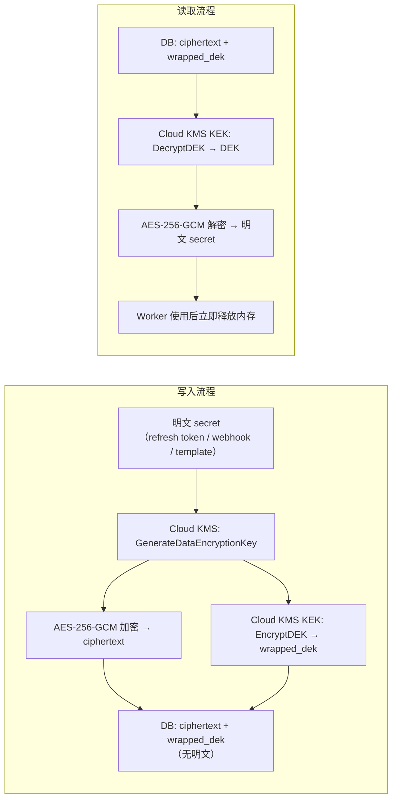

### 10.2 Service Account 权限矩阵

| Service Account | KMS 解密 | DB 读写 | Forms API | Pub/Sub | 说明 |
|---|---|---|---|---|---|
| `control-plane-sa` | ✅ webhook/token | ✅ 全表读写 | ✅ watch create/renew | ❌ | Control Plane 专用 |
| `ingress-sa` | ❌ | ✅ 仅 processing_jobs 写 | ❌ | ✅ push 验证 | Ingress 专用，不可解密 |
| `worker-sa` | ✅ webhook/token/template | ✅ 全表读写 | ✅ responses.list | ❌ | Worker 专用 |
| `scheduler-sa` | ❌ | ✅ watch + jobs 读写 | ✅ watch renew | ❌ | Scheduler 专用 |
| `support-sa` | ❌ | ✅ 只读（无 alert_configs） | ❌ | ❌ | 运维支持，不可解密任何 secret |

### 10.3 KEK 轮换策略（Zero-downtime）

| 步骤 | 操作 | 说明 |
|---|---|---|
| 1 | Cloud KMS 创建新 KEK 版本 | 旧版本仍 active |
| 2 | 启动后台重加密 Job | 逐批读取 wrapped_dek → 旧 KEK 解密 DEK → 新 KEK 重新加密 → 更新 DB |
| 3 | Worker 同时支持旧/新 wrapped_dek | 读取时先尝试新 KEK，失败则尝试旧 KEK |
| 4 | 重加密完成后 | 禁用旧 KEK 版本 |
| 轮换频率 | 每 90 天 | |

### 10.4 APM 数据脱敏要求

所有接入的可观测性工具（Cloud Logging / Sentry / Datadog 等）**必须**配置：

```
禁止上报：
- HTTP 请求 body（所有 /v2/* 路由）
- HTTP 响应 body（所有 /v2/* 路由）
- Authorization / X-Goog-* 请求头
- 变量：webhook / template / conditions / response / token

仅允许上报日志字段白名单：
- accountIdHash（SHA-256 前 12 位）
- formIdHash（SHA-256 前 12 位）
- operation（字符串枚举）
- httpStatusCode（整数）
- elapsedMs（整数）
- errorCode（字符串枚举）
- attempt（整数）
- occurredAt（时间戳）
```

---

## 11. 完整 API 规范

### 11.1 Control Plane — Add-on 调用接口

所有接口需要 Add-on 在 `Authorization: Bearer <ScriptApp.getIdentityToken()>` 头传递 OIDC token，Control Plane 验证 audience = `{CONTROL_PLANE_CLIENT_ID}` 且 `sub` 与 FormAlert account 匹配。

| Method | Path | 功能 | 请求体 | 响应 |
|---|---|---|---|---|
| POST | `/v2/oauth/google/start` | 发起 OAuth | `{ formId, redirectUri }` | `{ oauthUrl }` |
| GET | `/v2/oauth/google/callback` | 接收 OAuth code | query: `code, state` | HTML redirect（postMessage 给 Add-on） |
| POST | `/v2/forms/register` | 注册新 Form | `{ formId, title, schema, webhook, mode, template, conditions, matchMode }` | `{ formDbId, status, watchExpire }` |
| GET | `/v2/forms` | 获取所有 Forms | — | `[{ formDbId, title, status, enabled, updatedAt }]` |
| GET | `/v2/forms/:formId` | 获取单个 Form 详情 | — | `{ status, watchState, watchExpire, plan, enabledCount, planLimit }` |
| PUT | `/v2/forms/:formId/config` | 更新配置 | `{ webhook, mode, template, conditions, matchMode, configVersion }` | `{ configVersion }` |
| POST | `/v2/forms/:formId/pause` | 暂停监控 | — | `{ status: "paused" }` |
| POST | `/v2/forms/:formId/resume` | 恢复监控 | — | `{ status: "connected" }` 或 `{ error: "plan_limit" }` |
| POST | `/v2/forms/:formId/reconnect` | 重新 OAuth 并恢复 | — | `{ oauthUrl }` |
| DELETE | `/v2/forms/:formId` | 删除 Form | — | `{ deleted: true }` |
| POST | `/v2/forms/:formId/test` | 测试最新 response | — | `{ matched, reason, slackStatus }` |
| GET | `/v2/forms/:formId/debug` | 获取最近 10 条脱敏事件 | — | `[{ status, eventTime, errorCode, actionableHint }]` |
| DELETE | `/v2/account` | 断开并删除账号 | — | `{ deleted: true }` |

### 11.2 Internal 接口

| Method | Path | 调用方 | 说明 |
|---|---|---|---|
| POST | `/internal/pubsub/forms-events` | Cloud Pub/Sub push | 验证 OIDC → upsert job → 200 ACK |
| POST | `/internal/jobs/renew-watches` | Cloud Scheduler | 扫描并续订 48h 内到期 watches |
| POST | `/internal/jobs/repair-watches` | Cloud Scheduler | 修复 suspended/expired watches |
| POST | `/internal/jobs/health-scan` | Cloud Scheduler | 孤立 watch 检测与清理 |
| POST | `/internal/jobs/cleanup` | Cloud Scheduler | response_deliveries / debug_events 过期清理 |

### 11.3 接口安全规则

| 规则 | 说明 |
|---|---|
| Add-on → Control Plane | OIDC token（`ScriptApp.getIdentityToken()`），Control Plane 验证 audience + sub |
| Pub/Sub → Ingress | Google OIDC push token，Ingress 验证 issuer + audience（Ingress URL）+ service account |
| Cloud Scheduler → Internal | Cloud IAM OIDC，不使用静态 secret |
| 所有接口 | Rate limit（100 req/min/IP）；请求体最大 64KB；JSON Schema 校验 |
| 修改接口 | 所有者校验（account 是否拥有该 form_db_id） |

---

## 12. 可观测性设计

### 12.1 必须监控的指标

| 指标 | 说明 | 告警阈值 |
|---|---|---|
| `watch.active_count` | active watches 数量 | — |
| `watch.renew_success_rate` | 续订成功率 | < 99% → P1 告警 |
| `watch.expire_soon_count` | 6h 内到期且未成功续订数 | > 0 → P0 告警 |
| `pubsub.ingress_latency_p95` | Pub/Sub push 到 ACK 延迟 | > 5s → P2 告警 |
| `job.queue_depth` | 排队 job 数量 | > 1000 → P1 告警 |
| `job.oldest_age_minutes` | 最老排队 job 等待时长 | > 30min → P1 告警 |
| `job.dead_letter_count` | dead-letter job 累计数 | > 0 → P1 告警 |
| `forms_api.429_rate` | Forms API 限流率 | > 5% → P2 告警 |
| `slack.4xx_rate_per_form` | 单 Form Slack 4xx 比率 | > 50% → delivery_issue 状态 |
| `e2e.p50_minutes` | 提交到 Slack 的 P50 端到端延迟 | — |
| `e2e.p95_minutes` | 提交到 Slack 的 P95 端到端延迟 | > 15min → P2 告警 |

### 12.2 延迟拆解指标（对应 5.10）

```
e2e_latency = 
  google_watch_notification_delay    // Google 控制，不可控
  + pubsub_push_latency              // Cloud Pub/Sub → Ingress
  + job_queue_wait_time              // Ingress → Worker 取 job
  + forms_api_fetch_latency          // responses.list 耗时
  + filter_render_latency            // 内存处理耗时
  + slack_send_latency               // Slack 网络耗时
```

每段延迟独立打点，便于定位瓶颈。

---

## 13. 套餐配置

| Plan | Enabled Forms | Conditions/Form | Slack sends | Debug 条目 | Free 配额窗口 |
|---|---:|---:|---|---:|---|
| Free | 1 | 1 | 30 次/**每月重置** | 10 | 每自然月 1 日重置 |
| Standard | 20 | 5 | Unlimited | 10 | — |
| Business | 100 | 10 | Unlimited | 10 | — |

> **Free 每月 30 次**（对应 CI-12）：V1「累计 30 次」改为「每月 30 次」，Pricing 页面需同步更新。

---

## 14. Privacy Policy 必须更新的文案

在 V2 GA 前，以下旧文案必须替换（对应 CI-04）：

**删除（旧）：**
```
Form responses and Slack Webhooks never reach FormAlert servers.
We do not store Slack Webhook URLs.
Form response data is processed in your Google Apps Script environment.
```

**替换为（新）：**
```
When you enable FormAlert Cloud Monitoring, your Google Form responses are 
fetched transiently by FormAlert's servers solely to evaluate your filter 
rules and deliver matching Slack notifications. Response data is never 
stored in our database and is discarded from memory immediately after 
processing.

Your Slack Webhook URL, message templates, and filter conditions are 
encrypted at rest using industry-standard AES-256-GCM encryption managed 
by Google Cloud KMS. Our OAuth refresh token, which enables background 
monitoring, is stored with the same level of encryption.

You can revoke FormAlert's access at any time by disconnecting your 
account from within the add-on or by revoking access in your Google 
Account security settings. All associated data will be permanently deleted.
```

---

## 15. 实施阶段计划

### 15.1 阶段总览

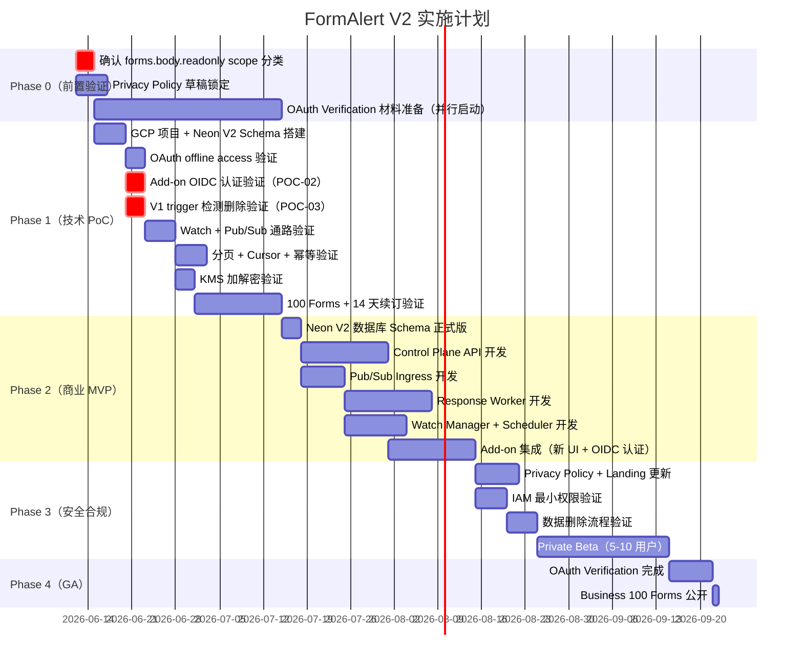

### 15.2 Phase 0：前置验证（1–2 周）

| 任务 | 负责 | 完成标准 |
|---|---|---|
| 在 Google Cloud Console 确认 `forms.body.readonly` scope 分类（Sensitive / Restricted） | 研发 | 书面确认结果；若 Restricted，输出 CASA 方案 |
| 起草 V2 Privacy Policy 草稿，标注所有改写段落 | 产品 | 草稿经负责人确认，锁定改写范围 |
| 启动 OAuth Verification 材料准备（consent screen / scope 说明 / demo 视频） | 研发 + 产品 | 材料清单完成，开始录制 demo 视频 |
| 确认 Neon PostgreSQL + Cloud KMS 集成可行性（DG-09） | 研发 | PoC 代码验证 KMS 调用从 Neon 环境正常工作 |

### 15.3 Phase 1：技术 PoC（3–5 周，Phase 0 后期并行）

**必须全部通过才可进入 Phase 2**：

| POC ID | 任务 | 通过标准 |
|---|---|---|
| POC-01 | scope 分类确认 | 已确认（Phase 0 完成） |
| POC-02 | Add-on OIDC → Control Plane 认证 | ScriptApp OIDC token 被 Control Plane 正确验证 |
| POC-03 | V1 trigger 检测 + 删除 | trigger 存在和不存在两种场景均正确处理 |
| POC-04 | OAuth offline access 48h 稳定 | refresh token 获取 + 刷新成功 |
| POC-05 | watch + Pub/Sub 通路 | 提交 response → Worker 收到通知并拉取 |
| POC-06 | forms.body.readonly schema 同步 | question title/type 存入 form_questions |
| POC-07 | 分页拉取 | 100+ responses 无漏 response |
| POC-08 | cursor overlap | watermark 边界无漏处理 |
| POC-09 | job coalesce | 重复 Pub/Sub 只触发 1 次处理 |
| POC-10 | worker 崩溃恢复 | lease 超时后幂等接管 |
| POC-11 | 100 Forms + 14 天续订 | 续订成功率 100% |
| POC-12 | KMS 加解密 | 加解密流程正确；删除后无法解密 |
| POC-13 | response 不落库/日志/APM | 扫描验证无敏感数据 |
| POC-14 | Pub/Sub push OIDC 验证 | 非法请求被拒绝 |
| POC-15 | IAM 最小权限 | ingress-sa 无法解密 Webhook |
| POC-16 | 完整删除 | 删除后无残留数据 |
| POC-17 | Forms API quota 多租户 | 10 用户 × 10 Forms 同时触发无失控 |
| POC-18 | Slack 429 恢复 | 429 后自动重试成功 |

### 15.4 Phase 2：商业 MVP（6–10 周，PoC 通过后）

**开发顺序（有依赖关系）**：

```
Week 1-2:  Neon V2 Schema（Drizzle migrate） + Control Plane API 骨架
Week 2-3:  Pub/Sub Ingress + pg-boss Worker 骨架
Week 3-5:  Response Worker 完整逻辑（filter / 渲染 / Slack / 幂等）
Week 4-5:  Watch Manager + Scheduler
Week 5-6:  Add-on 新版 UI（移除 trigger 相关代码，集成 OIDC 调用）
Week 6-7:  V1 用户迁移流程（trigger 检测 + 弹窗 + 配置预填）
Week 7:    Test 功能（/v2/forms/:formId/test）
Week 7-8:  Debug / Dashboard / 状态同步
Week 8:    端到端集成测试
```

### 15.5 Phase 3：安全合规与 Beta（3–4 周）

| 任务 | 完成标准 |
|---|---|
| Privacy Policy / Landing / FAQ 正式更新（新隐私文案） | 法律确认，网站发布 |
| Marketplace disclosure 更新 | 审核通过 |
| IAM 权限矩阵审计 | 所有 service account 权限符合最小权限原则 |
| KMS Data Access 审计日志启用 | Cloud Audit Logs 配置完成 |
| APM 数据脱敏配置 | 通过 POC-13 扫描验证 |
| Private Beta 开放（5-10 用户，≤ 20 Forms/人） | 14 天 SLO 达标 |

### 15.6 Phase 4：GA

| 条件 | 完成标准 |
|---|---|
| OAuth Verification 通过 | Google 审核邮件确认 |
| 14 天 Private Beta SLO | P95 < 10min，watch 续订 100%，无数据泄露事件 |
| Business 100 Forms 压测通过 | 单用户 100 Forms × 14 天稳定运行 |
| on-call runbook 完成 | 文档可操作，包含告警响应步骤 |
| 成本核算完成 | 确认 Business $15/月（或调整后价格）可覆盖成本 |

---

## 16. 快速参考：关键设计决策总结

| 决策点 | 确认结论 |
|---|---|
| Apps Script 执行模式 | **完全删除**；Apps Script 仅做 UI + OAuth 发起 |
| V1 双轨 / Local Mode | **不保留**；无回退路径 |
| 注册入口 | 首次 Save = 触发 OAuth + register + watch |
| Free 套餐计费 | **每月 30 次**（非累计），自然月重置 |
| 所有套餐执行路径 | **统一走 V2 Cloud Monitoring**（含 Free） |
| 模板加密 | **必须加密**（与 webhook / token 同级别） |
| response 处理位置 | Worker 内存，每条处理完立即释放 |
| job coalesce | pg-boss singleton key = form_db_id |
| Cursor + 幂等 | 同一数据库事务中推进 |
| Slack 429 最大等待 | 1800 秒（30 分钟） |
| 账号删除入口 | Add-on 内「Disconnect FormAlert」 |
| DB 选型 | Neon PostgreSQL（与现有栈一致） |
| 日志策略 | 白名单字段，非黑名单 |
| Business 定价 | 建议 V2 GA 时调整为 $15/月 |

---

## 17. 评审意见与待修复风险点

文档版本：v1.0 评审附录  
评审日期：2026-06-11  
评审角色：高级产品经理 + Google Workspace 插件架构 + 隐私安全  
评审结论：**方向正确，可进入 PoC；正式开发前须先修复本节 P0 项并完成待确认项。**

### 17.1 总体结论

本版技术方案已较好对齐「V2 Cloud Monitoring 全面替换 Apps Script 执行模式」的产品决策，组件边界、数据模型、流程图、PoC 清单和实施计划具备可执行性。但当前文档仍存在 **3 项 P0** 与若干 **P1** 问题；研发经理修订文档时应优先处理本节内容，再进入 Phase 2 正式开发。

### 17.2 关键风险点（P0 / P1）

| ID | 严重级别 | 涉及章节 | 问题 | 影响 | 建议修复 |
|---|---|---|---|---|---|
| R-01 | **P0** | §6.1 | 存量 V1 trigger 在 V2 注册成功**之前**即被删除 | OAuth、register 或 watch 创建失败时，用户原有通知链路直接中断 | 仅检测并提示旧 trigger；**待 `POST /v2/forms/register` 成功且 `watches.create` 成功、状态变为 `connected` 后再删除旧 trigger** |
| R-02 | **P0** | §6.7 | 迁移流程先 `PropertiesService` 清除本地配置，再读取旧配置 | 用户原有 Webhook、模板、Conditions 丢失，无法预填迁移 | 顺序改为：**读取并缓存旧配置 → 注册 V2 → 成功后删除 trigger → 成功后清理本地 Properties** |
| R-03 | **P0** | §6.3、§9.1 | `response_deliveries` 使用 `unique(form_db_id, response_id)` + `INSERT_OR_IGNORE`；`retryable_error` 后下次 job 会因记录已存在而 `continue` 跳过 | Slack 429/5xx 后消息可能**永久不重发** | 幂等 claim 须区分终态（`sent`/`skipped`/`permanent_error`）与可重试态（`retryable_error`）；后者在 `available_at` 到期后须允许重新 claim 并递增 `attempt_count` |
| R-04 | P1 | §6.7 | 迁移流程允许用户「取消」并「保持现有 trigger，不迁移」 | 与「V2 全面替换、无 Local Mode」表述冲突 | 改为：暂不迁移则该 Form **不由新版 FormAlert 保证交付**；不承诺旧 trigger 继续受支持 |
| R-05 | P1 | §4.3、§6.5 | `forms.status` 枚举无 `deleted`，但 Delete 流程写入 `status=deleted` | 数据模型与流程不一致 | 在 `forms.status` 增加 `deleted`，或 Delete 后硬删除 `forms` 行并仅保留审计表 |
| R-06 | P1 | §7.1 | Watch 状态机出现 `needs_reconnect`，但 `form_watches.state` 枚举无此值 | Watch 层与 Form 层状态混淆 | `needs_reconnect` 仅属于 `forms.status`；`form_watches.state` 保持 `active` / `suspended` / `expired` / `deleting` |
| R-07 | P1 | §13 | Free「每月 30 次」无对应数据模型与 Worker 扣减流程 | 套餐限制无法在后端执行 | 新增 `usage_counters` 或等价表；Slack `sent` 成功后按自然月扣减；超限返回明确错误 |
| R-08 | P1 | §11.3 | Add-on → Control Plane 依赖 `ScriptApp.getIdentityToken()`，尚未在 PoC 中验证 | audience、`sub` 绑定可能不可用，导致全链路 API 认证失败 | 保留为 Phase 0 阻塞项（POC-02）；验证失败须有备选方案（如短期 session token） |

### 17.3 待研发经理确认的事项

| ID | 优先级 | 待确认项 | 说明 |
|---|---|---|---|
| C-01 | **P0** | `forms.body.readonly` 是否为 Restricted scope | 若需 CASA 第三方安全审计，上线周期可能延长 2–6 个月 |
| C-02 | **P0** | `ScriptApp.getIdentityToken()` 能否作为 Add-on → Control Plane 稳定身份凭证 | 须验证 audience、`sub` 与 FormAlert account 绑定 |
| C-03 | P1 | Neon PostgreSQL + Cloud KMS 集成方案 | 网络、延迟、连接池、IAM；Phase 0 PoC 实测 |
| C-04 | P1 | Free 套餐是否确认为「每月 30 次」自然月重置 | 影响 Pricing 文案、成本模型与 `usage_counters` 设计 |
| C-05 | P1 | Business 定价是否调整为 $15/月（或 $149/年） | 当前 §16 为建议值，须产品定价确认 |
| C-06 | P1 | 存量 V1 用户「暂不迁移」的产品策略 | V2 全面替换下，是否允许旧 trigger 继续运行及支持边界 |

### 17.4 文档修订优先级（供研发经理）

```text
修订顺序建议：
1. 修复 §6.1 / §6.7 的 trigger 删除时机与 Properties 读写顺序（R-01、R-02）
2. 重写 §9.1 幂等 claim 逻辑，明确 retryable_error 可重试（R-03）
3. 对齐 §4.3 forms.status 与 §6.5 Delete 流程（R-05）
4. 修正 §7.1 Watch 状态机，移除 form_watches 层的 needs_reconnect（R-06）
5. 补充 Free 配额数据模型与扣减流程（R-07）
6. 明确迁移「取消」分支的产品文案（R-04）
7. 在 Phase 0 完成 C-01、C-02 书面结论后再锁定 §11 API 认证终稿
```

### 17.5 已确认无需大改的方向

以下方向评审通过，修订时保持：

- V2 全面替换 Apps Script 执行；Add-on 仅 UI + OAuth + 状态展示
- Pub/Sub push ingress → pg-boss → Worker 异步处理架构
- response 仅 Worker 内存短暂处理、不落库
- refresh token、Webhook、模板、Conditions 必须 KMS 加密存储
- Dashboard 仅展示已注册 Forms，不扫描 Drive
- Pause 释放名额；response 更新首版不重发
- PoC 18 项验收清单与 Phase 0–4 分阶段计划

---

*本节为 2026-06-11 评审附录，供研发经理据此修订主文档。修订完成后建议将主文档版本升至 v1.1 并更新 §23 评审记录。*
